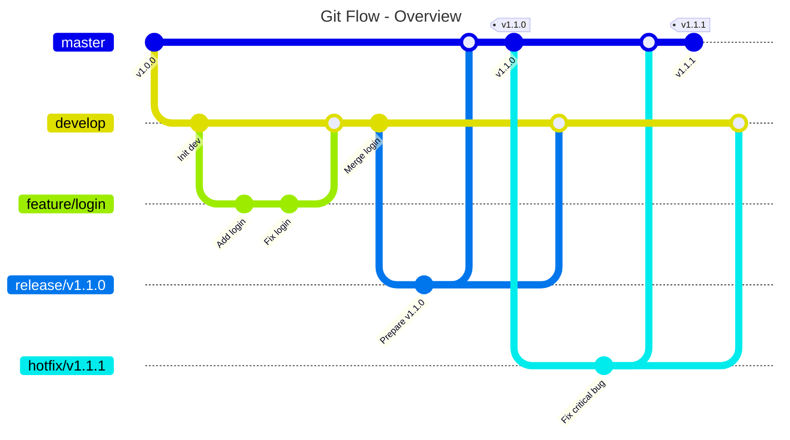
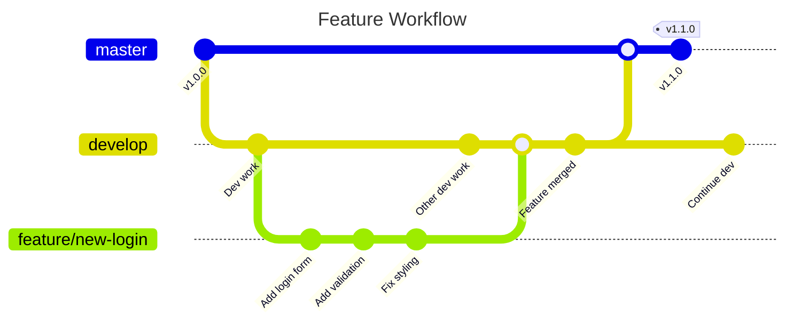
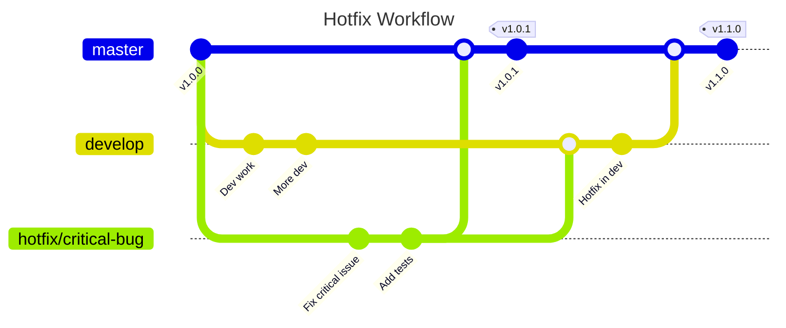
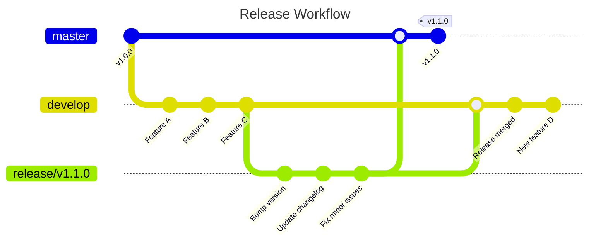
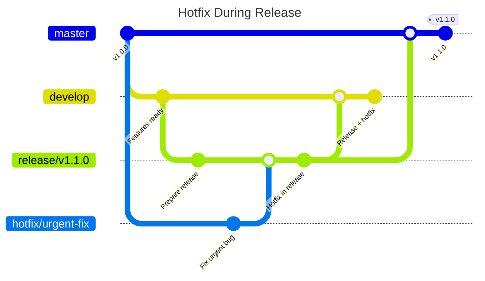

<h1 align="center">
  <a href="http://saumon.github.io/gitktti/" target="_blank">
    
  </a>
</h1>

# The `gitktti` project *- by saumon™*

[](https://metacpan.org/pod/App::GitKtti)
[](LICENSE)

The `gitktti` scripts are provided to help developers safely use git flow. So powerful... 🚀
>**saumon:** Yes so powerful!

## 📋 Table of contents

- [The `gitktti` project *- by saumon™*](#the-gitktti-project---by-saumon)
  - [📋 Table of contents](#-table-of-contents)
  - [📖 Description](#-description)
    - [Git flow principles](#git-flow-principles)
    - [Branch types](#branch-types)
  - [🔎 Detailed workflows](#-detailed-workflows)
    - [Feature workflow](#feature-workflow)
    - [Hotfix workflow](#hotfix-workflow)
    - [Release workflow](#release-workflow)
    - [Hotfix during release workflow](#hotfix-during-release-workflow)
  - [📦 Installation](#-installation)
    - [From CPAN (Recommended)](#from-cpan-recommended)
    - [From Source](#from-source)
    - [Manual Installation](#manual-installation)
  - [🗑️ Uninstallation](#️-uninstallation)
  - [⚒️ Available Commands](#️-available-commands)
  - [🚀 Quick Start](#-quick-start)
  - [⭐️ Recommended aliases](#️-recommended-aliases)
    - [Alias descriptions](#alias-descriptions)
    - [Usage examples](#usage-examples)
  - [📋 Recent Releases](#-recent-releases)
    - [Release `2.0.0` - 10/09/2025 🆕](#release-200---10092025-)
    - [Release `1.3.3` - 27/08/2025](#release-133---27082025)
    - [Release `1.3.2` - 25/08/2025](#release-132---25082025)
    - [Release `1.3.1` - 24/08/2025](#release-131---24082025)

## 📖 Description

Git flow is a branching methodology that organizes development around two main branches:

- **`master`** : production branch containing only stable and tagged code
- **`develop`** : development branch where all new features are integrated

### Git flow principles



### Branch types

- **`feature/*`** : development of new features (branched from `develop`)
- **`release/*`** : preparation of a new version (branched from `develop`)
- **`hotfix/*`** : urgent fixes in production (branched from `master`)

## 🔎 Detailed workflows

### Feature workflow

Feature branches are used to develop new functionality. They are created from
`develop` and merged back into `develop` when complete.



**Commands used:**

```bash
# Create feature branch
kfeat -n feat/new-login
# or
kfix --mode feature --name new-login

# Finalize feature (merge to develop)
kfixend
```

### Hotfix workflow

Hotfix branches are used for urgent production fixes. They branch from `master`
and merge back to both `master` and `develop`.



**Commands used:**

```bash
# Create hotfix branch (from master)
kfix -n critical-bug
# or
kfix --name critical-bug

# Finalize hotfix (merge to master and develop, create tag)
kfixend
```

### Release workflow

Release branches are used to prepare a new version. They branch from `develop`,
allow for final adjustments, then merge to both `master` and `develop`.



**Commands used:**

```bash
# Create release branch (from develop)
kfix --mode release
# or
kreal
# This will propose version numbers based on last tag

# Finalize release (merge to master and develop, create tag)
kfixend
```

### Hotfix during release workflow

Special case: when a release is in progress and a hotfix is needed, the hotfix
must be merged into the release branch first.



**Commands used:**

```bash
# Create hotfix as usual
kfix

# When finalizing, the script will detect the release branch
# and automatically merge hotfix into release instead of develop
kfixend
```

## 📦 Installation

### From CPAN (Recommended)

```bash
cpan App::GitKtti
```

### From Source

```bash
git clone https://github.com/saumon/gitktti.git
cd gitktti
./install.sh
```

### Manual Installation

```bash
perl Makefile.PL
make
make test
make install
```

## 🗑️ Uninstallation

To properly uninstall GitKtti based on how it was installed:

```bash
git clone https://github.com/saumon/gitktti.git
cd gitktti
./uninstall.sh
```

The uninstall script will guide you through removing GitKtti cleanly:

- **Local installation**: Simple directory removal guidance
- **System-wide**: Automatic detection and removal of installed files
- **~/perl5**: Clean removal from local Perl library
- **CPAN**: Uses `cpan -U App::GitKtti` or falls back to manual method

## ⚒️ Available Commands

After installation, the following commands are available:

- **`gitktti-checkout`** - Switch between branches safely
- **`gitktti-delete`** - Delete branches (local and remote)
- **`gitktti-fix`** - Start a hotfix branch
- **`gitktti-fixend`** - Finish a hotfix branch
- **`gitktti-move`** - Rename branches
- **`gitktti-tag`** - Create and push tags
- **`gitktti-tests`** - Run diagnostic tests

Each command supports `--help` for detailed usage information.

## 🚀 Quick Start

```bash
# Run diagnostics
gitktti-tests

# Switch branches
gitktti-checkout --filter feature

# Start a hotfix
gitktti-fix --name critical-bug

# Create a tag
gitktti-tag --name v1.2.0

# Get help for any command
gitktti-checkout --help
```

## ⭐️ Recommended aliases

For users who prefer shorter commands, you can create these aliases:

```bash
alias kfeat='gitktti-fix --mode feature'
alias kreal='gitktti-fix --mode release'
alias kprune='gitktti-fix --prune'
alias kfix='gitktti-fix'
alias kfixend='gitktti-fixend'
alias ktag='gitktti-tag'
alias kco='gitktti-checkout'
alias kmove='gitktti-move'
alias kdel='gitktti-delete'
alias ktest='gitktti-tests'
```

### Alias descriptions

| Alias | Purpose | Description |
|-------|---------|-------------|
| `kfeat` | **Create feature branch** | Creates a new feature branch from `develop`. Equivalent to `kfix --mode feature` |
| `kreal` | **Create release branch** | Creates a new release branch from `develop`. Equivalent to `kfix --mode release` |
| `kprune` | **Clean local branches** | Deletes local branches that have been merged and are no longer needed |
| `kfix` | **Create hotfix/feature branch** | Creates a new branch (hotfix from `master` by default, or feature/release with `--mode`) |
| `kfixend` | **Finalize current branch** | Merges the current branch to appropriate target(s) and creates tags if needed |
| `ktag` | **Create/manage tags** | Creates or manages version tags on the repository |
| `kco` | **Smart checkout** | Intelligent branch checkout with Git flow awareness |
| `kmove` | **Rename branch** | Renames current branch locally and remotely |
| `kdel` | **Delete branch** | Deletes a local branch and its remote counterpart safely |

### Usage examples

**With aliases (modern):**

```bash
# Start working on a new feature
kfeat --name user-authentication # Creates feature/user-authentication

# Create a hotfix for production
kfix --name critical-security-fix # Creates hotfix/critical-security-fix from master

# Prepare a new release
kreal                           # Creates release/vX.Y.Z from develop

# Finish your work
kfixend                         # Merges current branch and handles Git flow

# Clean up merged branches
kprune                          # Removes local branches that are fully merged

# Create a tag manually
ktag                            # Creates and pushes tag

# Smart branch switching
kco                             # Switches to another branch

# Rename current branch
kmove --name feature/new-name   # Renames current branch locally and remotely
kmove                           # Interactive branch renaming

# Delete a branch
kdel --name feature/old-feature # Deletes specified branch locally and remotely
kdel --force                    # Force delete with interactive selection
kdel                            # Interactive branch deletion

# Run tests
ktest                           # Run diagnostic tests
```

**Without aliases (full command names):**

```bash
# Same functionality with full command names
gitktti-fix --mode feature --name user-authentication
gitktti-fix --name critical-security-fix
gitktti-fix --mode release
gitktti-fixend
gitktti-fix --prune
gitktti-tag
gitktti-checkout
gitktti-move --name feature/new-name
gitktti-delete --name feature/old-feature
gitktti-tests
```

***

## 📋 Recent Releases

### Release `2.0.0` - 10/09/2025 🆕

**🚀 MAJOR MODERNIZATION RELEASE - CPAN READY!**

- **BREAKING CHANGES:** Complete architecture modernization for CPAN distribution
- **NEW:** CPAN installable with `cpan App::GitKtti`
- **NEW:** Scripts renamed with `gitktti-` prefix (e.g., `gitktti-checkout`)
- **NEW:** Professional test suite and modern documentation
- **MIGRATION:** Old `perl gitktti_*.pl` → New `gitktti-*` commands

### Release `1.3.3` - 27/08/2025

- GitKtti logo now displayed in terminal

### Release `1.3.2` - 25/08/2025

- Documentation reorganization

### Release `1.3.1` - 24/08/2025

- Added landing page

***

**📚 For complete version history and detailed changelogs, see [Changes](Changes) file**
