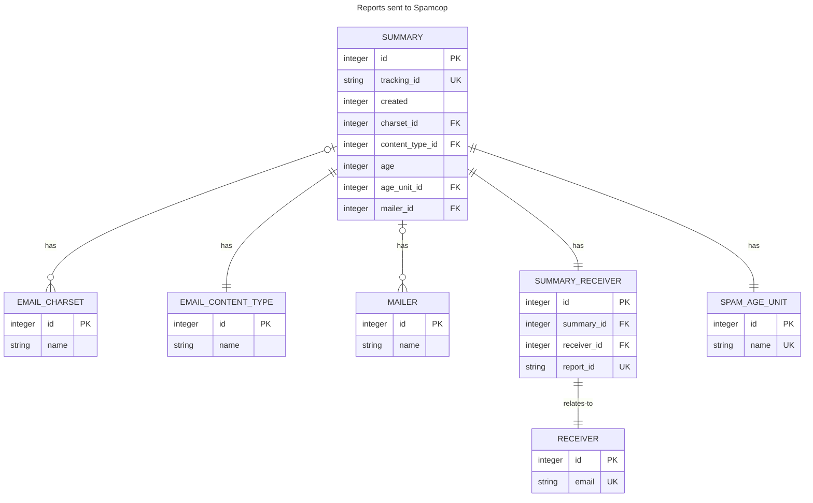

[](https://github.com/glasswalk3r/App-SpamcupNG/actions/workflows/unit-test.yml)

# App-SpamcupNG

## Description

App-SpamcupNG is a Perl web crawler for finishing
[SpamCop.net](https://www.spamcop.net/) reports automatically.

It will use your account details to login into SpamCop.net web page and finish
reporting your SPAM. Spamcup NG tries to be as polite as possible, introducing
forced delays to not overwhelm SpamCop.net website. All reports are sent
sequentially.

App-SpamcupNG also saves data from the report sends to Spamcop. The data
available are only those exposed by Spamcop itself, there is no correlation of
the statistics Spamcop have and save for themselves.

App-SpamcupNG is a fork from the original Spamcup project.

Spamcup is copyright (C) Toni Willberg.

## Introduction

In your favorite shell:

```
  $ spamcup
```

That's it! See the configuration file details.

You can also provide all the parameters in the command line. App-SpamcupNG
should be compatible with the command line options of Spamcup: check out the
program Pod for more information (`perldoc spamcup`).

Usage:

```
  $ spamcup -h
  spamcup <options> <SpamCop-Username>

  Options:
    -n Does nothing, just shows if you have unreported spam or not.
    -a Run in a loop untill all spam is reported.
    -s Stupid. Runs without asking confirmation. Use with care.
    -c Alternate method for signifying code. (Unpaid users WITHOUT username & password)
    -l Alternate method for providing username. (Paid & unpaid users with password)
    -p Method for providing password. (Required for users with password)
    -v Shows version and quit.
    -V Verbosity mode. Running "perldoc App::SpamcupNG" will provide more information on that.
    -h You are reading it.
```

## Warnings

Some important warnings before starting using it:

- The script does **not** know where the SPAM report will be sent so **it's
your responsibility**!
- If the script asks Spamcop to send reports to wrong places **it's your
fault**!
- If the script has a bug that causes same report being sent thousand times
**it's your mail addresses**!

## Setup

App-SpamcupNG is distributed as a regular Perl distribution, so you can do it
from [CPAN](http://search.cpan.org) by downloading it with your preferred CPAN
client or directly, by downloading the tarball (and doing the traditional
`perl Makefile.PL; make; make test; make install`).

Additionally, App-SpamcupNG ships with a `cpanfile`, which can allow you to
install directly from Github. See
[here](http://blogs.perl.org/users/mark_allen/2013/07/why-i-use-cpanfile-and-you-should-too.html)
for more details on that.

You will need administrator rights to install this globally unless you're lucky
to be on a UNIX-like OS and you install your own Perl interpreter (like those
installed by [perlbrew](https://perlbrew.pl/)).

[local::lib](https://metacpan.org/pod/local::lib) is also your friend to avoid
the need of administrative rights.

### Configuration file

You can also provide a configuration file to avoid having to provide the same
information everytime you want to execute the program.

The program will look for a configuration file name `.spamcupNG.yml` in the
corresponding home directory of the user (that will dependend on the OS you're
executing it). Pay attention to the dot ('.') in front of the file.

The configuration file must be written as an YAML file, with the exact
properties below:

```YAML
---
ExecutionOptions:
  all: y
  stupid: y
  check_only: n
  alt_code: n
  alt_user: n
  verbosity: INFO
  database:
    enabled: true
    path: /var/spamcupng/reports.db
Accounts:
  Yahoo!:
    e-mail: account@provider1.com.br
    password: FOOBAR
  Gmail:
    e-mail: account@provider2.com.br
    password: FOOBAR
```
All those options have their corresponding command line parameter. Be sure to
take care of file permissions to avoid disclosure of your SpamCop.net password!

### Local database

You probably noticed the following configuration lines from the YAML:

```YAML
  database:
    enabled: true
    path: /var/spamcupng/reports.db
```

Those lines define the configuration for a local database based on
[SQLite](https://sqlite.org/).

This database will save data related to the submitted reports and can be used
to provide further details of what kind of SPAM you're getting and from.

## Local database schema



# Copyright and license

This software is copyright (c) 2018 of Alceu Rodrigues de Freitas Junior,
<glasswalk3r@yahoo.com.br>

This file is part of App-SpamcupNG distribution.

App-SpamcupNG is free software: you can redistribute it and/or modify
it under the terms of the GNU General Public License as published by
the Free Software Foundation, either version 3 of the License, or
(at your option) any later version.

App-SpamcupNG is distributed in the hope that it will be useful,
but WITHOUT ANY WARRANTY; without even the implied warranty of
MERCHANTABILITY or FITNESS FOR A PARTICULAR PURPOSE. See the
GNU General Public License for more details.

You should have received a copy of the GNU General Public License
along with App-SpamcupNG. If not, see http://www.gnu.org/licenses/.
