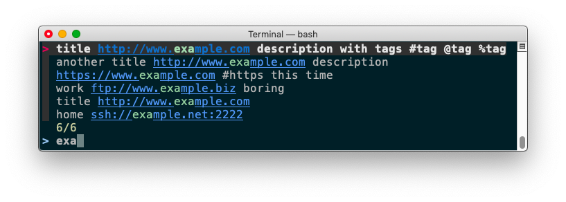

bookmarks - Export browser bookmarks as plain text.
===================================================

SYNOPSIS
--------

    $ bookmarks [-hVda] [-f format] [file ...]

    -h, --help      help
    -V, --version   version
    -d              debug
    -a              all files : process arguments and default locations
    -f format       any combination of letters t,u,d as title/url/description (default : tud)

DESCRIPTION
-----------

`bookmarks` is a tool to export bookmarks from files supplied as arguments, or
from browsers default locations (without arguments). The following browsers
and platform are supported :

- Safari (Mac)
- Firefox (Mac/Linux/Windows)
- Chrome (Mac/Linux/Windows)
- Internet Explorer (Windows)

Files named *.plist, *.sqlite and *Bookmarks are processed as Safari and Firefox
and Chrome bookmarks, respectively. Directories named *Favorites" are processed
as Internet Explorer favorites.

The fields `<title>`, `<url>` and `<description>` are retrieved (when existing) and
are available for exporting (in the desired format), by default :
`<title> <url> <description>`

The `<description>` field is filled with Safari's Description, Firefox's Tags or
empty for Internet Explorer.

SEARCH BOOKMARKS INTERACTIVELY FROM CLI
---------------------------------------

This tool can be used to search and open bookmarks interactively from the CLI. The following
instructions are for macOS, but it should be similar on any regular OS.



Install the wonderful [fzf](https://github.com/junegunn/fzf) (available in
[Homebrew](https://brew.sh)), [URI::Find](https://github.com/schwern/URI-Find) (CPAN),
[App::uricolor](https://github.com/kal247/App-uricolor) (CPAN),
and add these aliases to your shell :

**Open links(s) with default application :**
```
alias lk="safari-bookmarks.pl | uricolor | fzf --ansi --exact --multi | urifind | xargs open"
```

**Copy links(s) to clipboard :**
```
alias lkc="safari-bookmarks.pl | uricolor | fzf --ansi --exact --multi | urifind | pbcopy"
```

- `uricolor` colorizes URIs to distinguish them from title and description.
- `fzf` is a fuzzy finder (with many options) : use TAB for multiple selection, press ENTER to confirm, or ESC to cancel.
- `urifind` extracts all URIs. Try `uricolor -s` and `urifind --schemeless` to find schemeless URLs.
- Selected URIs will open with your default browser or application.
- Since `open` uses macOS _Launch Services_ to determine which program to run, most common schemes such as `ftp://` or `ssh://` are automatically recognized.


INSTALLATION
------------

To install this module automatically from CPAN :

    cpan App::bookmarks

To install this module automatically from Git repository :

    cpanm https://github.com/kal247/App-bookmarks.git

To install this module manually, run the following commands :

    perl Makefile.PL
    make     
    make test
    make install

PREREQUISITES
-------------

DBI, Config::Any, Config::Tiny (optional, for IE only), Win32 (optional)

SUPPORT AND DOCUMENTATION
-------------------------

After installing, you can find documentation for this module with the
perldoc command :

    perldoc bookmarks

You can also look for information at :

- CPAN

    [https://metacpan.org/release/App-bookmarks](https://metacpan.org/release/App-bookmarks)

- GITHUB

    [https://github.com/kal247/App-bookmarks](https://github.com/kal247/App-bookmarks)

LICENSE AND COPYRIGHT
---------------------

This software is Copyright (c) 2019 by jul.

This is free software, licensed under:

    The Artistic License 2.0 (GPL Compatible)