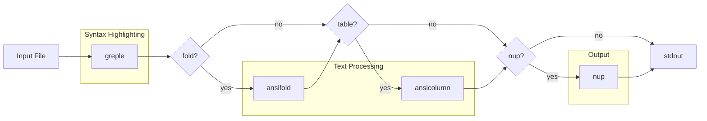

# App-mdee Project Instructions

## Overview

mdee (Markdown, Easy on the Eyes) is a Markdown viewer command implemented as a Bash script. It combines greple for syntax highlighting with nup for multi-column paged output.

## Project Structure

- `script/mdee` - Main script (Bash)
- `lib/App/mdee.pm` - Perl module (version info only)
- `t/` - Test files
- `t/test.md` - Color test file

## Development

### Testing Colors

```bash
./script/mdee t/test.md              # light mode
./script/mdee --mode=dark t/test.md  # dark mode
./script/mdee --list-themes          # show theme samples
```

### Theme System

Themes are defined as Bash associative arrays:
- `theme_default_light` - Light mode theme (full definition)
- `theme_default_dark` - Dark mode theme (only differences from light)

Dark theme inherits from light theme:

```bash
# After defining theme_default_dark with only different values
for k in "${!theme_default_light[@]}"; do
    [[ -v theme_default_dark[$k] ]] || theme_default_dark[$k]=${theme_default_light[$k]}
done
```

Field names are derived from theme keys (excluding `base`):

```bash
declare -a show_fields=()
for k in "${!theme_default_light[@]}"; do
    [[ $k != base ]] && show_fields+=("$k")
done
```

Color specifications use [Term::ANSIColor::Concise](https://metacpan.org/pod/Term::ANSIColor::Concise) format:
- `L00` - `L25`: Gray scale (L00=black, L25=white)
- `${base}`: Base color placeholder (expanded after loading)
- `+l10` / `-l10`: Adjust lightness
- `=l50`: Set absolute lightness
- `D`: Bold, `I`: Italic, `U`: Underline, `E`: Erase line
- `FG/BG`: Foreground/Background

## Implementation Notes

### Pipeline Architecture

mdee constructs a pipeline dynamically:



Each stage is optional (`--[no-]fold`, `--[no-]table`, `--[no-]nup`).

### Filter Mode

The `-f` / `--filter` option enables filter mode for simple highlighting:

```bash
mdee -f file.md           # highlight only (no fold, table, nup)
cat file.md | mdee -f     # highlight stdin
mdee -f --fold file.md    # highlight + fold
```

Implementation uses a callback function:

```bash
[       filter | f   !         # filter mode       ]=

filter() {
    fold=
    table=
    nup=
}
```

- The `!` marker triggers the callback when option is parsed
- Callback sets fold, table, nup to empty (disabled)
- Subsequent options (`--fold`, `--table`, `--nup`) can override
- Order matters: `-f --fold` enables fold, `--fold -f` disables it

### Greple Options

```bash
greple_opts=(-G --ci=G --all --need=0 --filestyle=once --color=always --prologue "$osc8_prologue")
```

- `-G`: Grep mode (line-based matching)
- `--ci=G`: Capture index mode - each captured group gets separate color
- `--all`: Output all lines (not just matches)
- `--need=0`: Output even if no matches
- `--prologue`: Define functions before processing (used for `osc8` function)

### Color Mapping with --cm

The `--cm` option specifies colors for captured groups, comma-separated:

```bash
--cm 'color1,color2,color3' -E '(group1)(group2)(group3)'
```

### Code Block Color Specification

Format: `opening_fence , language , body , closing_fence`

```bash
[code_block]='L10 , L10 , ${base}/L05;E , L10'
```

- 1st: Opening ``` color
- 2nd: Language specifier (e.g., `bash`, `perl`) color
- 3rd: Code body color (with background)
- 4th: Closing ``` color

Regex pattern ([CommonMark Fenced Code Blocks](https://spec.commonmark.org/0.31.2/#fenced-code-blocks)):
```
^ {0,3}(?<bt>`{3,}+|~{3,}+)(.*)\n((?s:.*?))^ {0,3}(\g{bt})
```

- `^ {0,3}`: 0-3 spaces indentation (CommonMark spec)
- `` `{3,}+|~{3,}+ ``: Backticks or tildes (3+ characters)
- Closing fence must use same character as opening

4 capture groups: opening fence, language, body, closing fence

### Inline Code Color Specification

Format: `before , match , after`

```bash
[inline_code]='/L05,/L05,/L05'
```

Regex pattern ([CommonMark Code Spans](https://spec.commonmark.org/0.31.2/#code-spans)):
```
(?<bt>`++)((?:(?!\g{bt}).)++)(\g{bt})
```

3 capture groups: opening backticks, content, closing backticks

### Header Colors

Light mode uses light background with dark text:
```bash
[h1]='L25DE/${base}'      # Gray text on base background
[h2]='L25DE/${base}+l10'  # Lighter background
```

Dark mode uses dark background with light text:
```bash
[h1]='L00DE/${base}'       # Black text on base background
[h2]='L00DE/${base}-l10'   # Darker background
[h3]='L00DN/${base}-l15'   # Normal weight, even darker
```

### Greple::tee Module

The `-Mtee` module allows greple to pipe matched regions through external commands.

#### Text Folding with ansifold

```bash
ITEM_PREFIX='^\h*(?:[*-]|\d+\.)\h+'
DEF_PATTERN='(?:\A|\G\n|\n\n).+\n\n?(:\h+.*\n)'
AUTOINDENT='^\h*(?:[*-]|\d+\.|:)\h+'

greple \
    -Mtee "&ansifold" --crmode --autoindent="$AUTOINDENT" -sw${width} -- \
    -GE "${ITEM_PREFIX}.*\\n" -E "${DEF_PATTERN}" \
    --crmode --all --need=0 --no-color
```

- `-Mtee`: Load tee module
- `"&ansifold"`: Call ansifold as function (not subprocess)
- `--crmode`: Handle carriage returns
- `--autoindent="..."`: Auto-indent pattern for list items and definitions
- `-sw${width}`: Silent mode with width
- `--`: Separator between tee args and greple args
- `-GE "..."`: Pattern to match list items
- `-E "..."`: Pattern to match definition lists

##### Definition List Pattern

`DEF_PATTERN='(?:\A|\G\n|\n\n).+\n\n?(:\h+.*\n)'`

- `(?:\A|\G\n|\n\n)`: Start of file, or after previous match, or after blank line
- `.+\n`: Term line
- `\n?`: Optional blank line between term and definition
- `(:\h+.*\n)`: Capture group for definition line (only this part is processed)

#### Table Formatting with ansicolumn

```bash
greple \
    -Mtee::config=discrete "&ansicolumn" -s '|' -o '|' -t --cu=1 -- \
    -E '^(\|.+\|\n){3,}' --all --need=0 --no-color
```

- `-Mtee::config=discrete`: Process each match separately
- `"&ansicolumn"`: Call ansicolumn as function
- `-s '|'`: Input separator
- `-o '|'`: Output separator
- `-t`: Table mode (auto-determine column widths)
- `--cu=1`: Column unit (minimum column width)
- `-E '^(\|.+\|\n){3,}'`: Match 3+ consecutive table rows

#### Table Separator Fix

After ansicolumn, a perl one-liner fixes the separator line:

```bash
perl -pE 's/ /-/g if /^ \| (\s* -+ \s* \|)+ $/x'
```

This replaces spaces with dashes in the `|---|---|` separator row.

### Field Visibility with --show Option

The `--show` option controls field visibility using a hash type with callback:

```bash
declare -A show=()

declare -A OPTS=(
    [         show |   %!          # field visibility   ]=
)

show() {
    local arg=$2 key val
    if [[ $arg == *=* ]]; then
        key=${arg%%=*} val=${arg#*=}
    else
        key=$arg val=1
    fi
    if [[ $key == all ]]; then
        for k in "${show_fields[@]}"; do
            show[$k]=$val
        done
    fi
}
```

- `%!`: Hash type with callback
- Callback receives `($optname, $arg)` - parse key=value from `$arg`
- `all` is special: sets all fields to the given value
- Order matters: `--show all= --show bold` disables all, then enables bold
- Individual key=value is automatically handled by getoptlong.sh

In `add_pattern`:

```bash
add_pattern() {
    local name=$1 pattern=$2
    local val=${show[$name]-1}  # unset defaults to 1 (enabled)
    [[ $val && $val != 0 ]] && greple_opts+=(--cm "${colors[$name]}" -E "$pattern") || :
}
```

### Emphasis Patterns (CommonMark)

Bold and italic patterns follow [CommonMark emphasis rules](https://spec.commonmark.org/0.31.2/#emphasis-and-strong-emphasis):

```bash
# Bold: ** and __
add_pattern bold '(?<!\\)\*\*.*?(?<!\\)\*\*'
add_pattern bold '(?<!\\)(?<!\w)__.*?(?<!\\)__(?!\w)'

# Italic: * and _
add_pattern italic '(?<!\\)(?<!\w)_(?:(?!_).)+(?<!\\)_(?!\w)'
add_pattern italic '(?<!\\)(?<!\*)\*(?:(?!\*).)+(?<!\\)\*(?!\*)'
```

Key rules:
- `(?<!\\)`: Not preceded by backslash (escape handling)
- `(?<!\w)` / `(?!\w)`: Word boundaries for `_` (prevents `foo_bar_baz` matching)
- `(?<!\*)` / `(?!\*)`: Not adjacent to `*` (distinguishes `*italic*` from `**bold**`)
- `(?:(?!\*).)+`: Match any character except `*`, and `.` excludes newlines (single-line only)
- `__` requires word boundaries (same as `_`)
- `**` doesn't require word boundaries (can be used mid-word)

### OSC 8 Hyperlinks

Links are converted to [OSC 8 terminal hyperlinks](https://gist.github.com/egmontkob/eb114294efbcd5adb1944c9f3cb5feda) for clickable URLs:

```bash
# Define osc8 function via --prologue
osc8_prologue='sub{ sub osc8 { sprintf "\e]8;;%2\$s\e\\%1\$s\e]8;;\e\\", @_ } }'

# Color functions using named captures
link_func='sub{ s/\[(?<text>.+?)\]\((?<url>.+?)\)/osc8("[$+{text}]",$+{url})/er }'
image_func='sub{ s/!\[(?<alt>.+?)\]\((?<url>.+?)\)/osc8("![$+{alt}]",$+{url})/er }'
image_link_func='sub{ s/\[!\[(?<alt>.+?)\]\(.+?\)\]\((?<url>.+?)\)/osc8("![$+{alt}]",$+{url})/er }'
```

Three link patterns:

| Pattern | Input | Output | Link Target |
|---------|-------|--------|-------------|
| link | `[text](url)` | `[text]` | url |
| image | `` | `![alt]` | img |
| image_link | `[](url)` | `![alt]` | url |

OSC 8 format: `\e]8;;URL\e\TEXT\e]8;;\e\`
- `\e]8;;URL\e\` - Start hyperlink with URL
- `TEXT` - Displayed text
- `\e]8;;\e\` - End hyperlink

The `osc8` function uses sprintf with positional arguments (`%2$s`, `%1$s`) to reorder text and URL.

### Mode Detection with [Getopt::EX::termcolor](https://metacpan.org/pod/Getopt::EX::termcolor)

Terminal background luminance is detected via Getopt::EX::termcolor module.

```bash
detect_terminal_mode() {
    local lum
    lum=$(perl -MGetopt::EX::termcolor=luminance -e luminance 2>/dev/null) || return
    [[ $lum ]] || return
    (( lum < 50 )) && echo dark || echo light
}
```

- `perl -MGetopt::EX::termcolor=luminance`: Import `luminance` function
- `-e luminance`: Execute the function (prints 0-100)
- Returns empty if terminal doesn't support background query
- Luminance < 50: dark mode
- Luminance >= 50: light mode

The module sends OSC 11 query to terminal and parses the response to calculate luminance from RGB values.

### [Getopt::Long::Bash](https://metacpan.org/pod/Getopt::Long::Bash) (getoptlong.sh)

Option parsing uses getoptlong.sh from Getopt::Long::Bash module.

#### OPTS Array Format

```bash
declare -A OPTS=(
    [&REQUIRE]=0.7.1 [&USAGE]="$USAGE"
    [  option | o  :  # comment  ]=default
)
```

Key format: `option_name | short_opt  spec  # comment`

- `option_name`: Long option name (becomes variable `$option_name`)
- `short_opt`: Single character short option
- `spec`: Option specification
- `# comment`: Description for help

#### Option Specifications

|Spec|Type|Description|
|-|-|-|
|(empty)|Boolean|Flag, sets variable to 1|
|`!`|Negatable|Supports `--no-option`|
|`+`|Incremental|Counter, increases with each use|
|`:`|Required arg|Requires argument value|
|`:=i`|Integer|Requires integer argument|
|`?!`|Optional+Negatable|Optional argument, negatable|
|`:>array`|Array append|Appends `--option=value` to array|
|`@`|Array|Array variable, supports comma-separated values|

#### Special Keys

- `[&REQUIRE]=version`: Minimum getoptlong.sh version
- `[&USAGE]="..."`: Usage message for --help

#### Callback Functions

If a function with the same name as an option exists, it's called after parsing:

```bash
pager() {
    [[ $pager ]] && nup_opts+=("--pager=$pager") || nup_opts+=("--no-pager")
}
```

#### Invocation

```bash
. getoptlong.sh OPTS "$@"
```

Sources the library with OPTS array name and arguments.

### Dependencies

- App::Greple - Pattern matching and highlighting tool with extensive regex support, used for syntax highlighting of Markdown elements including headers, bold text, inline code, and fenced code blocks
- App::ansifold - ANSI-aware text folding utility that wraps long lines while preserving escape sequences and maintaining proper indentation for nested list items
- App::ansicolumn - Column formatting tool with ANSI support that aligns table columns while preserving color codes
- App::nup - Paged output
- App::ansiecho - Color output
- Getopt::Long::Bash - Option parsing
- Getopt::EX::termcolor - Terminal detection

## Limitations

### HTML Comments

Only HTML comments starting at the beginning of a line are highlighted. Inline comments are not matched to avoid conflicts with inline code containing comment-like text (e.g., `` `<!-->` ``).

### Emphasis (Bold/Italic)

Emphasis patterns do not span multiple lines. Multi-line bold or italic text is not supported.

### Links

Link patterns do not span multiple lines. The link text and URL must be on the same line.

Reference-style links (`[text][ref]` with `[ref]: url` elsewhere) are not supported.

### OSC 8 Hyperlinks

OSC 8 hyperlinks require terminal support. Compatible terminals include iTerm2, Kitty, WezTerm, Ghostty, and recent versions of GNOME Terminal. Apple's default Terminal.app does not support OSC 8.

When using `less` as pager, version 566 or later is required with `-R` option.

## Build & Release

This project uses Minilla. See global CLAUDE.md for release instructions.

```bash
minil build    # Build and update generated files
minil test     # Run tests
minil release  # Release (interactive)
```

## Markdown Syntax Reference

This section demonstrates various Markdown syntax for testing mdee rendering.

### Blockquotes

> This is a blockquote.
> It can span multiple lines.

> Nested blockquote:
> > Inner quote with **bold** and `code`.

### Numbered Lists

1. First item
2. Second item with `inline code`
3. Third item with **bold text**

### Nested Lists

- Top level item
  - Second level with a longer description that should wrap when displayed in narrow width
    - Third level item
  - Another second level
- Back to top level

1. Numbered top level
   1. Nested numbered
   2. Another nested
2. Back to top

### Task Lists

- [x] Completed task
- [ ] Incomplete task with `code`
- [ ] Another todo item

### Horizontal Rules

Above the line.

---

Below the line.

### Links

- Inline link: [Greple documentation](https://metacpan.org/pod/App::Greple)
- Reference link: [Term::ANSIColor::Concise][tac]

[tac]: https://metacpan.org/pod/Term::ANSIColor::Concise

### Strikethrough

This is ~~deleted text~~ with strikethrough.

### Italic Text

Both syntaxes are supported:
- *Single asterisks* for italic
- _Single underscores_ for italic

Underscores require word boundaries: `foo_bar_baz` is not italic.

### Mixed Formatting

> **Important:** Use `--mode=dark` for dark terminals.
>
> ~~Old syntax~~ is deprecated. Use the new **`--theme`** option instead.
> Also supports *italic* and _emphasis_.

### Definition-style Content

**Term 1**
: Definition of the first term with `code` example.

**Term 2**
: Definition of the second term spanning a longer line that might need to be wrapped when displayed.
