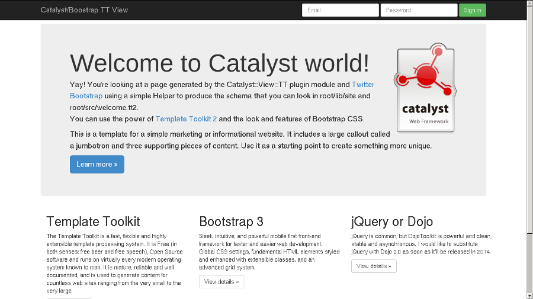

Catalyst--Helper--View--Bootstrap
=================================

A Catalyst web framework helper to init a HTML5 view using Twitter Bootstrap

So your starting page will be as

How to
------

use the helper to create the view module and templates

    $ script/myapp_create.pl view HTML5 Bootstrap

add something like the following to your main application module

    sub index : Path : Args(0) {
        my ( $self, $c ) = @_;
        $c->stash->{template} = 'welcome.tt2';
    }

    sub end : Private { # Or use Catalyst::Action::RenderView
        my ( $self, $c ) = @_;
        $c->forward( $c->view('HTML5') );
    }

