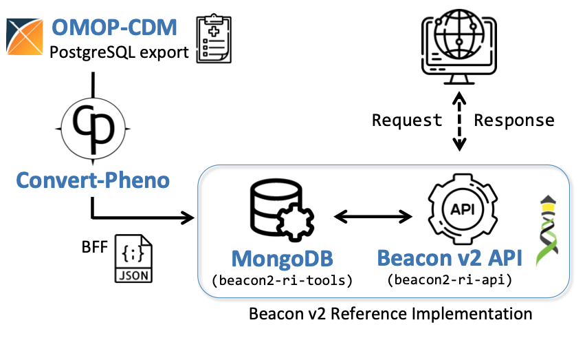

Frequently Asked Questions

## General

??? faq "What does `Convert-Pheno` do?"

    This tool facilitates the conversion of clinical data between commonly used formats, such as [GA4GH standards](https://www.ga4gh.org), to enable **secure data sharing** and discovery through **semantic interoperability**.

    ##### last change 2023-01-05 by Manuel Rueda [:fontawesome-brands-github:](https://github.com/mrueda)

??? faq "Is `Convert-Pheno` free?"

    Yes. See the [license](https://github.com/mrueda/convert-pheno/blob/main/LICENSE).

    ##### last change 2023-01-04 by Manuel Rueda [:fontawesome-brands-github:](https://github.com/mrueda)

??? faq "Can I use `Convert-Pheno` in _production_ software?"

    It's still in Beta so expect some bumps ahead.

    ##### last change 2023-06-27 by Manuel Rueda [:fontawesome-brands-github:](https://github.com/mrueda)

??? faq "If I use `Convert-Pheno` to convert my data to [Beacon v2 Models](bff.md), does this mean I have a Beacon v2?"

    I am afraid not. Beacon v2 is an [API specification](https://docs.genomebeacons.org), and the [Beacon v2 Models](bff.md) are merely a component of it. In order to _light a Beacon v2_, it is necessary to load the `JSON` files into a **database** and add an an **API** on top. Currently, it is advisable to utilize the [Beacon v2 Reference Implementation](https://b2ri-documentation.readthedocs.io/en/latest) which includes the database, the Beacon v2 API, and other necessary components.

    See below an example in how to integrate an OMOP-CDM export from SQL with Beacon v2.

    <figure markdown>
      { width="600" }
      <figcaption>Beacon v2 RI integration</figcaption>
    </figure>

    ##### last change 2023-06-20 by Manuel Rueda [:fontawesome-brands-github:](https://github.com/mrueda)

??? faq "What is the difference between Beacon v2 Models and Beacon v2?"

    **Beacon v2** is a specification to build an [API](https://docs.genomebeacons.org). The [Beacon v2 Models](https://docs.genomebeacons.org/models/) define the format for the API's responses to queries regarding biological data. With the help of `Convert-Pheno`, text files ([BFF](bff.md)) that align with this response format can be generated. By doing so, the BFF files can be integrated into a non-SQL database, such as MongoDB, without the API having to perform any additional data transformations internally.

    ##### last change 2023-02-13 by Manuel Rueda [:fontawesome-brands-github:](https://github.com/mrueda)

??? faq "Are you planning in supporting other clinical data formats?"

    Afirmative. Please check our [roadmap](future-plans.md) for more information.

    ##### last change 2023-01-04 by Manuel Rueda [:fontawesome-brands-github:](https://github.com/mrueda)

??? faq "Which ontologies are supported?"

    If the input files contain ontologies, the ontologies will be preserved and remain intact after the conversion process, except for:

    * _Beacon v2 Models_ and _Phenopackets v2_: the property `sex` is converted to [NCI Thesaurust](https://ncithesaurus.nci.nih.gov/ncitbrowser).
    * _OMOP-CDM_: the properties `sex`, `ethnicity`, and `geographicOrigin` are converted to [NCI Thesaurus](https://ncithesaurus.nci.nih.gov/ncitbrowser).

    |                | REDCap      | CDISC-ODM  | OMOP-CDM | Phenopackets v2| Beacon v2 Models |
    | -----------    | ----------- | ---------- | -------  | -------------- | -----------------|
    | Data mapping   | ✓ |  ✓ | ✓ | ✓ | ✓ |
    | Add ontologies | ✓ |  ✓ | `--ohdsi-db` |     |                  |

    For _REDCap_ and _CDISC-ODM_ we support:

    * [Athena-OHDSI](https://athena.ohdsi.org/search-terms/start) which includes multiple ontologies, such as _SNOMED, RxNorm or LOINC_
    * [NCI Thesaurus](https://ncithesaurus.nci.nih.gov/ncitbrowser)
    * [ICD-10](https://icd.who.int/browse10)
    * [CDISC](https://www.cdisc.org/standards/terminology/controlled-terminology) (Study Data Tabulation Model Terminology)
    * [OMIM](https://www.omim.org/) Online Mendelian Inheritance in Man
    * [HPO](https://hpo.jax.org/app) Human Phenotype Ontology (Note that prefixes are `HP:`, without the `O`)

    ##### last change 2023-07-03 by Manuel Rueda [:fontawesome-brands-github:](https://github.com/mrueda)

??? faq "Are longitudinal data supported?"

    Although Beacon v2 and Phenopackets v2 allow for storing time information in some properties, there is currently no way to associate medical visits to properties. To address this:

    * `omop2bff` -  we added an _ad hoc_ property (**_visit**) to store medical visit information for longitudinal events in variables that have it (e.g., measures, observations, etc.).

    * `redcap2bff` - In REDCap, visit/event information is not stored at the record level. We added this information inside `info` property.

    We raised this issue to the respective communities in the hope of a more permanent solution.

    ##### last change 2023-03-24 by Manuel Rueda [:fontawesome-brands-github:](https://github.com/mrueda)

??? faq "How are variables that cannot be mapped handled during the conversion process?"

    During the conversion process, when encountering variables that **cannot be directly mapped** to the target standard, two situations may arise. In the first situation, if the target format allows for additional properties, the variable will be stored under the _info property. This commonly occurs when converting from OMOP-CDM to BFFs. In the second situation, if the variable maps to other entities within Beacon v2 Models, it will be stored within BFF's _info term. An example of this is the storage of _biosample_ information in PXF files.

    ##### last change 2023-06-29 by Manuel Rueda [:fontawesome-brands-github:](https://github.com/mrueda)

## Installation

??? faq "There are multiple [download](download-and-installation.md) options, which one should I choose?"

    We recommend using the [containerized version](https://github.com/CNAG-Biomedical-Informatics/convert-pheno#containerized-recommended-method).

    The reason for this is that you'll get **all functionalities** working **out-of-the-box**.

    ##### last change 2023-06-27 by Manuel Rueda [:fontawesome-brands-github:](https://github.com/mrueda)

??? faq "I am installing `Convert-Pheno` from source ([non-containerized version](https://github.com/cnag-biomedical-informatics/convert-pheno#non-containerized)) but I can't make it work. Any suggestions?"

    #### Problems with Python / PyPerler

    !!! Failure "About PyPerler installation"
        Apart from [PypPerler](https://github.com/tkluck/pyperler#quick-install) itself, you may need to install `libperl-dev` to make it work.

        `sudo apt-get install libperl-dev`

    ##### last change 2023-01-04 by Manuel Rueda [:fontawesome-brands-github:](https://github.com/mrueda)
