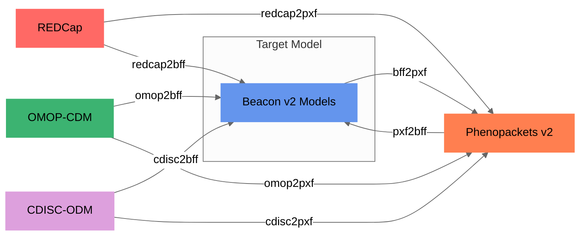

# Supported formats

<figure markdown>



  <figcaption>Convert-Pheno supported data conversions</figcaption>
</figure>

=== "Input formats:"

    * [Beacon v2 Models (JSON | YAML)](bff.md)
    * [Phenopacket v2 (JSON | YAML)](pxf.md)
    * [OMOP-CDM (SQL export | CSV)](omop-cdm.md)
    * [REDCap exports (CSV)](redcap.md)
    * [CDISC-ODM v1 (XML)](cdisc-odm.md)

=== "Output formats (Jun-2023):"

    * [Beacon v2 Models (JSON | YAML)](bff.md)
    * [Phenopacket v2 (JSON | YAML)](pxf.md)

    !!! Question "Why start with these two?"
        [Beacon v2](https://docs.genomebeacons.org) and [Phenopackets v2](https://phenopacket-schema.readthedocs.io/en/latest) are data exchange standards from the [G4AGH](https://www.ga4gh.org). Apart from phenotypic data, both standars allows for storing **genomic** data, which is a key component of today's research.

        Note that these output files are **intermediate** files that reach their full potential when loaded into a database. Once in the database their fields can be queried through an **API**, such as the [Beacon v2 API](https://docs.genomebeacons.org).


=== "Mapping steps:"

    Internally, all models are mapped to the [Beacon v2 Models](bff.md). 
    !!! Hint "Why use Beacon v2 as target model?"
        The reason for selecting Beacon v2 Model as the target for the conversion is its **schema flexibility**, which allows for the inclusion of variables that may not be present in the original schema definition. In contrast, Phenopackets v2 has stricter schema requirements. This flexibility offered by Beacon v2 schemas enables us to handle a wider range of phenotypic data and accommodate **additional variables**, enhancing the utility and applicability of our tool.

    <figure markdown>
    ```mermaid
    %%{init: {'theme':'neutral'}}%%
    graph LR
      subgraph "Step 1:Conversion to Beacon v2 Models"
      C[REDCap] -->|redcap2bff| A[Beacon v2 Models]
      D[OMOP-CDM] -->|omop2bff| A
      E[CDISC-ODM] -->|cdisc2bff| A
      end

      subgraph "Step 2:BFF to PXF"
      A --> |bff2pxf| B[Phenopackets v2]
      end

      style A fill: #6495ED, stroke: #6495ED
      style B fill: #FF7F50, stroke: #FF7F50
      style C fill: #FF6965, stroke: #FF6965
      style D fill: #3CB371, stroke: #3CB371
      style E fill: #DDA0DD, stroke: #DDA0DD
    ```
      <figcaption>Convert-Pheno internal mapping steps</figcaption>
    </figure>
