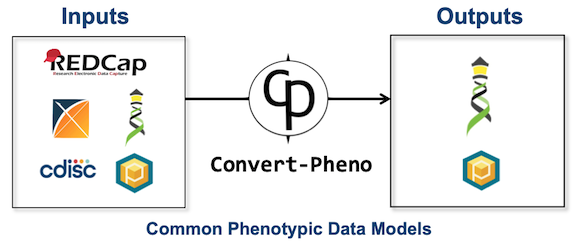

# What is Convert-Pheno?

`Convert-Pheno` is a software toolkit for the interconversion of standard data models for phenotypic data.

<figure markdown>
 {width="500"}
 <figcaption>Convert-Pheno schematic view</figcaption>
</figure>

!!! Tip "Modes of operation:"

    `Convert-Pheno` can be operated as a:

    * [Command-line interface](use-as-a-command-line-interface.md)
    * [Module](use-as-a-module.md)
    * [API](use-as-an-api.md)
    * [Web App User Interface](https://cnag-biomedical-informatics.github.io/convert-pheno-ui)
