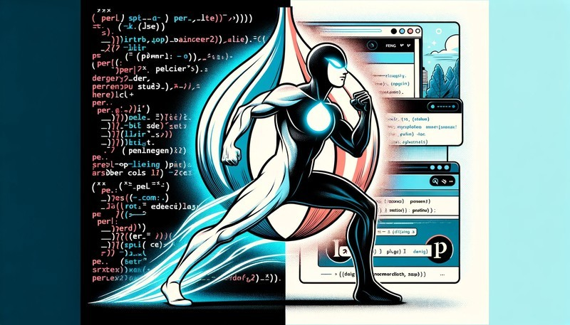

Welcome to your Liteblog site. This is an example of an article written under
the <code>tech</code> category. It is written in Markdown format.

You can freely edit or remove this article, it is just there to help you get
started with Liteblog conventions.

## The 'Blog' widget

The blog engine of Liteblog is super simple and minimalist. There is no database
at all. Everything (regarding content or even settings) is done via static files
(either YAML or Markdown).

The blogging system is handled via a Widget which is responsible for finding
articles, listing them in the appropriate category pages, rendering them, etc.

Here is a setting that enables the blogging widget: 

<pre><code class="yaml">liteblog:
  ...
  widgets:
    - name: blog
      params:
        title: "Read my Stories"
        root: "articles"
</code></pre>

In this case, <code>root</code> is the parent directory where the Blog widget
will look for content. 

You can inspect this folder in your current app, the scaffolder already
populated everything you need.

## Articles and Pages in Liteblog

In Liteblog, articles and pages are almost the same thing. The only difference
is their location:

  * articles are located under a sub-folder that represents their category (in
    this example, we are under the <code>tech</code> category, hence the article
    is under the <code>/blog/tech</code> prefix.
  * pages are located at the top-level directory of the content folder.

As you can see, an article or a page is represented by three elements: 

  1. the directory of the article (equivalent to its slug in the path)
  2. the meta.yml file, where you can set all appropriate meta-data of the
     article (its title, some tags, or even a featured image).
  3. the content itself (written in Markdown format), located in
     <code>content.md</code>

## About images integration in your articles/page

It's super easy to include images in your articles. The recommended way to
proceed is simply to host your assets within the article/page directory and just
source them with a relative path. 

Just like that : 

<pre><code class="html">&lt;img src="featured.jpg" /&gt;</code></pre>

Which renders properly into that : 

## It's your time to start editing!

Now, you know everything you need to write your own content. Why not starting by
editing this article? 

It's located in your app directory, under
<code>articles/tech/first-article/</code>

Happy Liteblogging!

## More about Liteblog

Feel free to [give Liteblog a star on CPAN Ratings](https://metacpan.org/dist/Dancer2-Plugin-LiteBlog) 
and [follow the official GitHub Project](https://github.com/sukria/Dancer2-Plugin-LiteBlog).

Voilà.
