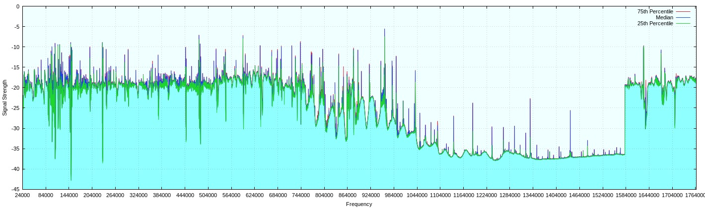
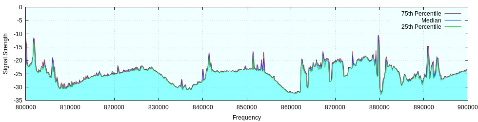

# gqrx-plot

## Overview

This is an example script demonstrating the usage of GQRX::Remote.  The script generates data on signal strength for a range of frequencies.  It does this by walking through the frequencies and taking multiple samples of the signal strength at each stop.  It then writes out the frequency and the 10th, 50th, and 90th percentile of signal strength values.

The data generated from this script can be useful for comparing different antenna configurations and other options to see how it impacts the results.

Here is an example visualization of the data generated by running over the full range of a cheap SDR device:




## Usage

The top of the script contains an OPTIONS section that is used to specify the options for the run.  To use, modify this section with the desired values and then run the script.  GQRX must be running and accepting conncections.

The sample `start_frequency` and `end_frequency` are set to scan the spectrum between 24 MHz and 1.76 GHz.  This is the range supported by many cheap SDR devices.  Any range can be used.  For example, to scan between 800 and 900 mHz:

```perl
   start_frequency => 800000,
   end_frequency => 900000,
```

Note that scanning a large range, such as what is used by default settings, can take a couple hours.  The time can be reduce by lowering the `num_samples` an the `sample_delay`.

The `step_size` is the amount of kHz too jump between each sample.  This should normally match the size of the `demodulator`.  The script defaults to using `WFM` since it helps for quickly sampling a wide area.  More fine measurements can be taken by changing the `demodulator` and choosing an appropriate `step_size`.


## Graphing

Here is an example visualization of the data generated by running this script over the 800 to 900 MHz range:



To create these graphs, a simple gnuplot script is included named `make-chart`.  This is setup to write a file `output.png` with a 2560x960 image.  Gnuplot is very feature rich, and it is easy to modify the chart and its output in many ways.  For more information, see the [gnuplot manual](http://www.gnuplot.info/documentation.html).  For a simpler way of dealing with the output data, it could be imported into a spreadsheet application.

The script is setup for charting the data from the default 24 MHz to 1.76 GHz range.  If an alternate range is being charted, the `set xtics` line will need to be adjusted or removed so that the X axis numbering is done reasonably.

