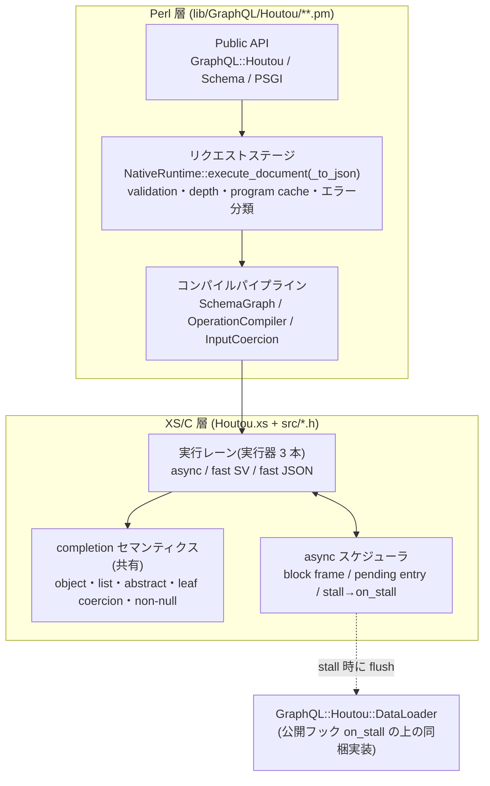
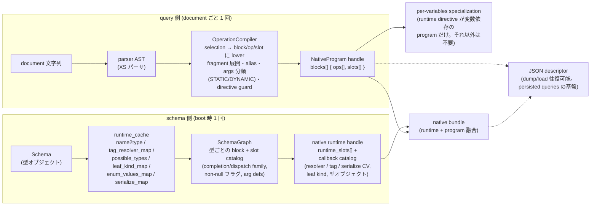
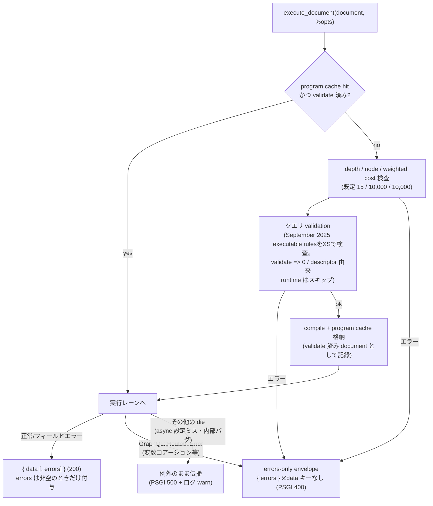
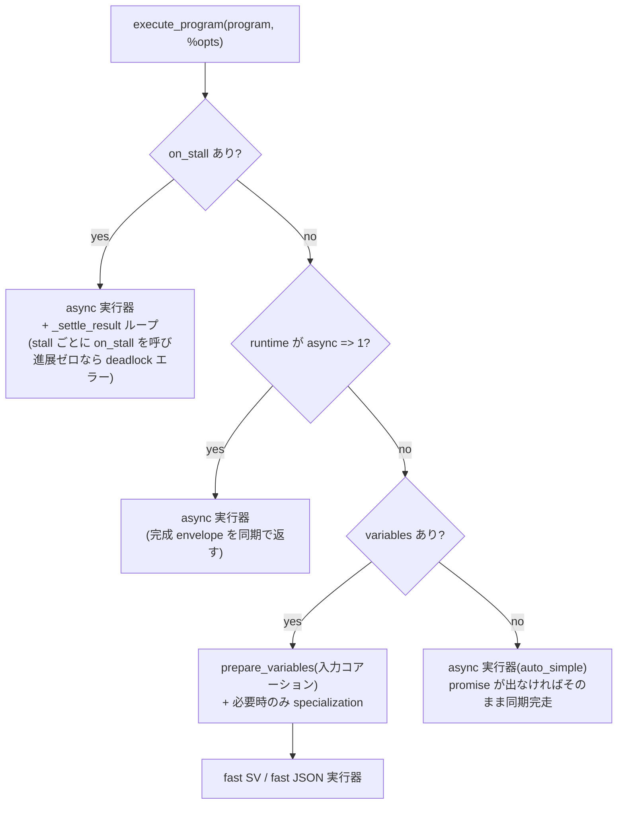
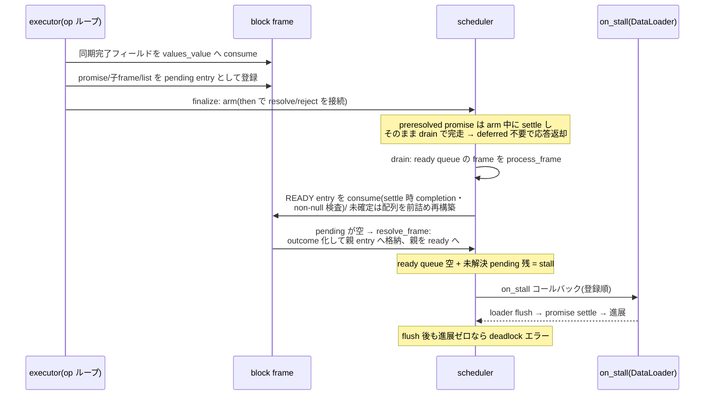

# GraphQL::Houtou アーキテクチャ全体図 (2026-07-16)

現在の実装におけるリクエスト validation、エラー envelope、結果コアーション、
Non-Null 伝播を含む全体像。個々のモジュールの責務は `module-map.md`、
opcode と実データ layout は `vm-internals-ja.md` を参照。この文書は
**データの流れと実行時の構造**を図で押さえるための地図である。

## 1. 全体レイヤ



原則: **キャッシュするのは実行計画**であり、
hot path の内部表現に Perl の HV/AV を使わない。schema と query を段階的に
lower して native 構造体で実行する。

## 2. コンパイルパイプライン

boot 時に 1 回(schema 側)、document ごとに 1 回(query 側)。以降は全部
キャッシュされ、リクエスト処理はコンパイル済み artifact の上だけを走る。



押さえどころ:

- **slot** はフィールドのメタデータの単位。completion family(GENERIC/
  OBJECT/LIST/ABSTRACT)、dispatch family(TAG/RESOLVE_TYPE/...)、
  `return_type_kind_code == 8`(最外 Non-Null)と `item_non_null`([T!])、
  leaf kind(コアーション用)を運ぶ
- **op** は「slot × クエリでの出現」。opcode = resolve 系 × complete 系で
  実行器の dispatch table を引く。子 selection は child_block_index、
  abstract は member block 群を持つ
- schema 由来のコールバック(resolver / tag_resolver / resolve_type /
  is_type_of / カスタム scalar の serialize)は **callback catalog** に
  slot index で引ける形で常駐する。実行中に Perl の型オブジェクトを
  たどることはない

## 3. リクエストパイプライン

`NativeRuntime::execute_document` / `execute_document_to_json` の入口。



エラー分類(**この 3 分類が全 API/PSGI の契約**):

| 分類 | 例 | 応答 |
|---|---|---|
| request error | 構文エラー、validation 違反、depth 超過、変数/リテラルの入力コアーション失敗 | `{ errors }`(data なし)。PSGI は 400 |
| field error | resolver の die、結果コアーション失敗、abstract 解決不能、Non-Null 違反 | `{ data, errors }` の errors 内。200 |
| config/internal | async => 1 忘れ、スケジューラ deadlock、内部バグ | 例外。PSGI は 500 + 詳細はログ |

XS の入力コアーション(`prepare_program_variables`)は失敗を
`GraphQL::Houtou::Error` に包んで croak し、この境界が envelope 化する。
plain string の die は internal 扱いのまま — **リクエスト起因の失敗だけを
blessed error にする**のが規律。

### なぜこのステージは Pure Perl か(意図的な設計判断)

「ループは native、ポリシーは Perl」の原則をこの層に適用した結果で、
XS 化しない理由は 3 つ:

1. **document 単位のコールドパスで、program cache が償却する。**
   ステージの実務(depth 検査・validation・コンパイル)が走るのは
   未キャッシュの document につき 1 回。ホットパスは Perl ハッシュを
   2 回引いて即 XSUB に入る。ゲートコストは単体計測でノイズの範囲
   (validate 全 on 86.8k/s vs 全 off 85.7k/s)。P0-1 導入時に一度
   15% 退行したのは cache 判定より前に毎回 parse していたのが原因で、
   ステージが Perl であること自体ではない(ホットパス復元で解消済み)。
2. **中身がポリシーで、Perl の道具が本体。** エラー分類は Perl 例外を
   eval で受けて blessed 判定するのが仕事の中心。オプション優先順位、
   validate オプトアウト、descriptor 由来 runtime の判定、cache eviction
   との連動など、変更頻度の高いオーケストレーションを Perl に置くことで
   反復を安くし、XS の表面積(ASan/soak/シード掃引が必要な領域)を
   増やさない。
3. **重いループは既に XS に降りている。** ステージが委譲する先 —
   パーサ、depth/node/weighted cost walk、validation ルール群
   (src/validation.h)、入力コアーション、
   実行本体 — は全部 native。Perl に残るのは depth walk(未キャッシュ時
   のみ)と directive 検査程度。

留意点: persisted queries なしでユニーククエリが無限に流れる運用では
ステージが毎リクエスト走るが、その場合の支配項も parse + validation +
limits walk(既に XS)であり、Perl のオーケストレーション部は小さい定数。
ポリシー値とcache signatureの管理をPerlに残すことで、上限変更時にも
native walkを使いながら入口の契約を保てる。

## 4. 実行レーン

実行器は 3 本。エントリポイント(XSUB)は複数あるが、実体はこの 3 つに
収束する。

| 実行器 | 実装 | 特性 | 主なエントリポイント |
|---|---|---|---|
| **async** | frame/scheduler ベース(`exec_state_*` / `complete_current_native_async_sv`) | promise を待たずに前進し、settle 時に completion。DataLoader はここ | `execute_native_program_auto_xs` / `auto_simple` / `auto_to_json` |
| **fast SV** | `execute_block_fast_sv`(再帰下降で HV/AV を直接組む) | 全 resolver 同期前提(promise は croak)。envelope を返す | `execute_native_program_handle_xs`(variables あり実行)、`execute_native_bundle_xs` |
| **fast JSON** | `execute_block_fast_json`(JSON バイト列へ直接 append) | 中間表現なしで最速。クエリのフィールド順を保存 | `execute_native_program_to_json_xs`、`execute_native_bundle_to_json_xs` |

ルーティング(`execute_program` / `execute_program_to_json`):



**レーンパリティ規律**(xs-coding-rules.md ルール 8): completion の
意味論は実行器ごとに実装が分かれるため、仕様上の分岐(null → null、
非配列リスト、abstract 解決不能、leaf コアーション、non-null 伝播)は
**全実行器に同じガードが要る**。判断ロジックはヘルパへ寄せ
(`serialize_leaf_sv` / `select_abstract_child_block_fast` /
`record_nonnull_violation`)、emit だけをレーンに残す。t/44・t/49・t/50 が
全エントリポイント横断のパリティバッテリ。

## 5. completion セマンティクス(spec 6.4)

各 op の実行は「resolve → runtime directive → complete」。complete は
slot の family で分岐し、全レーン共通の仕様分岐を持つ。

| family | 挙動 | エラー時 |
|---|---|---|
| OBJECT | null → null。非 null → child block を source の上で実行 | — |
| LIST | 非配列 → field error + null。項目ごとに child block / abstract 選択 / leaf コアーション | `[T!]` の null 項目 → リスト全体 null(下記) |
| ABSTRACT | tag_resolver → resolve_type → possible_types(is_type_of) の順で member 型を解決し member block 実行 | 解決不能 → field error + null(生 source は漏らさない) |
| GENERIC (leaf) | **結果コアーション**: Int(int32・数値文字列可)/ Float / String・ID(文字列化)/ Boolean(真偽値化)/ Enum(内部値→名前、非メンバー拒否)/ カスタム scalar(serialize CV 呼び出し) | 失敗 → field error + null |

**Non-Null 伝播**: null が `return_type_kind_code == 8` の位置に
入ると "Cannot return null for non-nullable field Parent.field." を 1 回
記録して**囲むオブジェクトごと null 化**し、nullable な位置まで(なければ
data まで)バブルする。エラーの重複は「この null は既にエラーを運んでいる」
フラグで防ぐ:

- sync 系レーン: `exec_state->null_carries_error`(ブロック実行は
  NULL 返却 / JSON はバイト列切り戻しで伝播を通知)
- async レーン: `outcome->null_carries_error` + `frame->self_nulled`

既知のレーン差(仕様適合の範囲): リスト内の複数違反で sync 系は最初の
違反で打ち切り(1 エラー)、async は全項目を報告する。

## 6. async スケジューラ

DataLoader バッチングの土台。**promise を待たずに実行を進め、進めなく
なった時点(stall)で on_stall が loader を flush する**(= 依存の波
単位のバッチング。レベル順BFSを専用の実行方式として導入せずに、同等の
バッチ境界を得る。

### 6.1 データモデル

```
exec state ── response frame ── block frame(1 selection block の実行状態)
                                 ├─ values_value   … 構築中の native object
                                 ├─ pending_entries[] … 未確定フィールド
                                 ├─ parent_frame / parent_entry_index
                                 └─ self_nulled    … non-null 違反で null 化予約

pending entry(1 未確定フィールド)
  ├─ result_name / path_frame / block・slot・op index(伝播判定に使用)
  ├─ payload kind:
  │    PROMISE_SV(1)            生 promise(値は素通し)
  │    OUTCOME_PTR(2)           確定済み outcome
  │    GENERIC_VALUE_SV(3)      settle 値を completion なしで格納(非 leaf の GENERIC)
  │    RESOLVED_VALUE_SV(4)     settle 時に completion を実行(leaf コアーション含む)
  │    BLOCK_FRAME_PTR(5)       子オブジェクトの frame(promise を挟まず直結)
  │    LIST_PENDING_PTR(6)      未確定項目を含むリスト
  └─ state: WAITING_UNARMED → WAITING_ARMED → READY_SV / READY_OUTCOME
```

### 6.2 リクエストの一生



不変条件(踏んだバグ由来。xs-coding-rules.md ルール 5〜7):

- arm 済み entry の then コールバックは entry index を値で持つ。
  process_frame の配列再構築で index が前詰めされるため、**再 push 時に
  ctx を retarget** する(`armed_resolve_ctx`/`armed_reject_ctx`)
- finalize の arm は `draining=1` で包む(arm 中に pending 配列の swap は
  起きない)
- 実行スタック上の親 frame は ready queue に入れない
- rejection は entry へ**直接**届く(派生 promise に outcome を落とさない)

### 6.3 Non-Null 伝播の async 経路

フィールド値が frame に入る全地点(同期 consume / process_frame の各
payload 消費 / list_pending 完了 / sync リスト組み立て)で
「null × slot の non-null」を検査 → 違反なら `frame->self_nulled`。
self_nulled な frame は resolve 時に `null_carries_error` 付きの null
outcome になり、親でも同じ検査が走って連鎖する。root まで届けば
data:null。

## 7. ファイルマップ

```
lib/GraphQL/Houtou.pm            公開入口(parse / execute / build_* )
lib/GraphQL/Houtou/
  Schema.pm                      型システムの根。runtime_cache(leaf/enum/serialize マップ含む)
  Type/*.pm                      Object/Interface/Union/Enum/Scalar/InputObject/List/NonNull
  Validation.pm + Validation/    クエリ validation の facade(実体は XS)+ depth limit
  Runtime/
    NativeRuntime.pm             リクエストステージ・レーン選択・program/specialization cache
    SchemaGraph.pm               schema lowering(block/slot catalog)
    OperationCompiler.pm         document lowering(compact program)
    InputCoercion.pm             変数準備の facade(実体は XS)
    Slot.pm ほか                 lowering artifact(inflate/debug 用)
  DataLoader.pm                  同梱 loader(公開フック on_stall の上に実装)
  PSGI.pm                        GraphQL over HTTP アダプタ(400/500 マッピング)
  Error.pm                       GraphQL::Houtou::Error(request error のマーカー)

lib/GraphQL/Houtou.xs (~11k 行)  実行器 3 本・async スケジューラ・XSUB 境界
src/vm_runtime.h (~5.6k 行)      native 構造体・プール・outcome/writer・入力コアーション・serialize_leaf_sv
src/schema_compiler.h            schema 検証の C 補助(DOES dispatch 等)
src/validation.h                 クエリ validation ルール(XS 実装)
src/parser_*.h                   XS パーサ内部(runtime mainline とは分離)
```

## 8. 検証系との対応

| 関心 | 固定するテスト/ツール |
|---|---|
| レーンパリティ(completion 意味論) | t/44(エッジケース)/ t/49(コアーション)/ t/50(non-null) |
| リクエストステージ | t/47(validation 結線)/ t/48(エラー envelope) |
| DataLoader / stall バッチング | t/36 / t/40 / t/41 / t/42(定番例題)|
| メモリ安全 | robustness.yml(ASan CI)+ PERL_HASH_SEED 掃引 + util/soak-test.pl |
| 性能ゲート | util/execution-benchmark-checkpoint.pl(退行検知は checkpoint 比較)|

変更時のチェックリストは `xs-coding-rules.md`(プール契約・borrowed
ポインタ・スケジューラ不変条件・レーンパリティ・ASan/soak 手順)。
