# GraphQL-Houtou アーキテクチャ進化と高速化の解説

> この文書は、graphql-perl・旧GraphQL::Houtou・現GraphQL::Houtouの3世代にわたる実装の変遷を、
> GraphQL や XS/C の知識がない方にも伝わるよう解説したものです。
> 図はすべて Mermaid.js で記述しています。

---

## 1. はじめに — GraphQL と Perl/XS の基礎

### 1-1. GraphQL とは何か

GraphQL は、API からデータを取得するためのクエリ言語です。
REST API が「URL ごとに決まったデータを返す」のに対し、GraphQL は「クライアントが必要なデータの形を指定して取得できる」仕組みです。

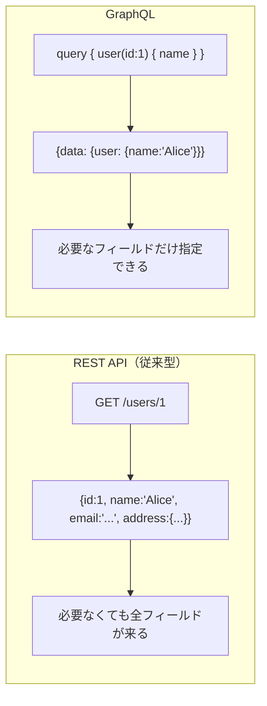

GraphQL の処理には大きく2段階あります。

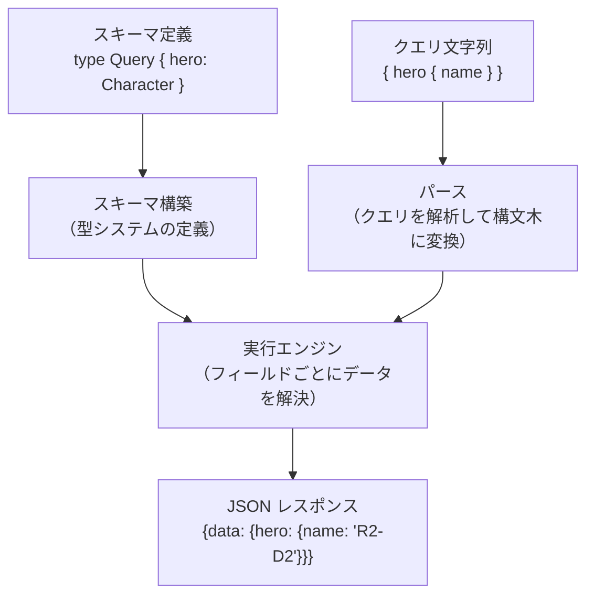

**フィールド解決（resolver）** とは「クエリが求める各フィールドの値を取得する処理」です。
たとえば `hero.name` を解決するには、データベースや別サービスから `"R2-D2"` という値を取り出します。

### 1-2. Perl と XS とは何か

**Perl** はスクリプト言語です。簡潔に書けますが、実行は比較的遅いです。

**XS（eXternal Subroutine）** は、Perl の関数を C 言語で実装する仕組みです。
C 言語はコンパイル済みバイナリで動くため、Perl より大幅に速く動作します。

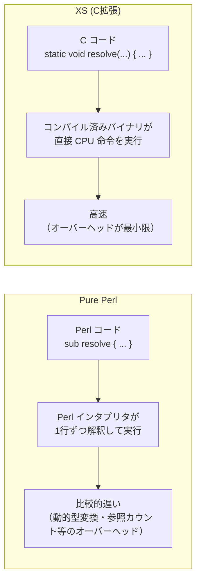

### 1-3. Perl と C の境界コスト

XS を使う際の重要な前提として、**Perl と C の境界（Perl↔C 境界）を越えるたびにコストが発生する**点があります。
このコストを本文書では「**境界コスト**」と呼びます。

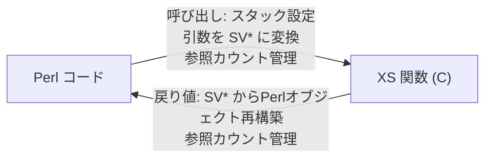

関数1回の境界越えのコストは小さいですが、**ホットパス（1リクエストで何十〜何百回も実行される処理）で繰り返し発生すると無視できない負荷**になります。
この「境界コスト」が、後述する「部分的なXS化がかえって遅くなる」現象の根本原因です。

---

## 2. 第1世代: graphql-perl（Pure Perl 実装）

graphql-perl は **このプロジェクトとは独立した Perl の GraphQL 実装**です。
XS を一切使わず、すべて Pure Perl で書かれています。

### 2-1. 処理フロー

```mermaid
flowchart TD
    USER["execute(schema, '{ hero { name } }', root)"]

    USER --> PH1["Phase 1: スキーマ定義\nMoo/MooseX クラスで型オブジェクトを構築"]
    USER --> PH2["Phase 2: クエリのパース\nPegex（Pure Perl PEG パーサ）"]

    PH1 --> PH3
    PH2 --> PH3

    PH3["Phase 3: 実行コンテキスト構築\n_build_context()"]
    PH3 --> PH4["Phase 4: フィールド解決\n_execute_fields()"]
    PH4 --> PH5["Phase 5: 値の完成\n_complete_value()"]
    PH5 -->|"再帰"| PH4
    PH5 --> PH6["Phase 6: レスポンス組み立て\n_build_response()"]
    PH6 --> JSON['{"data":{"hero":{"name":"R2-D2"}}}']
```

### 2-2. パーサ: Pegex

Pegex は PEG（Parsing Expression Grammar）文法を Perl で実装したパーサフレームワークです。
クエリ文字列を1文字ずつスキャンし、ルールがマッチするたびに Perl のメソッド呼び出しが発生します。

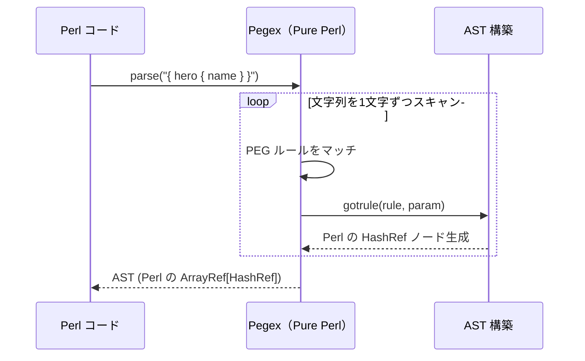

### 2-3. 実行エンジン: 再帰的な Perl 関数呼び出し

フィールドの解決は `_execute_fields` と `_complete_value` が互いを再帰的に呼び合う構造です。

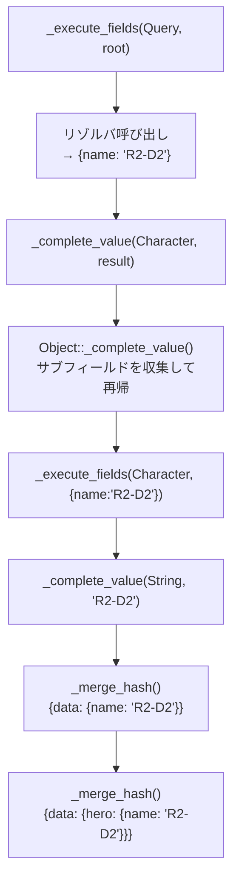

### 2-4. 内部表現: `ExecutionPartialResult`

処理の中間結果は常に Perl の HashRef `{ data => ..., errors => [...] }` として受け渡されます。
フィールドの深さ × 幅の数だけ HashRef が生成・破棄されます。

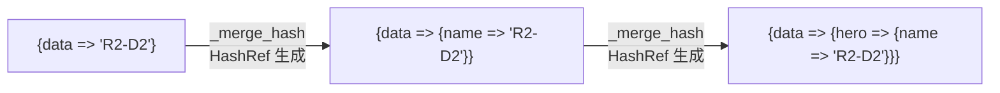

### 2-5. 速度の限界

graphql-perl の速度は次の要因によって上限が決まります。

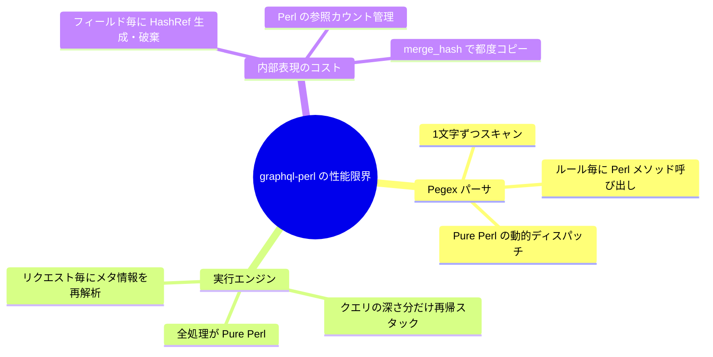

---

## 3. 第2世代: 旧GraphQL::Houtou（compiled_ir アーキテクチャ、〜ba7fbec）

### 3-1. 概要

旧GraphQL::Houtouは、graphql-perl の**ホットパスを段階的に XS/C に移植した**実装です。
中心にあったのが **compiled_ir（コンパイル済み中間表現）** という仕組みです。

graphql-perl との最大の違い:
- XS で書かれたパーサ（Pegex を廃止）
- スキーマ・クエリを事前にコンパイルして実行計画（IR）をキャッシュ
- ホットパスの関数を XS 化

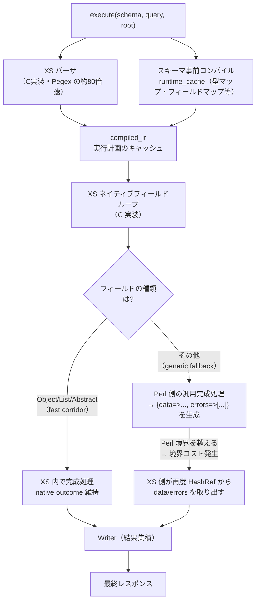

### 3-2. 段階的 XS 化の戦略と「corridor（回廊）」

旧GraphQL::Houtouでは、特定の処理パターンに対して **corridor（回廊）** と呼ばれる高速路を設けました。
Object/List/Abstract という完成タイプごとに専用の C コードを用意し、Perl に戻らず C のまま処理を完結させる試みです。

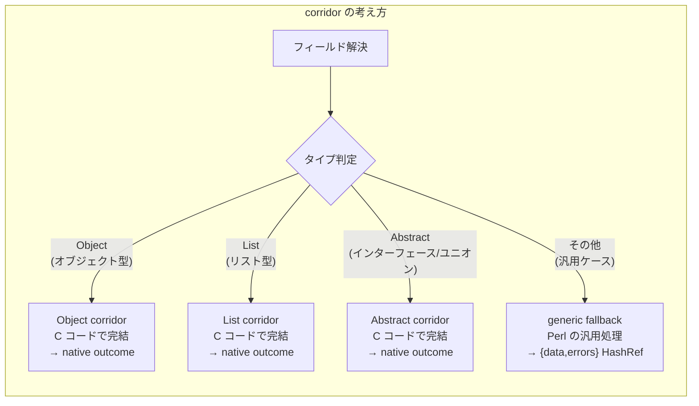

### 3-3. 速度の頭打ち: 境界コストの蓄積

corridor 戦略は効果がありましたが、**corridor を抜けるたびに Perl の HashRef 形式に戻す必要がありました**。
これが速度の頭打ちの根本原因です。

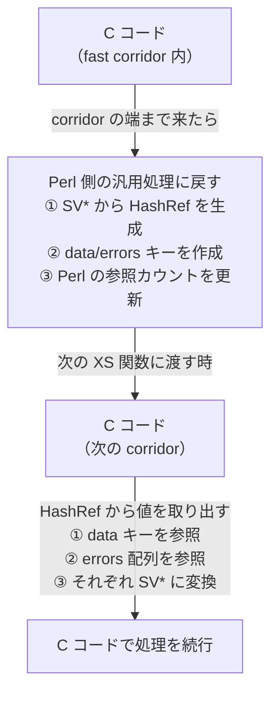

この「C → Perl HashRef 生成 → C で再取り出し」のサイクルが、フィールドの数だけ繰り返されます。
corridor が増えるほど corridor の端での折り返しも増え、**改善が小さくなる一方で複雑さだけが増す**という状況になりました。

### 3-4. 旧GraphQL::Houtouの速度上限

ba7fbec 時点での実測値（compiled_ir 最終版）:

| ケース | 旧GraphQL::Houtou (ops/sec) |
|--------|-----------------------------|
| nested_variable_object | ~56,878〜81,023 |
| list_of_objects | ~58,195〜59,935 |
| abstract_with_fragment | ~38,894〜41,818 |

内部ドキュメント（`docs/compiled-ir-vm-runtime.md`）には次の診断が記録されています：

> 残っているコストは、1つのルックアップよりも、重要なランタイム判断がすでに行われた後でも
> 実行が汎用完成処理や Perl 所有の中間表現に戻ってしまうという事実に支配されている。
> したがって次の有益なステップは、compiled_ir の実行をローカルな fast path の連鎖ではなく、
> 新しいランタイムにすることである。

つまり、**「局所的な高速化を積み重ねる」方向では頭打ちに達した**という判断です。

---

## 4. 部分的な XS 化がかえって遅くなる理由

旧GraphQL::Houtouの経験で明らかになった重要な教訓として、
**「Perl で書かれた処理を部分的に XS に置き換えると、場合によってかえって遅くなる」**という現象があります。

### 4-1. 問題の構造

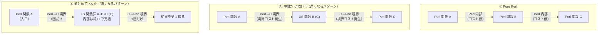

### 4-2. なぜ部分 XS 化が遅くなるのか

Perl から XS 関数を呼び出すには、次の処理が毎回発生します。

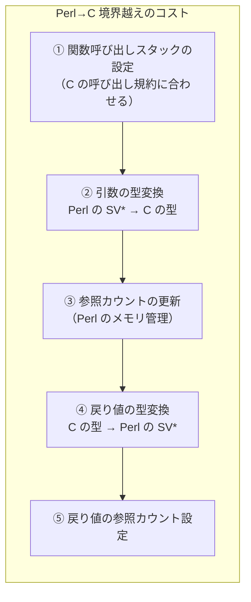

これが**1回**なら許容範囲ですが、旧GraphQL::Houtouではホットパスで何十回も発生していました。

さらに、XS 関数が **Perl の HashRef `{data => ..., errors => [...]}` を受け取って返す設計のまま**だと、次のコストも毎回かかります。

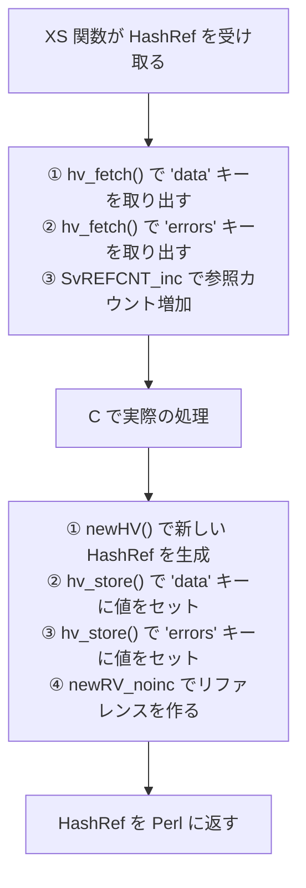

**XS にしても HashRef の生成・破棄コストはなくならない**のです。

### 4-3. 旧GraphQL::Houtouでの具体的な問題

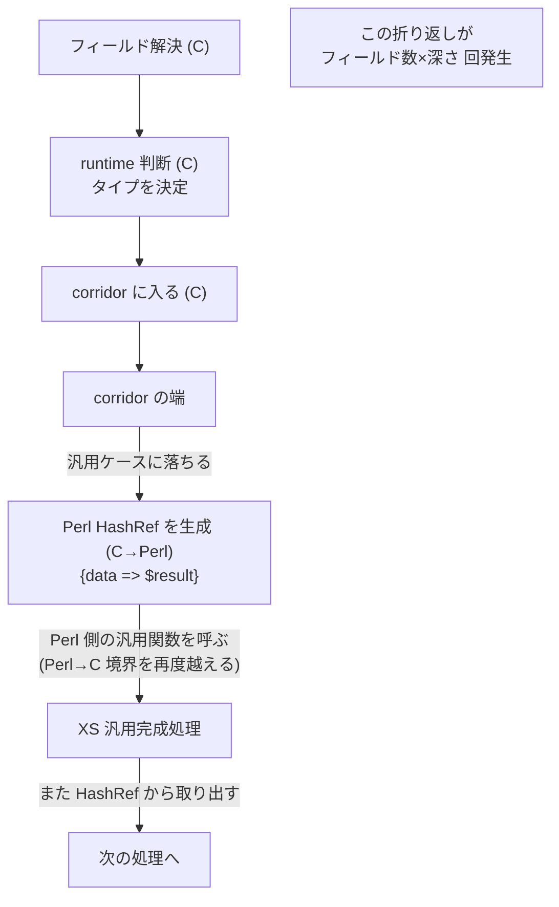

corridor ごとに高速化されても、**corridor の外の「のり代」部分の境界コストが積み重なり**、
全体のスループットは ~60k〜80k ops/sec で頭打ちになりました。

---

## 5. 第3世代: 現GraphQL::Houtou（VM + NativeBundle アーキテクチャ）

### 5-1. 設計の転換: 「局所最適化」から「全体を C に閉じる」へ

旧GraphQL::Houtouの診断を受けて、現GraphQL::Houtouは根本的に異なるアプローチを取りました。

> **局所的なホットパスを C に置き換えるのではなく、実行全体を C に閉じる**

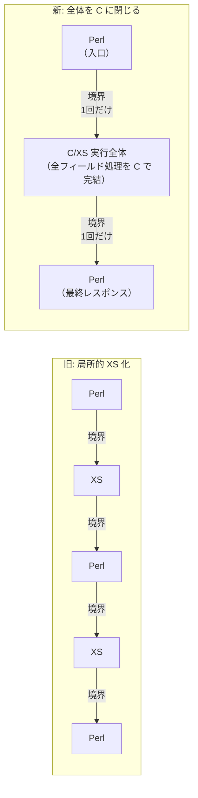

### 5-2. 全体アーキテクチャ

```mermaid
flowchart TD
    USER3["GraphQL::Houtou::execute(schema, query, root)"]

    USER3 --> XSP2["XS パーサ\nC 実装で AST を直接構築"]
    USER3 --> SCHEMA_COMPILE["スキーマコンパイル\nSchemaGraph（immutable）"]

    XSP2 --> OP_LOWER["OperationCompiler\nクエリ → 実行用中間表現"]
    SCHEMA_COMPILE --> OP_LOWER

    OP_LOWER --> VM_LOWER["VMCompiler\nprogram → block → op に変換\n（C 構造体として保持）"]

    VM_LOWER --> NATIVE_BUNDLE["NativeBundle\nC 構造体のキャッシュ\n（リクエスト間で再利用）"]

    NATIVE_BUNDLE --> XS_VM["XS VM（vm_runtime.h）\nC レベルで block/op をループ"]

    XS_VM -->|"リゾルバが必要な\nフィールドのみ"| RESOLVER["Perl リゾルバ\n（ユーザーの Perl コード）"]
    RESOLVER --> XS_VM

    XS_VM --> WRITER["Writer（XS opaque handle）\n最後の1回だけ\nPerl の HashRef に変換"]

    WRITER --> JSON3['{"data":{"hero":{"name":"R2-D2"}}}']
```

### 5-3. XS opaque handle: 内部表現の刷新

現GraphQL::Houtouでは、処理の中間状態を表すオブジェクトをすべて **XS opaque handle** に置き換えました。
「XS opaque handle」とは「C 構造体へのポインタを Perl から透過的に扱えるようにしたもの」です。
Perl からは「何かオブジェクトが来た」としか見えず、内部の C 構造体に直接アクセスできません。

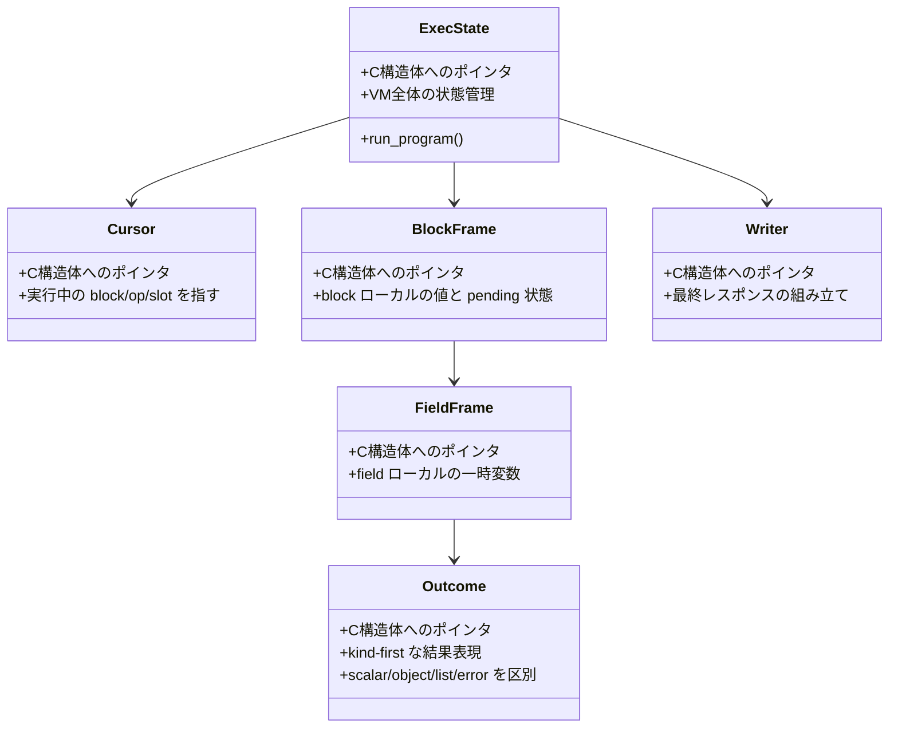

旧実装との最大の違いは、**これらのオブジェクトが Perl の `{data => ..., errors => [...]}` ではなく、C 構造体として保持される**点です。

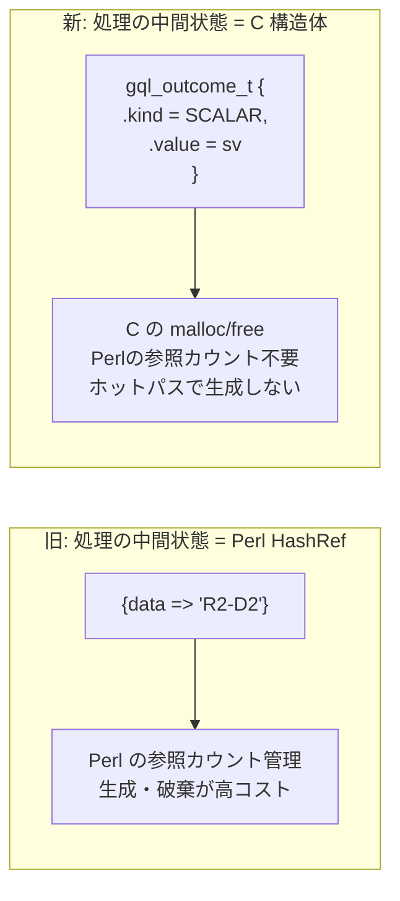

### 5-4. kind-first 設計: payload の遅延 materialize

現GraphQL::Houtouの重要な設計原則の一つが **「kind（種類）を先に決め、payload の Perl 化は遅延させる」** です。

```mermaid
flowchart TD
    FIELD_RESULT["フィールド解決結果"]

    FIELD_RESULT --> KIND_CHECK{"Outcome の kind を決定\n（C レベル）"}

    KIND_CHECK -- "SCALAR\nスカラー値" --> K_SCALAR["kind = SCALAR\nvalue = SV*\nPerl オブジェクト化は Writer まで待つ"]
    KIND_CHECK -- "OBJECT\nオブジェクト" --> K_OBJECT["kind = OBJECT\nnested block へ\nPerl HashRef はまだ作らない"]
    KIND_CHECK -- "LIST\nリスト" --> K_LIST["kind = LIST\n要素の kind を先に決める\nPerl ArrayRef はまだ作らない"]
    KIND_CHECK -- "ERROR\nエラー" --> K_ERROR["kind = ERROR\nエラーメッセージのみ保持\nErrorRecord は境界でのみ作成"]

    K_SCALAR --> WRITER2["Writer\n最後の1回だけ\nPerl の response shape に変換"]
    K_OBJECT --> WRITER2
    K_LIST --> WRITER2
    K_ERROR --> WRITER2
```

**なぜこれが高速か:**

旧実装は処理の途中で `{data => ..., errors => [...]}` という Perl の shape に変換していましたが、
現実装はレスポンスを作る最後の1回まで変換を遅らせます。
フィールドが100個あれば、旧実装は100個の HashRef を生成しますが、現実装は1個だけです。

### 5-5. 実行計画のキャッシュ

```mermaid
flowchart TD
    subgraph "旧実装（リクエスト毎に全処理）"
        OLD_R1["リクエスト1\nパース → フィールド定義検索 → 引数変換 → 実行"]
        OLD_R2["リクエスト2\nパース → フィールド定義検索 → 引数変換 → 実行"]
        OLD_R3["リクエスト3\nパース → フィールド定義検索 → 引数変換 → 実行"]
    end

    subgraph "現実装（実行計画をキャッシュ）"
        BOOT["初回のみ\nスキーマ + クエリ → NativeBundle（C 構造体）\nキャッシュ"]
        BOOT --> NR1["リクエスト1\n変数を準備して NativeBundle を実行"]
        BOOT --> NR2["リクエスト2\n変数を準備して NativeBundle を実行"]
        BOOT --> NR3["リクエスト3\n変数を準備して NativeBundle を実行"]
    end
```

キャッシュされるもの:
- スキーマメタデータ（型情報、フィールド定義）
- abstract dispatch テーブル（インターフェース/ユニオンの型解決）
- オペレーション lowering 結果
- VM program / NativeBundle（C 構造体）
- 静的引数の materialized HashRef（変数を含まない引数）

### 5-6. Perl↔C 境界を最小化した実行フロー

```mermaid
sequenceDiagram
    participant PL as Perl コード
    participant NR as NativeRuntime (Perl facade)
    participant C as vm_runtime.h (C)
    participant RS as リゾルバ (Perl callback)
    participant W as Writer (XS)

    PL ->> NR: execute(schema, query, variables)
    NR ->> C: execute_native_program_xs(bundle, vars)
    Note over C: ここから先は C の世界
    loop block/op ループ（C のみ）
        C ->> C: スロットのメタデータを参照
        alt 明示的リゾルバあり
            C ->> RS: resolver(source, args, ctx, return_type)
            Note over C,RS: Perl↔C 境界（必要な時だけ）
            RS -->> C: 値
        else デフォルトリゾルバ
            C ->> C: source から直接値を取得（Perl 不要）
        end
        C ->> C: Outcome を kind-first で決定（C のまま）
    end
    C ->> W: 全フィールド処理完了後 materialize
    W ->> W: Perl の response HashRef を構築（1回のみ）
    W -->> PL: {data => {...}}
    Note over PL,W: Perl↔C 境界は入口と出口だけ
```

---

## 6. 3世代の設計比較

### 6-1. 処理フローの変遷

```mermaid
flowchart TB
    subgraph "graphql-perl\n（Pure Perl）"
        direction LR
        GP1["Perl\nパース"] --> GP2["Perl\n実行コンテキスト"] --> GP3["Perl\nフィールド解決×N"] --> GP4["Perl\nレスポンス"]
    end

    subgraph "旧GraphQL::Houtou\n（compiled_ir・段階的 XS 化）"
        direction LR
        OL1["XS\nパース"] --> OL2["XS\n実行計画コンパイル"] --> OL3["XS/Perl 交互\ncorridor + generic fallback"] --> OL4["Perl/XS\nレスポンス"]
    end

    subgraph "現GraphQL::Houtou\n（VM + NativeBundle）"
        direction LR
        NL1["XS\nパース"] --> NL2["XS\n実行計画コンパイル\n（キャッシュ）"] --> NL3["XS\n全フィールド処理\nC のみ"] --> NL4["XS\nレスポンス生成\n（1回のみ）"]
    end
```

### 6-2. 内部表現の変遷

| 世代 | 中間データ形式 | 生成回数（フィールド100個の場合） |
|------|--------------|----------------------------------|
| graphql-perl | `{data => ..., errors => [...]}` HashRef | 約100回 |
| 旧GraphQL::Houtou | corridor 内は C 構造体、corridor 端で HashRef | 約20〜50回 |
| 現GraphQL::Houtou | XS opaque handle（C 構造体）のみ | 1回（最終レスポンス時のみ） |

### 6-3. Perl↔C 境界越えの回数

```mermaid
xychart-beta
    title "1リクエストあたりの Perl↔C 境界越え（概算）"
    x-axis ["graphql-perl", "旧GraphQL::Houtou\n(compiled_ir)", "現GraphQL::Houtou\n(NativeBundle)"]
    y-axis "境界越え回数（相対値）" 0 --> 100
    bar [0, 60, 4]
```

graphql-perl は全て Perl なので境界越えは 0 回ですが、代わりに全処理が Perl の遅い実行になります。
旧GraphQL::Houtouは corridor を増やすほど corridor の端での折り返しが増え、境界越えが多くなりました。
現GraphQL::Houtouは入口と出口だけなので境界越えが最小です。

### 6-4. モジュール対応表

| graphql-perl | 旧GraphQL::Houtou | 現GraphQL::Houtou | 役割 |
|--------------|-------------------|-------------------|------|
| Pegex（Pure Perl） | XS パーサ | XS パーサ（同じ） | クエリのパース |
| `Schema->from_doc()` | compiled_ir 実行計画 | SchemaGraph + NativeBundle | スキーマのコンパイル |
| `Execution::execute()` | `execute_compiled_ir_xs` | OperationCompiler + VMCompiler + NativeRuntime | 実行エンジン |
| `_execute_fields()` 再帰 | XS corridor ループ | XS VM（block/op ループ） | フィールド解決 |
| `{data,errors}` HashRef | corridor 内 C 構造体 + 端での HashRef | Outcome/Writer XS opaque handle | 内部表現 |
| `promise_code` 注入 | `promise_code` 注入（同じ） | Promise::XS 直結 + XS スケジューラ | 非同期処理 |

---

## 7. ベンチマーク: 3世代の速度比較

### 7-1. 同期実行（sync）

| ケース | graphql-perl | 旧GraphQL::Houtou | 現GraphQL::Houtou | 旧比改善倍率 |
|--------|-------------|-------------------|-------------------|------------|
| nested_variable_object | 数百〜数千/s | ~56,878/s | ~650,345/s | **約 11x** |
| list_of_objects | 〃 | ~58,195/s | ~548,036/s | **約 9x** |
| abstract_with_fragment | 〃 | ~38,894/s | ~611,211/s | **約 16x** |

### 7-2. 現GraphQL::Houtouの改善推移（native_bundle sync）

旧アーキテクチャから新アーキテクチャへの移行後も、段階的な最適化が続いています。

```mermaid
flowchart LR
    M0["旧 compiled_ir\n~56,878/s"]
    M0 -->|"リアーキテクチャ"| M1["NativeProgram mainline\n~343,901/s\n(約 6x)"]
    M1 -->|"direct-SV fast lane"| M2["~393,480/s"]
    M2 -->|"callback ABI 再特化"| M3["~522,198/s"]
    M3 -->|"path frame 遅延化"| M4["~531,431/s"]
    M4 -->|"callback_abi_code 導入"| M5["~551,441/s"]
    M5 -->|"静的 args キャッシュ"| M6["~566,900/s"]
    M6 -->|"stack writer"| M7["~579,118/s"]
    M7 -->|"variable-invariant fast lane"| M8["~621,166/s"]
    M8 -->|"path frame borrowed key"| M9["~650,345/s"]
```

大きなジャンプがリアーキテクチャの時点で発生し、その後は細かな最適化で積み上げています。

### 7-3. 非同期実行（async, Promise::XS）

| ケース | 旧GraphQL::Houtou（汎用 promise_code） | 現GraphQL::Houtou（XS スケジューラ最新） | 改善 |
|--------|----------------------------------------|----------------------------------------|------|
| async_scalar | ~3,082/s | ~183,991/s | **約 60x** |
| async_list | ~2,983/s | ~150,377/s | **約 50x** |
| async_object | ~3,027/s | ~143,479/s | **約 47x** |
| async_abstract | ~3,011/s | ~124,660/s | **約 41x** |

---

## 8. まとめ: 高速化の本質

```mermaid
flowchart TB
    INSIGHT["核心的な洞察"]

    INSIGHT --> I1["キャッシュすべきは\nresolver の結果ではなく\n実行計画（どう実行するか）"]
    INSIGHT --> I2["Perl↔C の境界越えは\nホットパスでは最小化すべき\n（境界コストが積み重なる）"]
    INSIGHT --> I3["部分的な XS 化では\n境界コスト増加 > C の高速化\nになる場合がある"]
    INSIGHT --> I4["内部表現を Perl の HashRef から\nC 構造体（XS opaque handle）に変えると\n生成・破棄コストが劇的に減る"]
    INSIGHT --> I5["kind-first 設計\npayload の Perl 化を最後まで遅らせる"]

    I3 --> SOLUTION["解決策:\n実行全体を C に閉じる\n（NativeBundle アーキテクチャ）"]
    I1 --> SOLUTION
    I2 --> SOLUTION
    I4 --> SOLUTION
    I5 --> SOLUTION
```

旧GraphQL::Houtouが頭打ちになった理由と、リアーキテクチャで大幅に速くなった理由は同じです。

**旧: 個々の関数を C に置き換えた**
→ corridor が増えるほど Perl↔C 境界も増え、HashRef の生成・破棄コストも残り続けた

**新: 実行全体を C に閉じた**
→ Perl との境界は入口（`execute()` 呼び出し）、リゾルバ callback、出口（Writer）の3ヶ所のみ
→ 内部表現は C 構造体で一貫し、最後の1回だけ Perl の response shape に変換する
