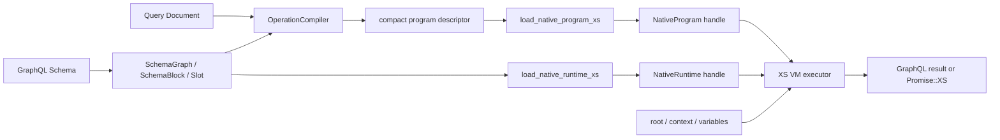
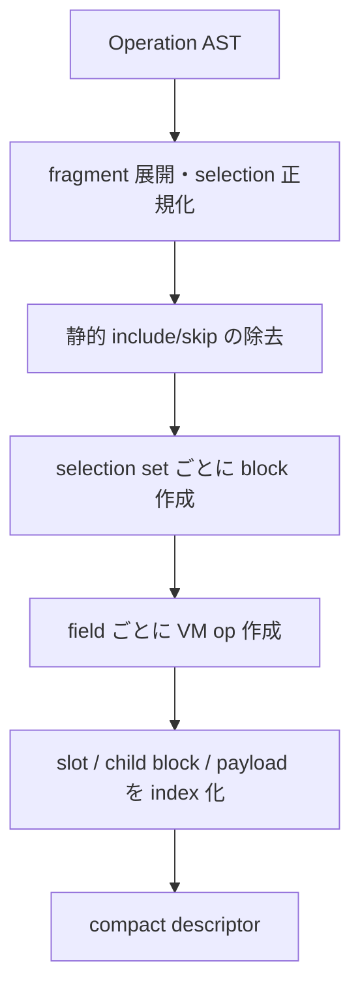
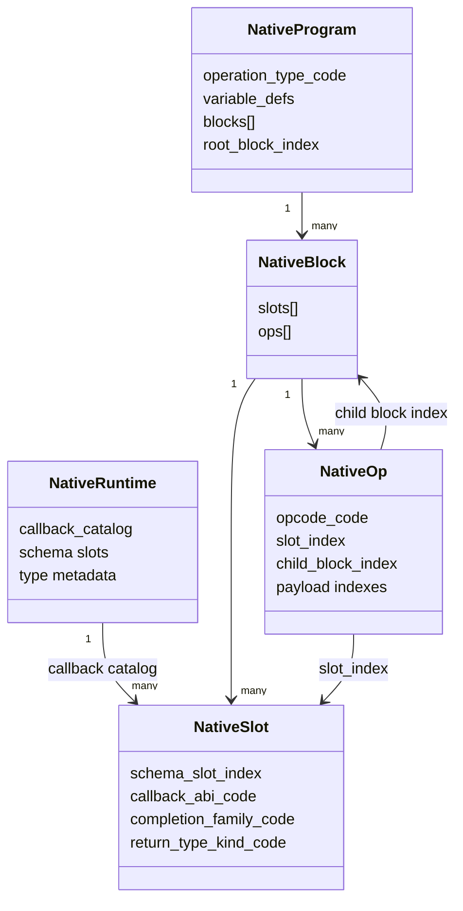
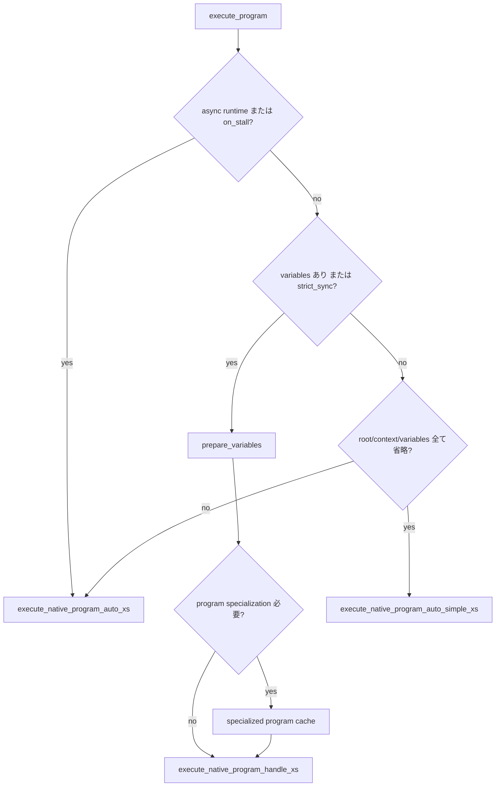
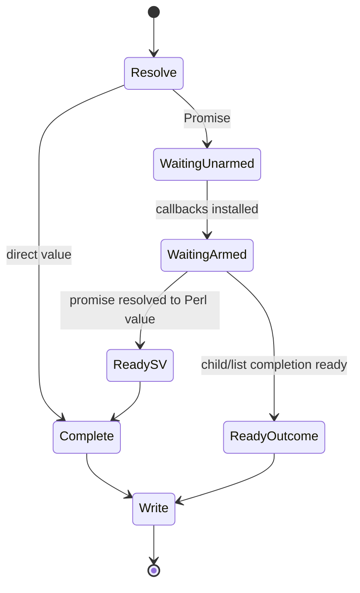

# GraphQL::Houtou VM 実行系の内部構成

この文書は、GraphQL クエリが `GraphQL::Houtou` の現行実行系でどのようにコンパイルされ、XS VM 上で評価されるかを説明する。特に、VM の opcode、compact descriptor、native 内部表現、同期・非同期実行の関係を扱う。

対象は現在の mainline である `Runtime::*` → `GraphQL::Houtou::XS::VM` → `src/vm_runtime.h` の経路である。`src/bootstrap.h` にある `gql_ir_vm_*` 系については、末尾の「似た名前の別内部表現」で区別する。

## 1. 全体像

実行は大きく「schema compile」「operation compile」「request-time execution」の3段階に分かれる。



重要なのは、リクエストごとに GraphQL AST を直接たどらない点である。schema は immutable な slot catalog に、operation は block と op の配列に落とされる。実行時の主な参照は文字列検索ではなく index で行われる。

公開側の主要な入口は次の通りである。

- `GraphQL::Houtou::Runtime::NativeRuntime::compile_program`
- `GraphQL::Houtou::Runtime::NativeRuntime::execute_program`
- `GraphQL::Houtou::Runtime::NativeRuntime::execute_program_to_json`
- `GraphQL::Houtou::Runtime::NativeRuntime::execute_document`

`compile_program` の戻り値は現行 public path では `NativeProgram` handle である。`VMProgram`、`VMBlock`、`VMOp` は readable descriptor の inflate、debug、内部検証にも使われるが、request-time の一次通貨ではない。

## 2. コンパイル層

### 2.1 schema 側: `SchemaGraph`、`SchemaBlock`、`Slot`

schema compile は、GraphQL 型定義を実行用の slot catalog に変換する。

- `SchemaGraph`: schema 全体、root type、型別 block、callback catalog を所有する。
- `SchemaBlock`: Object 型など、ある親型で選択可能な field slot の集合。
- `Slot`: 1つの schema field に関する不変メタデータ。

`Slot` の主要項目は次の通り。

| 項目 | 意味 |
|---|---|
| `schema_slot_index` | runtime 全体の callback catalog を引く index |
| `field_name` | schema 上の field 名 |
| `result_name` | response key。alias があれば alias |
| `return_type_name` | named return type |
| `return_type_kind_code` | scalar/object/list/interface 等の種別 |
| `item_non_null` | list item が non-null か |
| `resolver_shape` | `DEFAULT` または `EXPLICIT` |
| `resolver_mode` | `DEFAULT` または native resolver 契約の `NATIVE` |
| `callback_abi_code` | resolver 呼び出し ABI |
| `completion_family` | `GENERIC`、`OBJECT`、`LIST`、`ABSTRACT` |
| `dispatch_family` | abstract type の dispatch 方法 |
| `arg_defs_compact` | argument 定義と default 値 |

同じ schema field でも alias ごとに `result_name` が異なるため、operation block 内の slot table は `(slot identity, result_name)` の組で intern される。

### 2.2 operation 側: block と op

`OperationCompiler` は validation 済み operation を schema-aware な実行 plan に落とす。



selection set は `VMBlock` に対応し、各 field selection は基本的に1個の `VMOp` に対応する。object field の子 selection は別 block になり、親 op の `child_block_index` から参照される。interface/union は possible concrete type ごとに child block を持ち、`abstract_child_block_indexes` で type name から block index を引く。

fragment は実行時 call 命令にはならず、compile 時に selection へ正規化される。`@skip` / `@include` の定数条件も compile 時に除去される。変数依存 guard だけが runtime payload として残る。

## 3. VMProgram の内部表現

### 3.1 readable 表現

`VMProgram::to_struct` は人間が読める hash descriptor を返す。

```text
program
├── version
├── operation_type / operation_name
├── variable_defs
├── args_payloads
├── directives_payloads
├── root_block
└── blocks[]
    ├── name / type_name / family
    └── ops[]
        ├── opcode / opcode_code
        ├── resolve_family / complete_family
        ├── field_name / result_name
        ├── child block references
        └── argument/directive payload references
```

これは dump、round-trip、debug には便利だが、hot path では hash lookup と文字列解釈が多い。

### 3.2 compact 表現

native loader が主に消費する compact program は、固定位置の配列を使う。

program の概念的な形は次の通り。

```text
{
  version,
  operation_type_code,
  operation_name,
  variable_defs,
  args_payloads_compact,
  directives_payloads_compact,
  root_block_index,
  blocks_compact
}
```

compact block は5要素である。

| index | 内容 |
|---:|---|
| 0 | block name |
| 1 | parent type name |
| 2 | block family code |
| 3 | block-local slot table |
| 4 | op array |

compact slot は14要素である。

| index | 内容 |
|---:|---|
| 0 | `field_name` |
| 1 | `result_name` |
| 2 | `return_type_name` |
| 3 | `schema_slot_index` |
| 4 | resolver shape code |
| 5 | completion family code |
| 6 | dispatch family code |
| 7 | return type kind code |
| 8 | `has_args` |
| 9 | `has_directives` |
| 10 | resolver mode code |
| 11 | compact argument definitions |
| 12 | callback ABI code |
| 13 | `item_non_null` |

compact op は21要素である。

| index | 内容 |
|---:|---|
| 0 | combined `opcode_code` |
| 1 | resolve code |
| 2 | complete code |
| 3 | dispatch family code |
| 4 | block-local `slot_index` |
| 5 | `child_block_index` |
| 6 | concrete type → child block index map |
| 7 | argument mode code |
| 8 | intern 済み argument payload index |
| 9 | inline argument payload |
| 10 | `has_args` |
| 11 | directive guard mode code |
| 12 | intern 済み directive payload index |
| 13 | inline directive payload |
| 14 | `has_directives` |
| 15 | `field_name` |
| 16 | `result_name` |
| 17 | `return_type_name` |
| 18 | custom runtime directive mode code |
| 19 | custom runtime directive payload |
| 20 | `has_runtime_directives` |

payload index と inline payload が両方あるのは、同一 payload を program-level catalog に intern できる一方、inflate/debug 経路では inline 値も扱えるためである。通常の compact compile では共有可能な payload は catalog index になる。

## 4. opcode の設計

### 4.1 1 field = resolve × complete

公開 operation VM の opcode は、単独の命令名ではなく「値を得る方法」と「得た値を完成させる方法」の直積である。

```text
opcode_code = resolve_code * 16 + complete_code
```

resolve family は2種類。

| code | family | 動作 |
|---:|---|---|
| 1 | `RESOLVE_DEFAULT` | hash key、method、既定規則などの default resolver |
| 2 | `RESOLVE_EXPLICIT` | schema field に登録された resolver callback |

complete family は4種類。

| code | family | 動作 |
|---:|---|---|
| 1 | `COMPLETE_GENERIC` | leaf serialization、null、汎用 scalar 値 |
| 2 | `COMPLETE_OBJECT` | child block を source object に対して実行 |
| 3 | `COMPLETE_LIST` | item ごとに scalar/object/abstract completion |
| 4 | `COMPLETE_ABSTRACT` | runtime concrete type を決定後、対応 child block を実行 |

したがって有効な combined opcode は8種類になる。

| opcode string | code | 概要 |
|---|---:|---|
| `RESOLVE_DEFAULT:COMPLETE_GENERIC` | 17 (`0x11`) | default resolve → leaf/null completion |
| `RESOLVE_DEFAULT:COMPLETE_OBJECT` | 18 (`0x12`) | default resolve → object block |
| `RESOLVE_DEFAULT:COMPLETE_LIST` | 19 (`0x13`) | default resolve → list loop |
| `RESOLVE_DEFAULT:COMPLETE_ABSTRACT` | 20 (`0x14`) | default resolve → abstract dispatch |
| `RESOLVE_EXPLICIT:COMPLETE_GENERIC` | 33 (`0x21`) | callback → leaf/null completion |
| `RESOLVE_EXPLICIT:COMPLETE_OBJECT` | 34 (`0x22`) | callback → object block |
| `RESOLVE_EXPLICIT:COMPLETE_LIST` | 35 (`0x23`) | callback → list loop |
| `RESOLVE_EXPLICIT:COMPLETE_ABSTRACT` | 36 (`0x24`) | callback → abstract dispatch |

XS 側はこの code を8通りの dispatch index に変換できるため、実行ループで opcode string を parse しない。

`__typename` は専用の外部 opcode を持たず、`RESOLVE_DEFAULT:COMPLETE_GENERIC` の slot と meta dispatch として表現される。

### 4.2 completion と dispatch の違い

`COMPLETE_ABSTRACT` は「abstract completion が必要」という大分類であり、その中で concrete type をどう決めるかを dispatch family が指定する。

| code | dispatch family | 意味 |
|---:|---|---|
| 1 | `GENERIC` | 一般経路 |
| 2 | `RESOLVE_TYPE` | interface/union の `resolve_type` callback |
| 3 | `TAG` | runtime tag と事前構築 map |
| 4 | `POSSIBLE_TYPES` | possible type の `is_type_of` を順に評価 |

高速な順序を概念的に書くと、tag lookup、`resolve_type`、possible-types fallback となる。決定された concrete type name で `abstract_child_block_indexes` を引き、その block を実行する。

### 4.3 argument と directive の mode

argument と directive guard は同じ3値の mode code を使う。

| code | mode | 意味 |
|---:|---|---|
| 0 | `NONE` | payload なし |
| 1 | `STATIC` | compile 時に materialize 済み |
| 2 | `DYNAMIC` | variable reference を含み request 時に構築 |

argument の `STATIC` はそのまま resolver に渡せる形へ近づけられる。`DYNAMIC` は prepared variables を参照して request 時に native dynamic value を materialize し、schema の argument definition に従って coercion/default 適用を行う。

directive は2層に分かれる。

- `directives_*`: `@include` / `@skip` の実行 guard。
- `runtime_directives_*`: それ以外の runtime directive payload。

静的な `@include` / `@skip` は可能なら compile 時に消えるため、mode が残るのは主に変数依存の場合である。

## 5. native loader 後の C 構造体

compact descriptor は XS boundary で C の配列と構造体へ inflate される。主要な型は `src/vm_runtime.h` にある。



schema と operation を分離する理由は、schema metadata と callback は多数の query program で共有できるためである。op は block-local slot を参照し、slot の `schema_slot_index` が runtime callback catalog の resolver、type object、tag resolver、`resolve_type`、leaf serializer などへ接続する。

### 5.1 callback ABI

| code | ABI | 用途 |
|---:|---|---|
| 1 | default | default resolver |
| 2 | explicit generic | 通常の明示 resolver。lazy `info` 等を利用可能 |
| 3 | explicit native | `resolver_mode => 'native'` の高速契約 |

generic callback boundary は Perl API 互換のため source、args、context、lazy info を用意する。native mode は hot path 向けで、generic lazy-info ABI を要求しない resolver に限定される。

## 6. request-time 実行

`NativeRuntime::execute_program` は引数と runtime 設定に応じて XS entrypoint を選ぶ。



variable preparation は `native_program_prepare_variables_xs` が所有する。型 coercion と variable default を一度適用し、以後の dynamic argument/guard は prepared variables を参照する。

変数があっても常に program clone を作るわけではない。dynamic arguments は request 時に評価できるため、program specialization が必要なのは主に variable-dependent directive/runtime directive が program shape を変える場合である。specialized program は `(program identity, variables key)` で cache される。

### 6.1 block 実行

概念上、block executor は以下を行う。

```text
execute_block(block, source, path):
    result = native object value
    for op in block.ops:
        if directive guard rejects op:
            continue
        slot = block.slots[op.slot_index]
        resolved = resolve(slot, source, args, context)
        outcome = complete(op, slot, resolved, child blocks)
        write result[slot.result_name] = outcome
        propagate errors / non-null state
    return outcome(result)
```

実装は promise、list、non-null propagation、error path を扱うためさらに複雑だが、opcode の責務はこの resolve/complete の境界に対応する。

query の sibling fields は独立に進められる。mutation root は GraphQL の仕様に従い serial execution が必要であり、promise-aware lane でも root field の順序を保つ。

### 6.2 値の内部表現

hot path では Perl の `{ data => ..., errors => ... }` を各段階で組み立てず、kind-first な native value/outcome を使う。

native value kind:

| code | kind | payload |
|---:|---|---|
| 0 | UNDEF | null/未設定 |
| 1 | SCALAR | IV、NV、PV、または fallback SV |
| 2 | OBJECT | name/value entry の集合 |
| 3 | LIST | child value の配列 |

scalar payload はさらに `UNDEF`、`IV`、`NV`、`PV`、`FALLBACK_SV` に分かれる。整数、浮動小数、文字列を Perl scalar に戻さず保持できる範囲を増やすためである。custom scalar など Perl callback の値を保持する必要がある場合だけ fallback SV を使う。

completion outcome は scalar/object/list という shape と error records を運ぶ。response envelope の `{ data, errors }` または JSON は最後の writer boundary で materialize される。

### 6.3 leaf completion

`COMPLETE_GENERIC` は return type metadata に従って leaf coercion を行う。

| leaf code | 対象 |
|---:|---|
| 1 | Int |
| 2 | Float |
| 3 | String |
| 4 | Boolean |
| 5 | ID |
| 6 | Enum |
| 7 | Custom scalar |

Enum は value-to-name map、custom scalar は serialize callback を runtime callback catalog から取得する。built-in scalar は可能な限り C 側で検査・変換される。

### 6.4 null と non-null propagation

slot の `return_type_kind_code == NON_NULL` は field position 自体が non-null であることを示し、`item_non_null` は `[T!]` の item position を示す。

non-null violation は単にその field を `undef` にするだけではない。親 selection set まで bubble し、nullable boundary で止まる。list item の violation は item または list 全体へ、型構造に従って伝播する。error record は field path とともに writer に蓄積される。

## 7. promise と非同期 scheduler

resolver が `Promise::XS::Promise` を返すと、同じ program/op を使ったまま pending scheduler へ移る。別の async bytecode があるわけではない。



pending entry は promise SV だけでなく、既に得られた outcome、child block frame、list pending state も保持できる。主な payload kind は次の通り。

- promise SV
- outcome pointer
- generic value を待つ promise
- leaf-coerced resolved value を待つ promise
- child block frame
- list pending state

block frame は sibling field の完了状態を保持する。object child や list item がさらに promise を返しても、親 frame を再帰的な Perl closure 群へ作り直さず scheduler state として継続できる。

`on_stall` を指定した DataLoader 型の実行では、VM が全 pending field で stall した時に callback を呼び、loader flush による進捗を要求する。pending promise があるのに進捗が0なら deadlock として中止し、`cancel_pending_response_xs` が request frame と参照 cycle を解放する。

## 8. error と response writer

resolver exception、serialization error、abstract type 解決失敗、non-null violation は error record に正規化される。各 record は message と path を持ち、必要な場合は location 等の cold metadata を materialize する。

通常実行は Perl の response hash を返す。`execute_program_to_json` は native value tree と error records から直接 JSON を生成する経路を持ち、中間の巨大な Perl response tree を避ける。

resolver 用 `info` も eager には作らない。context、parent type、field definition、return type、nodes、path などは `gql_execution_lazy_resolve_info` に保持され、generic resolver が参照した時点で Perl hash surface を構築する。

## 9. 具体例

次の query を考える。

```graphql
query User($id: ID!, $withFriends: Boolean!) {
  user(id: $id) {
    name
    friends @include(if: $withFriends) {
      id
    }
  }
}
```

概念的には以下の block/op になる。

```text
block Query#0 (Query)
  op user
    RESOLVE_EXPLICIT:COMPLETE_OBJECT
    args_mode = DYNAMIC
    child_block_index = User#1

block User#1 (User)
  op name
    RESOLVE_DEFAULT:COMPLETE_GENERIC
  op friends
    RESOLVE_DEFAULT:COMPLETE_LIST
    directives_mode = DYNAMIC
    child_block_index = User#2

block User#2 (User)
  op id
    RESOLVE_DEFAULT:COMPLETE_GENERIC
```

`$id` と `$withFriends` は最初に variable definition に従って coercion される。`user` の argument payload は prepared `$id` から構築される。`friends` は `$withFriends` guard が false なら resolve 自体を行わない。true なら list item ごとに `User#2` を実行する。

## 10. キャッシュと再利用単位

実行系は resolver 結果ではなく実行 plan を cache する。

- runtime schema handle: schema が変わらない限り共有。
- program cache: query string → `NativeProgram`。既定上限は1000、FIFO。
- specialized program cache: variable-dependent specialization が必要な場合のみ使用。
- payload catalog: program 内で同一 argument/directive payload を共有。
- callback catalog: schema slot index から resolver/type/serializer を共有。

この分離により、同じ query を異なる root/context/variables で実行しても parse、selection lowering、block binding を繰り返さない。

## 11. 似た名前の別内部表現

`src/bootstrap.h` には `gql_ir_vm_program`、`gql_ir_vm_block`、`gql_ir_vm_field_meta`、`gql_ir_native_field_op` という別系統の名前がある。この field-op VM は、field を最大5個程度の micro-op に分解する構造を持つ。

代表的な micro-op:

- `META`
- `TRIVIAL_CONTEXT`
- `CALL_FIXED_EMPTY_ARGS`
- `CALL_FIXED_BUILD_ARGS`
- `CALL_CONTEXT_EMPTY_ARGS`
- `CALL_CONTEXT_BUILD_ARGS`
- `COMPLETE_TRIVIAL`
- `COMPLETE_GENERIC`
- `COMPLETE_OBJECT`
- `COMPLETE_LIST`
- `COMPLETE_ABSTRACT_*`
- `CONSUME`

これは本書で説明した public `NativeProgram` の8 combined opcode と同じ bytecode ではない。前者は parser/compiled execution 側の field-local micro-plan、後者は `Runtime::OperationCompiler` が生成し `NativeRuntime` が公開 API から実行する schema-aware program である。コードを読む際は、次の識別が有効である。

| 系統 | 主なファイル | 識別子 |
|---|---|---|
| 現行 public runtime VM | `Runtime/OperationCompiler.pm`, `Runtime/NativeRuntime.pm`, `src/vm_runtime.h`, `Houtou.xs` | `GQL_VM_*`, `NativeProgram`, compact block/op |
| field-local IR VM | `src/bootstrap.h` と関連 XS | `gql_ir_vm_*`, `GQL_IR_NATIVE_FIELD_OP_*` |

## 12. コードを読む順序

1. `lib/GraphQL/Houtou/Runtime/NativeRuntime.pm` — public request path と lane 選択。
2. `lib/GraphQL/Houtou/Runtime/OperationCompiler.pm` — query から compact block/op を作る処理。
3. `lib/GraphQL/Houtou/Runtime/Slot.pm` — schema field metadata と compact slot layout。
4. `lib/GraphQL/Houtou/Runtime/VMOp.pm` — readable/native/compact op の対応。
5. `lib/GraphQL/Houtou/Runtime/VMBlock.pm`, `VMProgram.pm` — container と payload catalog。
6. `src/vm_runtime.h` — enum、native descriptor/value、loader helper。
7. `lib/GraphQL/Houtou.xs` — resolve/complete loop、promise scheduler、writer、XS API。

関連する俯瞰資料は `docs/architecture-overview.md`、モジュールごとの責務は
`docs/module-map.md` を参照。本書はそれらより opcode と実データ layout に
焦点を置いている。
