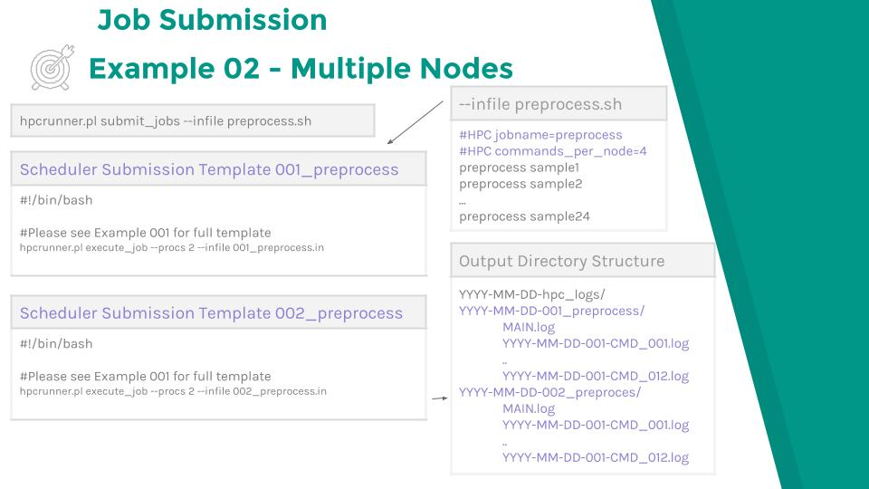
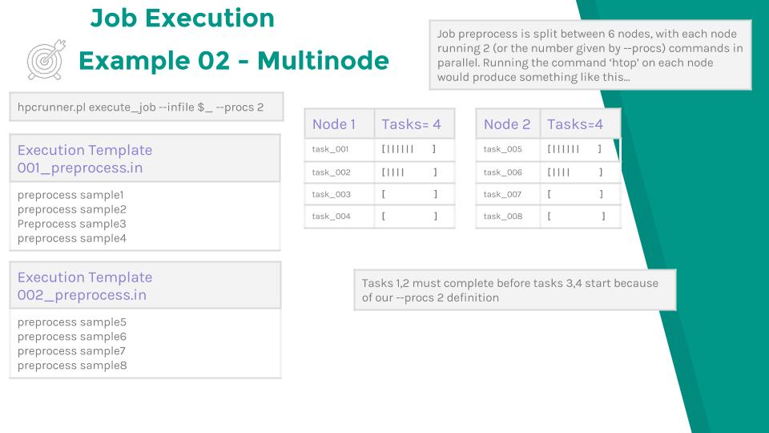

# Example 02  - Multiple Nodes

## Usual case - 1 command per node
Special considerations should be used when submitting a large number of tasks.
Depending on the configuration of your scheduler you will hit limits very
quickly. In this case you would group tasks together, using the commands_per_node option.
You may also want to increase the number of concurrent tasks using the procs
option. Consider the case when having a large number of single threaded tasks.
Normally you would submit the job as follows:

```
#HPC commands_per_node=1
#HPC procs=1
#HPC ntasks=1
#HPC walltime=01:00:00
#HPC cpus_per_task=1
#HPC mem=100GB
```

## Two commands per node - Concurrency 1

Now, you could pack 2 commands onto a node, but only run 1 task concurrently. In
this case you would increase the walltime by a factor of commands_per_node, in
this case two, but leave the other variables the same.

```
#HPC commands_per_node=2
#HPC procs=1
#HPC ntasks=1
#HPC walltime=02:00:00
#HPC cpus_per_task=1
#HPC mem=100GB
```

## Two commands per node - Concurrency 2

Now, you are packing 2 commands per node, but increasing the concurrency to 2.
Since our tasks are running concurrently you would set the walltime to the time
it takes 1 task to complete, but increase the cpus_per_task, ntasks (if using
SLURM) and memory by a factor of procs.

```
#HPC commands_per_node=2
#HPC procs=2
#HPC ntasks=2
#HPC walltime=01:00:00
#HPC cpus_per_task=2
#HPC mem=200GB
```

Here is a birds eye view of a simple example.

### Submission and output directory structure



### Job execution


