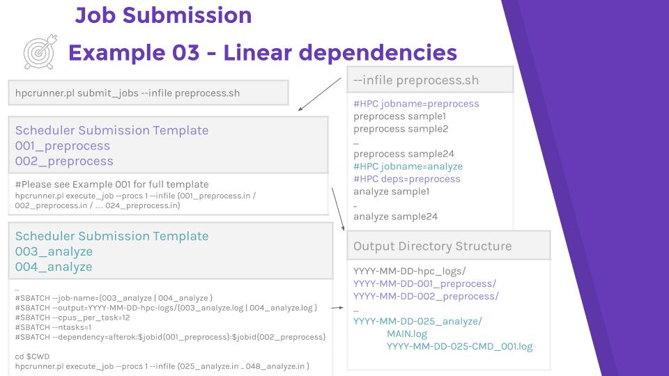
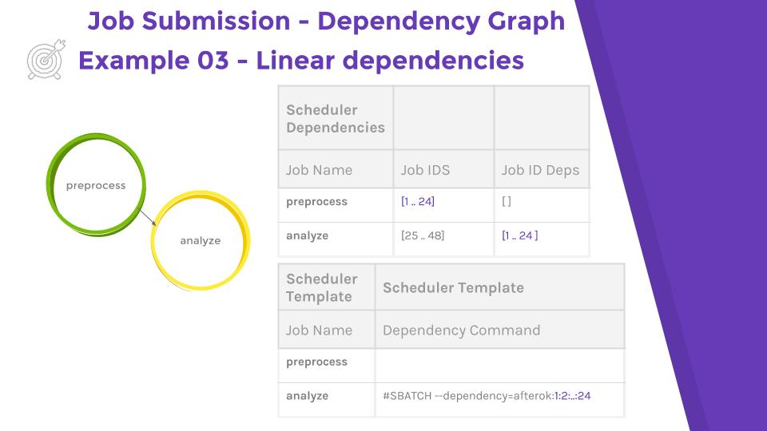
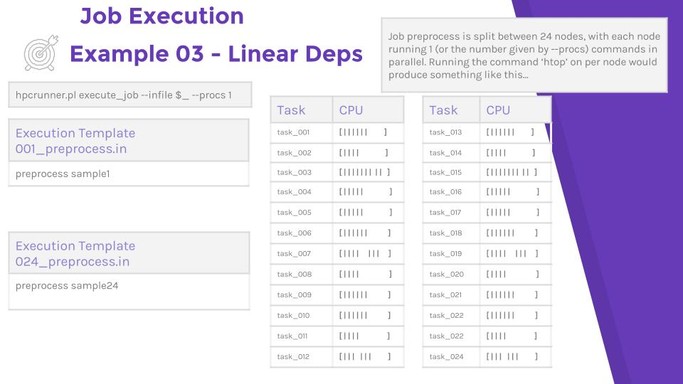

# Example 03 - Linear Dependencies

Dependencies can be linear, meaning one job depends upon the next, or nested,
where one job can depend upon any other. This example describes linear
dependencies.

### Submission and output directory structure

### Dependency Tree

### Job execution

