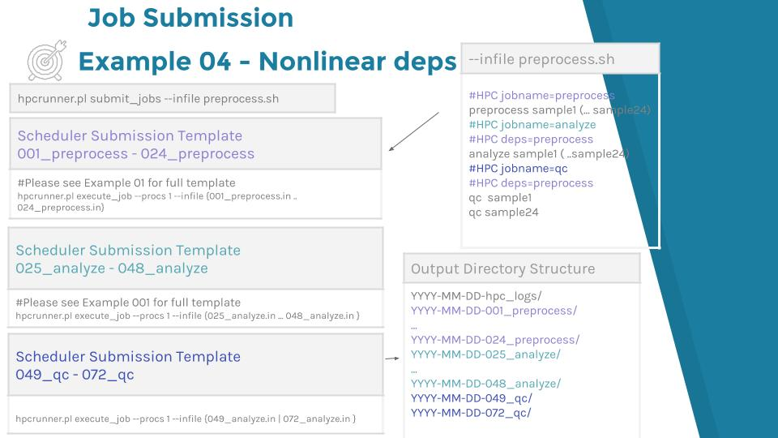
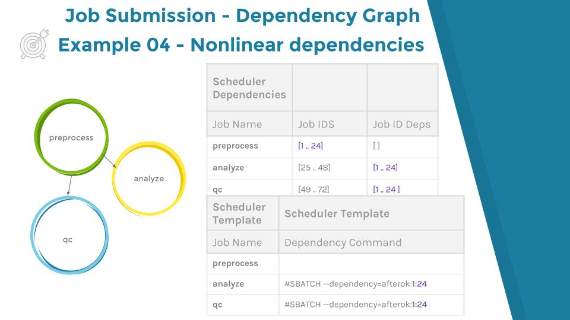

# Example 04 - Non Linear Dependencies

An example of non linear dependencies would be to have 3 job types, where two
of those jobtypes depend upon the same job.

```
#HPC jobname=preprocess

#HPC jobname=analyze
#HPC deps=preprocess

#HPC jobname=qc
#HPC deps=preprocess
```

The jobtype preprocess would execute first, followed by either analyze, qc or
both if there is room in the scheduler. Qc and analyze would have the same job
weight.

### Submission and output directory structure



### Dependency Tree


