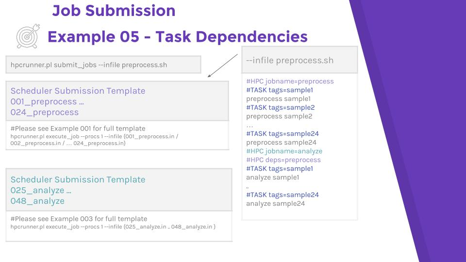
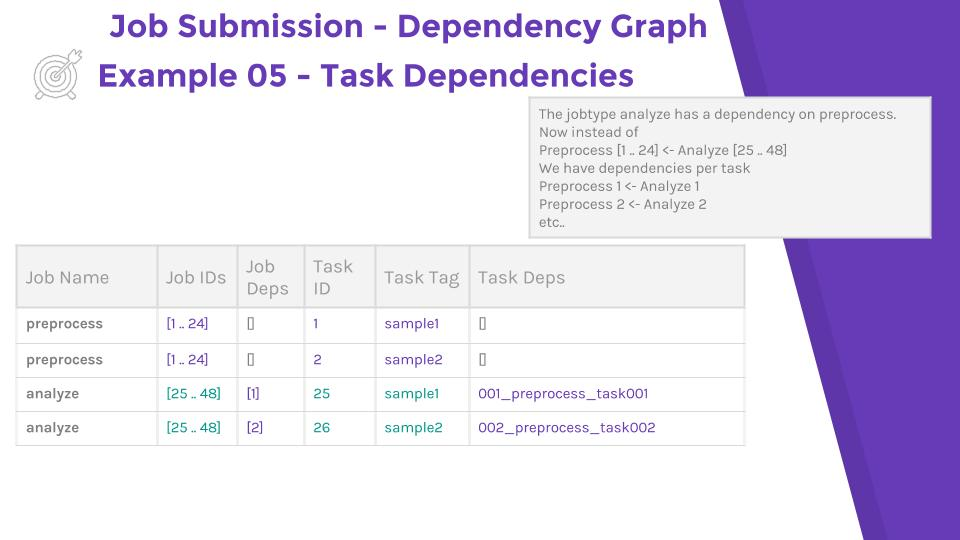

# Example 05  - Declaring Task Dependencies


HPC Runner has two levels of dependencies. The first is the job type, declared as

```
#HPC jobname=preprocess

#HPC jobname=qc
#HPC deps=preprocess
```

The second level declares within job type task dependencies.

```
#HPC jobname=preprocess
#TASK tags=sample1
preprocess sample1
#TASK tags=sample2
preprocess sample2

#HPC jobname=qc
#HPC deps=preprocess
#TASK tags=sample1
qc sample1
#TASK tags=sample2
qc sample2
```
Now, the qc job tagged with sample1 would only depend upon the sample1 task in
preprocess, instead of the entire preprocess job.

### Submission and output directory structure



### Dependency Tree


