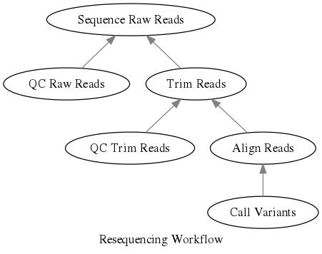

# Overview

An analysis can be thought of as a series of inputs and outputs, and can be mapped like so.



```
#INPUT <- OUTPUT
QC Raw Reads
Trim Reads    <- QC Trim Reads
QC Trim Reads <- Align Reads
Align Reads   <- Convert Alignment
Convert Reads <- Call Variants
```

## Job Type dependency Resolution

Using the HPC Runner Syntax our dependencies would look like:

```
#HPC jobname=qc_raw_reads

fastqc --read1 Sample1.raw_read1.fastq --read2 Sample1.raw_read2.fastq
fastqc --read1 Sample2.raw_read1.fastq --read2 Sample2.raw_read2.fastq
fastqc --read1 Sample3.raw_read1.fastq --read2 Sample3.raw_read2.fastq
fastqc --read1 Sample4.raw_read1.fastq --read2 Sample2.raw_read2.fastq

#HPC jobname=trim_reads

java -jar trimmomatic  Sample1
java -jar trimmomatic  Sample2
java -jar trimmomatic  Sample3
java -jar trimmomatic  Sample4

#HPC jobname=qc_trim_reads
#HPC deps=trim_reads

fastqc --read1 Sample1.trim_read1.fastq --read2 Sample1.trim_read2.fastq
fastqc --read1 Sample2.trim_read1.fastq --read2 Sample2.trim_read2.fastq
fastqc --read1 Sample3.trim_read1.fastq --read2 Sample3.trim_read2.fastq
fastqc --read1 Sample4.trim_read1.fastq --read2 Sample4.trim_read2.fastq

#HPC jobname=align_reads
#HPC deps=trim_reads

bowtie2 -x homo_sapiens_ensembl -1 Sample1.trim_read1.fastq -2 Sample1.trim_read2.fastq -out Sample1.sam
bowtie2 -x homo_sapiens_ensembl -1 Sample2.trim_read1.fastq -2 Sample2.trim_read2.fastq -out Sample2.sam
bowtie2 -x homo_sapiens_ensembl -1 Sample3.trim_read1.fastq -2 Sample3.trim_read2.fastq -out Sample3.sam
bowtie2 -x homo_sapiens_ensembl -1 Sample4.trim_read1.fastq -2 Sample4.trim_read2.fastq -out Sample4.sam

#HPC jobname=convert_alignment
#HPC deps=align_reads

samtools view Sample1.sam Sample1.bam
samtools view Sample2.sam Sample2.bam
samtools view Sample3.sam Sample3.bam
samtools view Sample4.sam Sample4.bam

#HPC jobname=call_variants
#HPC deps=convert_alignment

samtools mpileup Sample1.bam > Sample1.vcf
samtools mpileup Sample2.bam > Sample2.vcf
samtools mpileup Sample3.bam > Sample3.vcf
samtools mpileup Sample4.bam > Sample4.vcf
```

This would take each jobtype, and make it depend upon all job batches from its dependencies.

For instance, the job type align_reads depends upon all trim_reads completing.

We drew our dependency tree but mapping our input and outputs. This is always a very helpful and informative exercise!

| Job Type Name | Variable | INPUT | OUTPUT |
| --            | --       | --    | --     |
| QC Raw Reads | qc_raw_reads | Sample1.raw_read1.fastq, Sample1.raw_read2.fastq | raw_fastqc_folder |
| Trim Raw Reads | trim_raw_reads | Sample1.raw_read1.fastq, Sample1.raw_read2.fastq | Sample1.trim_read1.fastq, Sample1.trim_read2.fastq |
| QC Trimmed Reads | qc_trim_reads | Sample1.raw_read1.fastq, Sample1.raw_read2.fastq | trimmomatic_fastqc_folder |
| Align Trimmed Reads | align_reads | Sample1.trim_read1.fastq, Sample1.trim_read2.fastq | Sample1.sam |
| Convert Alignment | convert_alignment | Sample1.sam | Sample1.bam |

## Task Dependency Resolution


In addition to using job type dependency resolution, we can also defined task
dependencies. Please note that task dependencies are only supported when using
job arrays, which is the default HPC-Runner-Command configuration for SLURM and
PBS.

Let's take our previous example.

```
#HPC jobname=qc_raw_reads

fastqc --read1 Sample1.raw_read1.fastq --read2 Sample1.raw_read2.fastq
fastqc --read1 Sample2.raw_read1.fastq --read2 Sample2.raw_read2.fastq
fastqc --read1 Sample3.raw_read1.fastq --read2 Sample3.raw_read2.fastq
fastqc --read1 Sample4.raw_read1.fastq --read2 Sample2.raw_read2.fastq

#HPC jobname=trim_reads

#TASK tags=Sample1
java -jar trimmomatic  Sample1
#TASK tags=Sample2
java -jar trimmomatic  Sample2
#TASK tags=Sample3
java -jar trimmomatic  Sample3
#TASK tags=Sample4
java -jar trimmomatic  Sample4

#HPC jobname=qc_trim_reads
#HPC deps=trim_reads

#TASK tags=Sample1
fastqc --read1 Sample1.trim_read1.fastq --read2 Sample1.trim_read2.fastq
#TASK tags=Sample2
fastqc --read1 Sample2.trim_read1.fastq --read2 Sample2.trim_read2.fastq
#TASK tags=Sample3
fastqc --read1 Sample3.trim_read1.fastq --read2 Sample3.trim_read2.fastq
#TASK tags=Sample4
fastqc --read1 Sample4.trim_read1.fastq --read2 Sample4.trim_read2.fastq

#HPC jobname=align_reads
#HPC deps=trim_reads

#TASK tags=Sample1
bowtie2 -x homo_sapiens_ensembl -1 Sample1.trim_read1.fastq -2 Sample1.trim_read2.fastq -out Sample1.sam
#TASK tags=Sample2
bowtie2 -x homo_sapiens_ensembl -1 Sample2.trim_read1.fastq -2 Sample2.trim_read2.fastq -out Sample2.sam
#TASK tags=Sample3
bowtie2 -x homo_sapiens_ensembl -1 Sample3.trim_read1.fastq -2 Sample3.trim_read2.fastq -out Sample3.sam
#TASK tags=Sample4
bowtie2 -x homo_sapiens_ensembl -1 Sample4.trim_read1.fastq -2 Sample4.trim_read2.fastq -out Sample4.sam

#HPC jobname=convert_alignment
#HPC deps=align_reads

#TASK tags=Sample1
samtools view Sample1.sam Sample1.bam
#TASK tags=Sample2
samtools view Sample2.sam Sample2.bam
#TASK tags=Sample3
samtools view Sample3.sam Sample3.bam
#TASK tags=Sample4
samtools view Sample4.sam Sample4.bam

#HPC jobname=call_variants
#HPC deps=convert_alignment

#TASK tags=Sample1
samtools mpileup Sample1.bam > Sample1.vcf
#TASK tags=Sample2
samtools mpileup Sample2.bam > Sample2.vcf
#TASK tags=Sample3
samtools mpileup Sample3.bam > Sample3.vcf
#TASK tags=Sample4
samtools mpileup Sample4.bam > Sample4.vcf
```

Now we will take trim_reads and align_reads to figure out exactly what is happening.

For the sake of this exercise let's say trim_reads is submitted and has a scheduler id of 1234.

Each task (when commands_per_node=1) is an element in the array.

| JobName     | SchedulerID | Task Tag | Scheduler Array ID | Scheduler Array Dependencies |
| --          | --          | --       | --                 | --                           |
| trim_reads  | 1234        | Sample1 | 1234_1             |                              |
| trim_reads  | 1234        | Sample2 | 1234_2             |                              |
| trim_reads  | 1234        | Sample3 | 1234_3             |                              |
| trim_reads  | 1234        | Sample4 | 1234_4             |                              |
| align_reads | 2345        | Sample1 | 2345_1             | 1234_1                       |
| align_reads | 2345        | Sample2 | 2345_2             | 1234_2                       |
| align_reads | 2345        | Sample3 | 2345_3             | 1234_3                       |
| align_reads | 2345        | Sample4 | 2345_4             | 1234_4                       |
