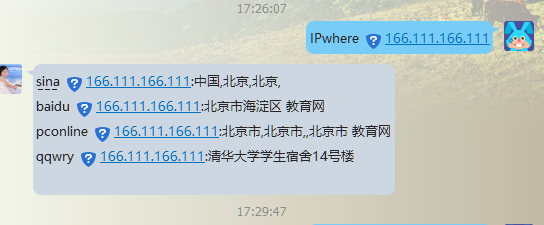

##IP::IPwhere - IP address search from baidu,taobao,sina,pconlie public IP API!

批量ip归属地查询，调用阿里新浪、百度和pconline ip库api接口,也可以增加纯真库，单独
查询，没有整合到本模块中。

试用方法： ./ipwhere.pl 8.8.8.8 8.8.8.6
需要安装perl及扩展LWP::Simple；use JSON;
建议通过cpanm LWP::Simple JSON 一键安装。

## useage：
    
    use IP::IPwhere;
    print query(\@ARGV);

### 使用用方法： 

    perl ipwhere.pl  223.123.123.45 203.123.123.123 

### 结果展示
    
    perl ipwhere.pl 223.123.123.45 203.123.123.123

    taobao 223.123.123.45:中国,北京市,北京市,移动
    taobao 203.123.123.123:澳大利亚,,,
    sina 223.123.123.45:中国,北京,北京,
    sina 203.123.123.123:澳大利亚,西澳大利亚,North Fremantle,
    baidu 223.123.123.45:北京市西城区 移动
    baidu 203.123.123.123:澳大利亚
    pconline 223.123.123.45:,,, 中国移动
    pconline 203.123.123.123:,,, 澳大利亚

### Mojo::webqq插件，我们也提供一个Mojo::webqq插件，见example
目录。

通过本插件可以通过qq，QQ群，以及微信，交互式查询ip归属地。
[Mojo-Webqq-IPwhere插件](https://git.oschina.net/ijz/Mojo-Webqq-IPwhere)

  
##备注：

   需要安装perl及扩展LWP::Simple ,JSON;
   可以通过cpanm 简单的安装: cpanm LWP::Simple JSON 

    
##INSTALL

To install this module, run the following commands:

	perl Makefile.PL
	make
	make test
	make install

##SUPPORT AND DOCUMENTATION

After installing, you can find documentation for this module with the
perldoc command.

    perldoc IP::IPwhere

You can also look for information at:

    RT, CPAN's request tracker (report bugs here)
        http://rt.cpan.org/NoAuth/Bugs.html?Dist=IP-IPwhere

    AnnoCPAN, Annotated CPAN documentation
        http://annocpan.org/dist/IP-IPwhere

    CPAN Ratings
        http://cpanratings.perl.org/d/IP-IPwhere

    Search CPAN
        http://search.cpan.org/dist/IP-IPwhere/

##LICENSE AND COPYRIGHT

Copyright (C) 2016 Orange

This library is free software; you can redistribute it and/or modify
it under the same terms as Perl itself.
