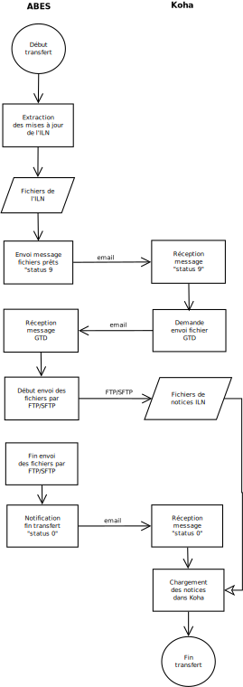

= Chargeur Sudoc Koha par Tamil =
Tamil s.a.r.l. <contact@tamil.fr>
v2.30, juillet 2019
:linkcss:
:icons: font
:toc: right
:source-highlighter: coderay
:coderay-css: class

== Introduction

[NOTE]
================================================================================
Une version en-ligne de ce document est disponible à l'URL suivante :

- *HTML* :
  http://www.tamil.fr/sudoc/sudoc.html[http://www.tamil.fr/sudoc/sudoc.html]
- *PDF* :
  http://www.tamil.fr/sudoc/sudoc.pdf[http://www.tamil.fr/sudoc/sudoc.pdf]
================================================================================

[IMPORTANT]
.Résumé
===========
Le *Chargeur Sudoc Koha* est un logiciel sous licence GNU GPL. Il permet
de déployer un Catalogue http://koha-community.org[Koha] dans le Sudoc.
Ses principales caractéristiques sont les suivantes :

- Gestion du protocole d'envoi des fichiers par l'ABES à l'établissement
  en mode PUT.
- Multi-établissements (ILN). L'outil peut gérer les chargements de
  plusieurs ILN fonctionnant sur un même serveur en tant qu'instances
  distinctes de Koha.
- Dédoublonnage des notices bibliographiques et d'autorités entrantes.
- Gestion des liens aux autorités.
- Création des exemplaires en ajout de notice. Pour chaque ILN, il est
  possible de mettre en oeuvre une logique spécifique
  d'exemplarisation. On peut ainsi créer entièrement ses exemplaires
  dans WinIBW et générer automatiquement des exemplaires Koha.
- Logique de fusion de notices bibliographiques paramétrable et
  programmable.
- Outils d'aide au déploiement initial d'un ILN dans le Sudoc.
===========

== Principes ==

Le catalogue du Système Universitaire de Documentation
http://www.sudoc.abes.fr[Sudoc] est le catalogue collectif français
réalisé par les bibliothèques et centres de documentation de
l'enseignement supérieur et de la recherche. Le Sudoc est géré par
l'Agence bibliographique nationale de l'enseignement supérieur
(http://www.abes.fr[ABES]).  Le Sudoc comprend plus de 9
millions de notices bibliographiques qui décrivent tous les types de
documents (livres, thèses, revues, ressources électroniques, documents
audiovisuels, microformes, cartes, partitions, manuscrits et livres
anciens...)

Le *Chargeur Sudoc Koha* est une boîte à outils permettant l'échange de
données entre le SIGB http://www.koha-community.org[Koha] et le Sudoc.
Différentes opérations sont à réaliser afin de *déployer* dans le Sudoc
un établissement (ILN pour l'ABES) constitué d'une ou plusieurs
bibliothèques (RCR). À chaque ILN, correspond une instance de Koha et à
chaque RCR d'un ILN correspond une bibliothèque d'une instance Koha.

Il y a une phase préalable de localisation des ressources de l'ILN dans le
Sudoc. Cette opération peut être automatisée dans une certaine mesure. Le
Chargeur Sudoc propose des outils d'extraction des données bibliographiques
d'un Catalogue Koha dans des formats reconnus par le Sudoc. Au moyen de ces
fichiers, un ILN évalue le taux de recouvrement de son Catalogue dans le
Sudoc, le localise automatiquement et en retour enrichit son Catalogue de
liens vers les notices du Sudoc.

On passe ensuite à la phase de fonctionnement avec le Sudoc. À cette
étape, l'ILN utilise le logiciel WinIBW afin de saisir ses notices
bibliographiques et d'autorités directement dans le Sudoc. Les notices
ainsi créées sont renvoyées par l'ABES à l'ILN qui les charge
périodiquement dans son Catalogue Koha. Le Chargeur Sudoc gère à la fois
les transferts de fichiers par l'ABES et le chargement des notices dans
un Catalogue Koha. 

== Installation ==

Le Chargeur Sudoc est une collection de scripts Perl qui fonctionnent sous tout
système d'exploitation Linux/Unix. Le Chargeur est disponible sous la forme
d'un module CPAN qui s'installe par la commande suivante :

[source,sh]
----
cpan Koha::Contrib::Sudoc
----

Une fois le module installé, il faut créer un répertoire par ILN dans lequel
seront placés les fichiers de notices fournis par l'ABES, ainsi que le fichier
de configuration du Chargeur, ses fichiers de log et, éventuellement, ses
bibliothèques spécifiques de conversion/exemplariasation de notices.

Pour exécuter les scripts du Chargeur, une variable d'environnement `Sudoc`
doit pointer sur le répertoire de l'ILN.  Et bien sûr, il faut que vous ayez au
moins une instance de Koha installée, avec les variables d'environnement
`KOHA_CONF` et `PERL5LIB` correctement initialisées.

Par exemple, vous créez un répertoire pour le Chargeur `/usr/local/koha/sudoc`,
puis vous l'initialisez avec tous les sous-répertoires nécessaires en exécutant
la séquence suivante de commandes shell :

[source,sh]
----
cd /usr/local/koha
mkdir sudoc
cd sudoc
export Sudoc=/usr/local/koha/sudoc
sudoc init
----

Vous aurez un répertoire `/usr/local/koha/sudoc` contenant une
arborescence de sous-répertoires et les fichiers du Chargeur. Quelque
chose comme ceci :

----------------------------------------
.
|-- etc
|   `-- sudoc.conf
|-- lib
`-- var
    |-- log
    |   |-- Authorities.log
    |   `-- Biblios.log
    `-- spool
        |-- done
        |-- staged
        `-- waiting
            |-- ILN186-TEST-933r374B001.raw
            |-- ILN186-TEST-933r374C001.raw
            `-- ILN186-TEST-933r376A001.raw
----------------------------------------
   
[CAUTION]
Lisez attentivement la suite de ce document pour comprendre le
fonctionnement du Chargeur Sudoc. Configurer soigneusement le chargeur
lui-même et la/les instances de Koha avec lesquelles vous l'utiliserez.
Avant toute utilisation, adaptez à vos besoins le fichier
`sudoc.conf` Faites des essais sur une instance de test de Koha avant
d'utiliser le Chargeur sur votre instance de production.

== Chargements réguliers ==

Le Chargeur Sudoc distingue le transfert des fichiers de l'ABES de leur
chargement dans un/des catalogues Koha. Le chargeur peut fonctionner sur
un serveur partagé disposant de plusieurs instances de Koha
correspondant à des ILN distincts. 

Pour chaque ILN, il y a un *spool* de fichiers Sudoc qui sont placés
dans trois sous-répertoires. Les fichiers passent d'un sous-répertoire à
l'autre en fonction de l'avancement des traitements :

- Les fichiers arrivent de l'ABES dans le sous-répertoire *staged* de
l'ILN. Ils y restent tout le temps du transfert par FTP. 
- Quand ils sont entièrement téléchargés, les fichiers sont déplacés
du sous-répertoire *staged* dans le sous-répertoire *waiting*.
- À une heure déterminée, a priori quand le serveur Koha est peu
utilisé, le chargement des fichiers est lancé. Ce traitement peut être
programmé ou lancé à la main en période de test. 

<<<

=== Transferts Sudoc > Koha ===

Le transfert de fichiers du serveur du Sudoc sur le serveur Koha se
fait au moyen de la méthode *PUT* proposée par l'ABES. Le serveur Sudoc
et le serveur Koha réalisent des actions et échangent des messages par
courriel selon le protocole suivant :

[horizontal]
Sudoc::       Les notices de l'ILN sont extraites selon la périodicité
              qui a été demandée à l'ABES.  Quand les fichiers sont
              prêts, un message est envoyé au serveur Koha, le message
              *status 9*.
Koha::        Le message *status 9* est reçu par le serveur Koha. Un
              message GTD est envoyé au serveur de l'ABES. Il est
              demandé que les fichiers soient transférés dans le
              répertoire `var/spool/staged` de l'ILN.
              Le serveur FTP/SFTP du serveur Koha est configuré pour que sa
              racine pointe sur `var/spool`. La commande GTD demande à l'ABES
              d'envoyer les fichiers dansle sous-répertoire `staged`.
Sudoc::       Réception du message GTD de l'ILN. Transfert des fichiers
              par FTP sur le serveur Koha dans le sous-répertoire de
              l'ILN. Quand le transfert est terminé, envoi par l'ABES du
              message *GTD Status 0*.
Koha::        Réception du message *GTD Status 0*. Les fichiers sont
              déplacés dans le spool de *staged* en *waiting*.

Les éléments suivants doivent être définis/configurés :

- Email du serveur Sudoc
- Email du serveur Koha
- FTP sur serveur Koha, hôte, login, password

Un serveur FTP/SFTP (racine sur `var/spool`) doit être configuré sur le
serveur Koha ainsi qu'un serveur SMTP.

La commande `sudoc trans` gère ce protocole de transfert. Le programme
examine la boîte aux lettres locale MBOX définie dans le fichier de
configuration par son chemin d'accès. Il traite deux messages en
provenance du Sudoc :

1. *Message status 9* qui indique qu'un lot de notices destinées à un
   ILN ont été extraites du Sudoc. `sudoc-trans` répond à ce message en
   renvoyant immédiatement une demande de transfert par FTP : GTD.

2. *Message GTD Status 0* qui indique que les fichiers ont été transmis
   par le Sudoc sur le serveur FTP dans le répertoire *staged* du spool
   de l'ILN.  `sudoc-trans` déplace les fichiers dans le répertoire
   *waiting* du spool de l'ILN.

Le fonctionnement du daemon `sudoc trans` est piloté par la section
<<conf-trans, Transfert>> de `sudoc.conf`.

[CAUTION]
`sudoc trans` doit avoir les droits suffisants pour lire et écrire le
fichier MBOX de la boîte aux lettres contenant les courriels envoyés par
l'ABES.

[NOTE]
================================================================================

Dans certaines circonstances, il peut être nécessaire d'envoyer à l'ABES une
demande d'envoi de fichiers sans avoir reçu au préalable le message _status
9_. Pour ce faire, il est nécessaire de connaître le _jobid_ ABES de son
établissement : c'est l'identifiant ABES de la tâche automatisée qui extrait
du Sudoc les notices de l'établissement récemmment mises à jour. Cet
identifiant se trouve dans les messages envoyés par l'ABES.

On peut alors lancer la commande suivante : `sudoc gtd`. Cette commande force
l'envoi à l'ABES d'un message GTD. Le jobid demandé se trouve dans le paramètre
_loading > jobid_. Le GTD demande à l'ABES de placer les fichiers directement
dans le sous-répertoire `waiting` du spool.

On peut alternativement utiliser la commande `sudoc chargeauto`. Cette commande
envoie le GTD à l'ABES attend un certain délai (paramètre _loading > timeout >
transfer_) ; déplace les fichiers de `staged` dans `waiting` ; puis, si le
paramètre _loading > auto_ est à 1, lance directement le chargement des notices.
================================================================================

=== Les fichiers Sudoc ===

Les fichiers de notices bibliographiques et d'autorité sont stockés dans
le *spool* du Chargeur Sudoc. La variable d'environnement `Sudoc` pointe
sur le répertoire racine du Chargeur. Le sous-répertoire `var/spool`
contient les fichiers de notices.

**Liste des fichiers du spool** -- On examine les fichiers de notices avec la
commande `sudoc spool`. Cette commande renvoie la liste de tous les fichiers
qui sont en cours de transfert, en attente de chargement ou qui ont été
chargées. On a donc trois sous-répertoires :

1. *staged* contenant les fichiers en cours de transfert par l'ABES
2. *waiting* contenant les fichiers en attente de chargement
3. *done* contenant les fichiers qui ont été chargés.

La commande `sudoc spool` répondra par exemple :

-----
Fichiers des autorités chargées : 
Fichiers des notices biblio chargées : 
Fichiers des autorités en attente de chargement : 
  1. ILN186-TEST-933r374C001.raw
Fichiers des notices biblio en attente de chargement : 
  1. ILN186-TEST-933r374B001.raw
  2. ILN186-TEST-933r376A001.raw
-----

**Visualisation de fichiers** -- On peut également voir le contenu d'un fichier
spécifique avec la commande : `sudoc spool fichier1 fichier2 ...`. 

**Nettoyage** -- Les chargements réguliers peuvent transférer de l'ABES sur le
serveur Koha des fichiers vides. C'est spécialement vrai si l'ILN a choisi des
transferts quotidiens.  Ces fichiers peuvent être tous supprimés avec cette
commande : `sudoc spool vide`.

=== Chargements dans le Catalogue Koha ===

L'ILN définit avec l'ABES les fichiers qu'il souhaite recevoir
régulièrement. Les notices bibliographiques des ressources cataloguées
par l'établissement dans le Sudoc sont toujours transmises. Le chargeur
Sudoc requiert que les notices envoyées soient encodées en UTF-8/NFC. Il est
possible de demander à recevoir également les notices liées, les notices
de collection par exemple. Enfin, l'ABES peut également transmettre des
fichiers des autorités contenues dans les différentes notices
bibliographiques.

Le Chargeur Sudoc dispose de deux commandes distinctes de chargement des
notices : une première pour les notices bibliographiques et une seconde
pour les notices d'autorité. 

[NOTE]
Si vous n'avez pas utilisé `sudoc trans` pour placer vos fichiers de
notices dans le spool de votre ILN, vous pouvez le faire à la main :
Copiez dans `var/spool/waiting` les fichiers de l'ABES. Vous pouvez
ensuite les lister avec la comamnde `sudoc spool`, puis les charger avec
les commandes décrites ci-dessous.

[WARNING]
Il faut toujours commencer par charger les autorités afin de permettre
la création des liens entre notices bibliographiques et notices
d'autorité.

==== Notices d'autorité ====

La commande de chargement des autorités `sudoc autorité` examine le répertoire
des fichiers en attente de chargement. Les fichiers d'autorités sont traités
un-à-un.

Pour chaque autorité, on détermine s'il s'agit d'une nouveauté ou de la mise à
jour d'une autorité existante. **Les nouveautés** sont ajoutées à Koha. **Les
mises à jour** remplacent les autorités Koha correspondantes.  On interroge
les autorités Koha pour savoir s'il en existe une ayant l'identifiant de la
notice entrante (son PPN en 001). Si c'est le cas, il s'agit d'une autorité
déjà présente dans Koha et qui a été modifiée dans le Sudoc.

Le Chargeur traite également le cas des *Fusions Sudoc*. La zone 035 est
examinée afin de déterminer si l'autorité est marquée comme étant une fusion
Sudoc d'autorités.  Dans ce cas, on peut savoir si une autorité Koha existe
déjà ayant l'identifiant (PPN) de l'autorité obsolète ayant fusionnée avec
l'autorité entrante. Les notices bibliographiques liées à l'ancienne autorité
sont retrouvées et elles sont rattachées à la nouvelle autorité.

Après chargement, chaque fichier d'autorités est déplacé dans le
répertoire *done* des fichiers ayant été traités.

[IMPORTANT]
.Indexation
====
Concernant l'indexation des autorités chargées, il y a plusieurs
stratégies possibles. Il est nécessaire que toutes les autorités
chargées soient indexées avant de passer à l'étape de chargement des
notices bibliographiques, sans quoi le lien biblio -> autorités ne pourra
pas être réalisé.

Si on est sûr de ne pas avoir de volumes trop importants d'autorités,
on peut laisser Koha indexer les autorités en tâche de fond. On attend
un certain délai avant de lancer le chargement des notices
bibliographiques.

Une autre stratégie consiste à arrêter l'indexeur Zebra de Koha avant le
lancement du chargement des autorités. À la fin du chargement, on indexe
manuellement les autorités ajoutées/modifiées, puis on redémarre
l'indexeur.
====

==== Notices bibliographiques ====

Le chargement des notices bibliographiques est réalisé par la commande 
`sudoc biblio`. Tout en ayant la même logique de fonctionnement que le chargeur
des autorités, ce script réalise des traitements supplémentaires et
paramétrables. On peut par exemple avoir pour un établissement donné une
logique spécifique de création des exemplaires reprenant des données de champs
locaux (niveau 2) de la notice entrante. Pour les mises à jour, il peut y
avoir des règles de fusion entre la notice entrante et la notice existante. On
peut décider de ne pas charger certaines notices sur la base de critères
paramétrables.

===== Fusion =====

Pour chaque notice bibliographique, on détermine s'il s'agit d'une
nouveauté ou de la mise à jour d'une notice existante. Les nouveautés
sont ajoutées à Koha.  Les mises à jour remplacent les notices Koha
correspondantes.

Il y a trois cas de figure où l'on a affaire à une mise à jour :

. *Mise à jour dans le Sudoc* -- On interroge les notices Koha pour
  savoir s'il en existe une ayant le PPN de la notice entrante.  Si
  c'est le cas, il s'agit d'une notice déjà présente dans Koha et qui
  a été modifiée dans le Sudoc.
. **Localisation Sudoc** -- On peut marquer dans le Sudoc qu'une notice
  est déjà présente dans Koha, soit manuellement en saisissant une zone
  035 contenant un de ses RCR, soit automatiquement au moment du
  déploiement initial de l'ILN dans le Sudoc. On a alors une zone 035
  avec un sous-champ `$5` contenant un des RCR de l'ILN et en `$a` le
  numéro (biblionumber) de la notice Koha correspondante.
. **Fusion Sudoc** -- La zone 035 est examinée afin de déterminer si la notice
  est marquée comme étant une fusion Sudoc de notices.  On cherche une zone 035
  contenant un `$9 sudoc`. Le `$a` contient le PPN de l'ancienne notice qui a
  été fusionnée. Dans ce cas, on peut savoir si une notice Koha existe déjà
  ayant le PPN de la notice qui a été fusionnée à la notice entrante. Le
  Chargeur Sudoc ne peut effectuer la fusion de la notice entrante à une notice
  existante dans Koha que si une fusion n'est pas déjà nécessaire pour une des
  raisons précédentes (mise à jour dans le Sudoc ou localisation) et s'il n'y a
  bien qu'une notice Koha correspondante à une fusion Sudoc. En cas de fusion
  nécessaire mais que le chargeur ne peut pas effectuer, un message d'alerte est
  écrit dans les logs.

===== Exemplarisation =====

Pour les nouvelles notices, des exemplaires Koha peuvent être créés. Ce mode
de fonctionnement est paramétrable : voir `sudoc.conf` paramètre *itemize*.
Pour une mise à jour, la notice bibliographique est fusionnée avec la notice
entrante mais ses exemplaires ne sont pas affectés. Il n'y pas de logique de
fusion des exemplaires en standard.

En standard, le Chargeur Sudoc crée automatiquement des exemplaires Koha (zones
995) à partir du contenu des zones 915 et 930 des notices entrantes. Les
sous-champs suivants de la zone 995 sont créés de la façon suivante :

[horizontal]
*$b*:: contient le code bibliothèque Koha du RCR de l'exemplaire Sudoc. Ce code
  est obtenu à partir de la table d'équivalence RCR:code Koha de `sudoc.conf`.
*$c*:: idem. On a donc toujours $c = $b.
*$f*:: contient le code à barres de l'exemplaire : 915$b ou, en son absence,
  l'EPN (le n° d'exemplaire Sudoc). Si l'EPN est utilisé, il est préférable de
  modifier par la suite les codes à barres dans Koha. 
*$k*:: contient la cote qui se trouve en 930$a.

===== Autoritisation =====

Pour toute notice, il est possible "d'autoritiser" les zones contrôlées
par autorités (7xx, 6xx, etc.), c.-à-d. leur ajouter l'identifiant des
autorités Koha. En effet, les notices entrantes ont un PPN Sudoc dans le
sous-champ $3. Il convient d'y ajouter un sous-champ $9 contenant le
numéro d'autorité Koha. On peut choisir de ne pas effectuer ce
traitement, auquel cas on n'aura que des identifiants d'autorités Sudoc,
ce qui peut convenir à un établissement dont tout le Catalogue Koha
provient du Sudoc sans notices locales.  Voir `sudoc.conf` paramètre
`authoritize`.

=== Fichiers de log ===

Les chargeurs des notices bibliographiques et des autorités affichent à l'écran
quelques informations sur les traitements qu'ils effectuent. Le détail de
l'activité des chargeurs est écrit dans des fichiers de log se trouvant dans le
répertoire `var/log` :

- Biblios.log
- Authorities.log

Ces log contiennent les informations suivantes :

- Nom du fichier chargé
- Nombre de notices/autorités chargées dont nombre de notices fusionnées
- Notice/autorité Sudoc entrante brute
- Notice/autorité avant chargement dans Koha, donc avec exemplaires, liens aux
  autorités, fusion, etc.
- Rapport d'anomalie

En phase de test, on peut utiliser le chargeur sans le paramètre `--doit`.
Ainsi les notices/autorités sont préparées pour être chargées dans Koha mais ne
sont pas effectivement chargées. En examinant les log, on peut voir les
traitements réalisés et vérifier qu'ils correspondent bien à ce que l'on
souhaitait obtenir.

=== Fichier de configuration sudoc.conf ===

Un fichier de configuration `sudoc.conf` contient tous les paramètres
nécessaires au bon fonctionnement du Chargeur Sudoc. Il y a deux grandes
sections : une première qui pilote le fonctionnement du transfert de
fichiers et une seconde qui pilote le chargement des notices. Le fichier
`sudoc.conf` se trouve dans le sous-répertoire `etc` du répertoire
d'installation du Chargeur Sudoc.

[[conf-trans]]
==== Section *transfert* ====

Une section *trans* détermine le fonctionnement du service de transfert
`sudoc trans` des fichiers ABES :

timeout::
  Délai en minutes entre deux réveils du service de transfert. Par
  exemple, une valeur de `10` signifie que la boîte aux lettres Sudoc
  sera examinée toutes les dix minutes.
email::
  Section contenant les adresses de courrier électronique utilisées par
  le protocole de transfert de fichiers entre l'ABES et le serveur
  Koha :
  abes;;
    Email de l'ABES à laquelle envoyer les messages. A priori c'est
    toujours l'adresse `abes_ftp@carmin.sudoc.abes.fr`
  koha;;
    Email du serveur Koha. C'est la boîte aux lettres de cette adresse
    qui est examinée par le service de transfert.
mbox::
  Chemin d'accès à la boîte aux lettres
  http://fr.wikipedia.org/wiki/Mbox[MBOX] contenant les messages
  adressés au serveur par l'ABES.

La section *loading* détermine si les notices seront chargées automatiquement
dans Koha par le service de transfert après que les fichiers ont été transférés
par FTP/SFTP sur le serveur Koha. Les info de cette section sont également
utilisées par la commande `sudoc chargeauto`.

auto::
  Indique si les fichiers qui se trouvent dans le répertoire `waiting` du
  spool doivent être chargés dans le Catalogue Koha. 1=oui, 0=non. Le
  chargement est déclanché par la réception du message _status 0_ envoyé par
  l'ABES quand le transfert par FTP/SFTP est achevé. En phase de test, on
  laisse ce paramètre à 0, et on utilise les commandes de chargement manuel des
  notices : `sudoc autorité` et `sudoc biblio`.
doit::
  Indique si le chargement est effectif ou non. Mettre ce paramètre à la
  valeur 0 (non) permet de tester le fonctionnement du chargement automatique
  après réception des fichiers.
timeout::
  Délai en minutes entre les deux étapes du chargement, envoi GTD et chargement
  proprement dit.
  transfer;;
    Délai entre l'envoi à l'ABES de la commande GTD et le début du chargement
    automatique des fichiers de notices. Ce paramètre est utilisé par les
    commandes `sudoc trans` et `sudoc chargeauto`.
  indexing;;
    Délai entre les chargements des fichiers du spool `waiting`. Les fichiers
    du spool sont chargées dans l'ordre suivant : par type (autorités, notices
    liées, notices) et pour chaque type, par date. Ce paramètre est à définir
    en fonction des réglages du service d'idexation en continue de Koha. Si par
    exemple, les notices sont indexées toutes les cinq minutes, un timeout de
    sept minutes entre les chargements est une valeur appropriées.
log::
  Un log du chargement est envoyé par email à un administrateur de Koha. On peut
  régler le niveau du log ainsi que son destinataire.
  level;;
    Niveau du log : `notice` ou `debug`. Le mode `debug` remplit le log avec
    d'avantage d'informations.
  from;;
    Email de l’émetteur de l'email.
  to;;
    Email du destinataire de l'email.

==== Section *chargement* ====

Les paramètres de chargement sont définis ainsi :

iln::
  Numéro de l'ILN.
rcr::
  Liste des équivalences entre les RCR et les bibliothèques Koha.
auth::
  Cette section contient tous les paramètres du chargeur des autorités
  `sudoc autorité` :   
  ppn_move;;
    Tag dans lequel déplacer le PPN de l'autorité avant son chargement.
    Le PPN est en 001. On le déplace généralement en 009. On peut
    également le déplacer en 090$p : ppn_move = 090p. On ne peut pas le
    laisse en 001 car Koha utilise toujours cette zone pour son propre
    identifiant (authid). Ce n'est pas le cas pour les notices
    bibliographiques.
  typefromtag;;
    Liste des équivalences entre la zone contenant la vedette dans
    l'autorité entrante et le type d'autorité Koha. Par exemple, si on a
    un type d'autorité Koha Nom de personne `NP` et que les autorités
    auteurs entrantes ont leur vedette en `200`, on aura alors :
    `200: NP`.
biblio::
  Cette section contient tous les paramètres du chargeur des notices
  bibliographiques `sudoc biblio` :   
  ppn_move;;
    Tag dans lequel déplacer le PPN de la notice bibliographique avant
    son chargement.  Le PPN est en 001. On le déplace généralement en
    `009`. On peut également le déplacer en 090$p : `ppn_move:090p`.
  framework;;
    Le code Koha de la grille de saisie à laquelle affecter toutes les notices
    entrantes. Un _converter_ spécifique peut permettre d'aller au-delà et de,
    par exemple, ventiler les notices entrantes dans différentes grilles en
    fonction du type des notices.
  authoritize;;
    Est-ce qu'on autoritise les notices entrantes ? Oui = 1, Non = 0. Le
    chargement de notices bibliographiques est sensiblement plus rapide en
    l'absence d'autoritisation.
  itemize;;
    Exemplarise-t-on les notices entrantes ? Oui = 1, Non = 0.
  converter;;
    Généralement laissé vide. Peut contenir le nom d'une sous-classe
    Perl spécifique de conversion des notices. Accessible uniquement à
    un programmeur Perl. Si le champs est renseigné mais que le Chargeur
    n'arrive pas à charger la sous-classe (à cause d'une erreur de
    syntaxe ou parce qu'il ne trouve pas la sous-classe), le Chargeur
    retournera une erreur et s'interrompra.
  exclure;;
    Contient la liste des champs de la notice Sudoc qu'il faut supprimer.
  proteger;;
    Contient la liste des champs de la notice Koha qu'il faut "protéger" en
    cas de fusion avec une notice Sudoc. Les champs protégés sont conservés de
    la notices Koha. Tous les autres champs sont remplacés par les champs de la
    notice Sudoc. Il y a un dédoublonnage des champs protégés qui s'effectue
    sur tous les sous-champs mis bout à bout et passés en minuscule, sauf les
    sous-champs 0 à 9.

==== Exemple ====

[source,yaml]
----------
---
iln: 1234
rcr:
  692755301: BIB1
  692767892: BIB2
trans:
  timeout: 10
  email:
    abes: abes_ftp@carmin.sudoc.abes.fr
    koha: sudoc@bibliotheque.fr
  mbox: /var/mail/sudoc
  ftp_host: ftp.bibliotheque.fr
loading:  
  auto: 1
  doit: 1
  timeout: 5
  log:
    level: notice
    from: contact@bibliotheque.fr
    to: sudoc@bibliotheque.fr
auth:
  ppn_move: 009
  typefromtag:
    200: NP
    210: CO
    215: SNG
biblio:
  ppn_move: 009
  authoritize: 1
  linking: 1
  itemize: 1
  framework: PROPRE
  converter:
  exclure:
    - 680
    - 801
  proteger:
    - 610
----------

=== Configuration de Koha ===

Une des tâches du Chargeur Sudoc consiste à mettre en correspondance les
notices d'autorité et bibliographiques en provenance du Sudoc avec les
notices déjà présentes dans Koha. Dans le Sudoc, chaque notice,
d'autorité et bibliographique, est identifiée par un numéro unique
appelé le PPN qui se trouve dans la zone 001.

Il est nécessaire que les notices Sudoc chargées dans Koha conservent
leur PPN car c'est au moyen de cet identifiant que le Chargeur peut
savoir si une notice entrante doit être ajoutée à Koha ou bien si elle
doit écraser (partiellement éventuellement) une notice existante. Le PPN
des autorités sert également à *autoritiser* les zones des notices
bibliographiques liées à des autorités.

En fonction de son paramétrage local de Koha, il peut être nécessaire de
déplacer le PPN dans une zone différente qui n'entre pas en conflit avec
les zones déjà utilisées. Par exemple, il arrive que la zone 001 des
notices bibliographiques Koha contienne le *biblionumber* (numéro
interne des notices Koha). Il est recommandé de déplacer la zone 001 des
autorités et des notices bibliographiques dans la zone 009. Cette zone
cible est définie via le paramètre *ppn_move* de la section biblio/auth
de `sudoc.conf`. Ce déplacement est même indispensable pour les
autorités parce que l'identifiant interne de Koha (authid) est toujours placé
en 001. Ce n'est pas le cas nécessairement pour les notices bibliographiques.

Afin que le Chargeur Sudoc puisse interroger les PPN, il faut configurer son
moteur de recherche, ElasticSearch ou Zebra, pour indexer le champ qui contient
le PPN, bibliographique et d'autorité.

*Zebra* -- Il faut ajouter aux fichiers de configuration de Zebra un nouvel
index *PPN*. Par exemple, si on déplace les PPN en 009, il faudra ajouter la
ligne suivante aux fichiers `authority-koha-indexdefs.xml` ou
`biblio-koha-indexdefs.xml` des autorités et des notices bibliographiques :

[source,xml]
-----
<index_control_field tag="009">
  <target_index>PPN:w</target_index>
  <target_index>PPN:n</target_index>
</index_control_field>
-----

=== Automatisation ===

Les différents programmes du Chargeur Sudoc doivent être utilisés conjointement
et en séquence afin de réaliser les opérations de chargement des notices : 1°)
autorités, 2°) notices liées, 3°) notices bibliographiques. De plus, entre
chaque chargement, l'indexation des nouvelles données doit être réalisée.

Toutes ces tâches peuvent être automatisées en activant le paramètre
`loading:auto`. On peut alternativement lancer les commandes de chargement au
moyen d'un script Shell. Par exemple :

[source,bash]
.sudoc-charge.sh
-----
#!/bin/sh
 
CLIENT='mabibli'
ILN='123'
DOIT='--doit'
EMAIL_FROM='Tamil e-Biblio Service <contact@tamil.fr>'
EMAIL_TO='xx@yy.fr'
EMAIL_CC='yy@zz.fr'
SLEEP='5m'
TMP_FILE="/tmp/sudoc_$CLIENT"

export LANG='fr_FR.UTF-8'
export PERL5LIB=/usr/local/koha/lib
export KOHA_CONF=/usr/local/koha/koha-conf.xml
export SUDOC=/usr/local/koha/sudoc <1>

exec 1>$TMP_FILE 2>&1 <2>
echo "Chargement Sudoc"

sudoc autorité $DOIT <3>
echo ----------------------------------------
sleep $SLEEP <4>
sudoc biblio $DOIT<5>
echo ----------------------------------------
sleep $SLEEP <6>
sudoc biblio $DOIT <7>
 
iconv -f utf8 -t latin1 -c $TMP_FILE | \
  mail -a "FROM: $EMAIL_FROM" -s 'Chargement Sudoc' -c $EMAIL_CC $EMAIL_TO <8>
-----
<1> Définition de l’environnement d'exécution du Chargeur Sudoc
<2> Renvoi dans un fichier temporaire de la sortie standard
<3> On charge d'abord les autorités
<4> On laisse le temps à l'indexeur Zebra d'indexer les autorités ajoutées/modifiées
<5> On charge les notices bibliographiques liées (collections par ex.)
<6> Idem 3 pour l'indexation des notices biblio
<7> Chargement des notices bibliographiques.
<8> Envoi par email du résultat des différents chargements

== Chargement initial ==

Opération de chargement initial des notices d'un établissement dans le
Sudoc.

=== sudoc-localisation ===

Cette commande est à utiliser en vue d'une localisation automatique d'un
Catalogue Koha dans le Sudoc. 

La procédure et les fichiers attendus sont
http://documentation.abes.fr/sudoc/manuels/echanges/exemplarisation_automatique/explmonogr.html[documentés
par l'ABES].

À partir d'un Catalogue Koha, ce script génère des fichiers de clés de
dédoublonnage qui doivent permettre à l'ABES de repérer dans le Sudoc les
notices Koha. Ces fichiers sont demandés par l'ABES afin de réaliser soit un
test de recouvrement soit une localisation automatique. Ces fichiers suivent la
convention de nommage demandée par l'ABES : commence par une lettre (**p** pour
des PPN, **i** pour des ISBN, **r** pour Date-Auteur-Titre), suivi du RCR de la
bibliothèque, puis le code de PEB (**u** disponible pour le PEB, ou **g** non
disponible). Ces noms de fichiers sont suffixés d'un index. Par exemple :

-----
i3641767u_0001.txt
i3641767g_0002.txt
-----

Plusieurs fichiers sont créés, chacun contenant un maximum de 1000 lignes.
Chaque ligne contient une clé de dédoublonnage (ISBN, date-auteur-tire ou PPN),
suivie d'une cote et du biblionumber de la notice Koha, séparés par un point
virgule. Un groupe de fichiers est généré par RCR tel que défini dans
`sudoc.conf`. Exemple de fichier :

 ISBN;930 $a;L035 $a
 0140222421;GEN ETU KUP 5.1981;263
 0195089464;GEN ETU DAD 5.1993;301
 031209809X;HIS CONT NASS 5.1984;404

Pour les notices ayant plusieurs exemplaires dans une même bibliothèque (RCR),
on retient la cote du premier exemplaire.

Si une même clé de dédoublonnage (ISBN ou Date-Auteur-Titre) pointe sur
plusieurs ISBN, la clé n'est pas retenue. Elle est envoyée dans un fichier des
**clés multiples**, un fichier par RCR. Vous pouvez choisir de dédoublonner
ces notices dans Koha ou bien de les localiser manuellement dans le Sudoc.
Exemple de fichier de clés multiples : `i641767u_clemult.txt` :
 
 2858310009
   1753 POL IDE 3.1978
   1754 POL IDE 3.1978
   1783 POL IDE 3.1978
   1784 POL IDE 3.1981
 2863640046
   822 LIT NOU AHA ԱՀԱ 3.1978
   3255 LIT NOU AHA ԱՀԱ 3.1979

Ces fichiers sont envoyés à l'ABES qui, en retour, soit renvoie un rapport de
taux de recouvrement soit procède à la localisation automatique des notices de
chaque bibliothèque dans le Sudoc.

Ce script dispose de plusieurs paramètres :

==== --type ====

Spécifie le type de clé de dédoublonnage produite. Trois valeurs possibles :
**isbn** pour des clés extraites de la zone 010 ; **ppn** pour des clés
extraites par défaut de la zone 001, ou d'une autre zone avec le paramètre
--ppn ; **dat** pour des clés extraites des champs date-auteur-titre.

==== --ppn ====

Le champ contenant le PPN peut être spécifié explicitemnt : `--ppn 001` ou
`--ppn 912a`. Par défaut `001`.

==== --select <clause SELECT sur base KOHA> ====

Sélection des biblionumber des notices pour lesquelles générer les fichiers de
localisation. Par défaut, on prend toutes les notices. Exemple :

-----
--select "SELECT biblionumber FROM biblioitems WHERE itemtype='OUV'"
--select "SELECT biblionumber FROM biblioitems WHERE isbn IS NULL"
-----

==== --lignes ====

Les fichiers clés contiennent au plus <lignes> lignes, y compris la première
ligne qui indique ce que contiennent les lignes suivantes. Par défaut 1000
lignes.

==== --test ====

Fichiers de clés uniquement pour un test de recouvrement.

==== --coteabes ====

Spécifie le champ de la notice ABES où placer la cote Koha. Par exemple, pour
une rétroconversion : `--coteabes 991\ \$a`. Par défaut, `930 $a`.

==== --peb | --nopeb ====

Notices disponibles pour le PEB ? Si non fourni, disponibles pour le PEB. Les
fichiers générés pour le PEB contiennent **u** dans leur nom. Ceux contenant des
notices non disponibles pour le PEB ont un nom comprenant un **g**.

=== sudoc-ppnize ===

Cette commande ajoute à un catalogue Koha les PPN Sudoc des notices qui
y ont été localisées automatiquement.

Après une localisation automatique, l'ABES fournit un fichier d'équivalences
entre les PPN des notices Sudoc et les biblionumber des notices Koha. Ce script
modifie les notices Koha en y ajoutant en 009 le PPN du Sudoc.  

Le fichier fourni est consitué d'une ligne par équivalence, chaque ligne ayant
le format suivant :

-----
PPN <PPN> : <biblionumber>
-----

Par exemple :

-----
PPN 000004405 : 17417
PPN 000006475 : 11841
PPN 000007323 : 5810
-----

Usage :

[source,sh]
----
sudoc-ppnize [--doit --verbose]
----

Synopsis :

[source,sh]
----
sudoc-ppnize L035-ILN80-abcd.raw
sudoc-ppnize L035-ILN80-abcd.raw --verbose
sudoc-ppnize L035-ILN80-abcd.raw --doit
----
