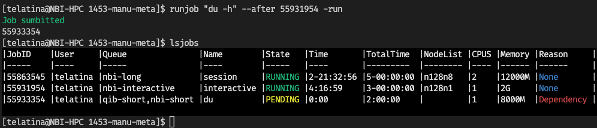
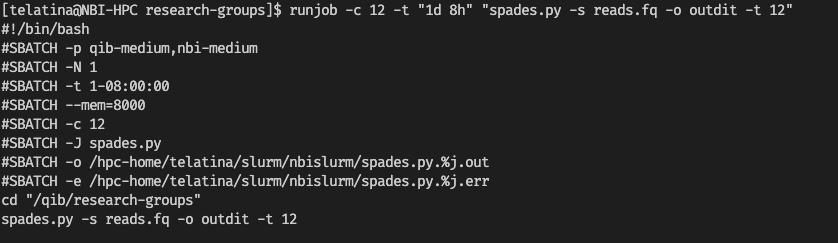
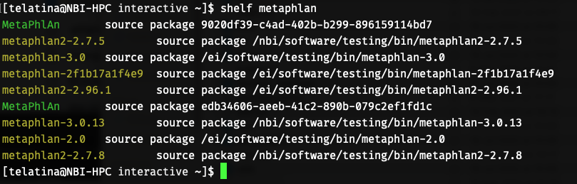
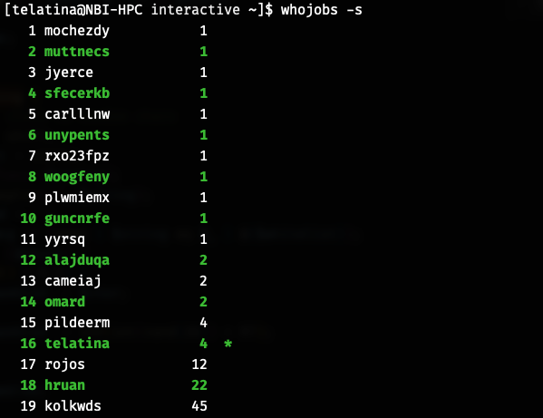

# *New Batch Interface* for SLURM

<a href="https://metacpan.org/dist/NBI-Slurm"></a>

[](https://github.com/quadram-institute-bioscience/NBI-Slurm/actions/workflows/main.yml)
[](https://metacpan.org/dist/NBI-Slurm)
[](http://matrix.cpantesters.org/?dist=NBI-Slurm;maxver=1)


## Scripts

This package provides a set of binaries (and a Perl module) to interact with the NBI HPC cluster.

### lsjobs 

List or delete your jobs in the queue with **lsjobs**. By default search is restricted to the active user, which can be changed 
with `-u USER` or set to `-u all`. 

See [docs](https://metacpan.org/dist/NBI-Slurm/view/bin/lsjobs)

```bash
lsjobs [options] [jobid.. | pattern ]
```

Add `-d` to delete the jobs (you will be prompted for confirmation).



### runjob

Submit a job to the queue (with cores, memory, time, etc) with **runjob**. 

See [docs](https://metacpan.org/dist/NBI-Slurm/view/bin/runjob)

```bash
runjob -n "my-job" -t 2 -r -c 18 -m 32 --after 9290 "python script.py --threads 18"
```

If invoked without `--run` (or `-r`) it will print the command to be executed.



### waitjobs

Wait for all jobs matching a pattern to finish (to be used to run a second job when they are all finished), with **waitjobs**.
You can send it to the queue, and use its JOBID as dependency for other jobs.

See [docs](https://metacpan.org/dist/NBI-Slurm/view/bin/waitjobs)

```bash
waitjobs [-u $USER] [pattern]
```

### shelf

List packages installed in the NBI HPC with **shelf**. See [docs](https://metacpan.org/dist/NBI-Slurm/view/bin/shelf)

```bash
shelf QUERY_STRING
```



### make_image_from_bioconda

Generate a Singularity image from a bioconda package with **make_image_from_bioconda**. 

See [docs](https://metacpan.org/dist/NBI-Slurm/view/bin/make_image_from_bioconda)

```bash
make_image_from_bioconda --output seqfu-1.20.sif --version 1.20.0 --package seqfu
```

### make_package

Given a singularity image, "install" a package in the NBI HPC (to be used with `source package xyz`)

See [docs](https://metacpan.org/dist/NBI-Slurm/view/bin/make_package)

```bash
make_package --image seqfu-1.20.sif --package seqfu__1.20   seqfu fu-orf fu-rename fu-msa...
```

:warning: If you generated the image with *make_image_from_bioconda* you should be able to omit the list of binaries, as they are
stored in the image itself.

### session

Start an interactive session with **session**, defaults can be saved in the configuration file.

See [docs](https://metacpan.org/dist/NBI-Slurm/view/bin/session)


```bash
session [-t 2 -c 18 -m 32]
```

### whojobs

Who is using the cluster: list usernames and number of jobs in ascending order with **whojobs**. See [docs](https://metacpan.org/dist/NBI-Slurm/view/bin/whojobs)

```bash
whojobs [--min-jobs INT]
```




## Configuration

The scripts will look for a configuration file in `~/.nbislurm.config` where you can store
your email address, default queue, and other options, as well as default parameters for 
interactive sessions.
See [the docs](https://metacpan.org/dist/NBI-Slurm/view/bin/configuration).

## Perl Module

[`NBI::Slurm`](https://metacpan.org/dist/NBI-Slurm) is a Perl package that provides a convenient interface for submitting jobs to SLURM, 
a workload manager for *High-Performance Computing* (HPC) clusters. 
It includes two main classes to submit jobs to SLURM: 

* `NBI::Job`, which represents a job to be submitted to SLURM, and 
* `NBI::Opts`, which represents the SLURM options for a job.

And two classes to manage the output of the jobs:

* `NBI::Queue`, which represents the content of the SLURM queue, and
* `NBI::QueuedJob`, which represents a single job in the queue.

Features

* Very experimental, very alpha, very buggy.
* Easily create and configure SLURM jobs using the NBI::Job class.
* Comes with binaries to submit jobs, list jobs, wait for jobs, etc.
  
## Installation

To use [NBI::Slurm](https://metacpan.org/dist/NBI-Slurm), you need Perl 5.12 or higher installed on your system. 
You can install the package using CPAN or manually by copying the NBI/Slurm.pm file to your Perl library directory.

cpanm is a command line utility for installing Perl modules from CPAN.

To install cpanm, run the following command:

```bash
# If you dont have cpanm installed:
curl -L https://cpanmin.us | perl - --sudo App::cpanminus

# Install with cpanm
cpanm NBI::Slurm
```


## Library Usage

Here's a simple example demonstrating how to use NBI::Slurm to submit a job to SLURM:

```perl
use NBI::Job;
use NBI::Opts;

# Create a job
my $job = NBI::Job->new(
    -name    => "job-name",
    -command => "ls -l",
);

# Create options
my $opts = NBI::Opts->new(
    -queue   => "short",
    -threads => 4,
    -memory  => 8,
    -opts    => ["-m afterok:1234"],
);

# Set options for the job
$job->set_opts($opts);

# Submit the job to SLURM
my $jobid = $job->run;
```

For more detailed information on the available methods and options, please refer to the individual documentation of the NBI::Job and NBI::Opts classes.

## Author

[NBI::Slurm](https://metacpan.org/dist/NBI-Slurm) is written by [Andrea Telatin](https://telatin.github.io)

## License

This module is released under the [MIT License](https://mit-license.org/).
