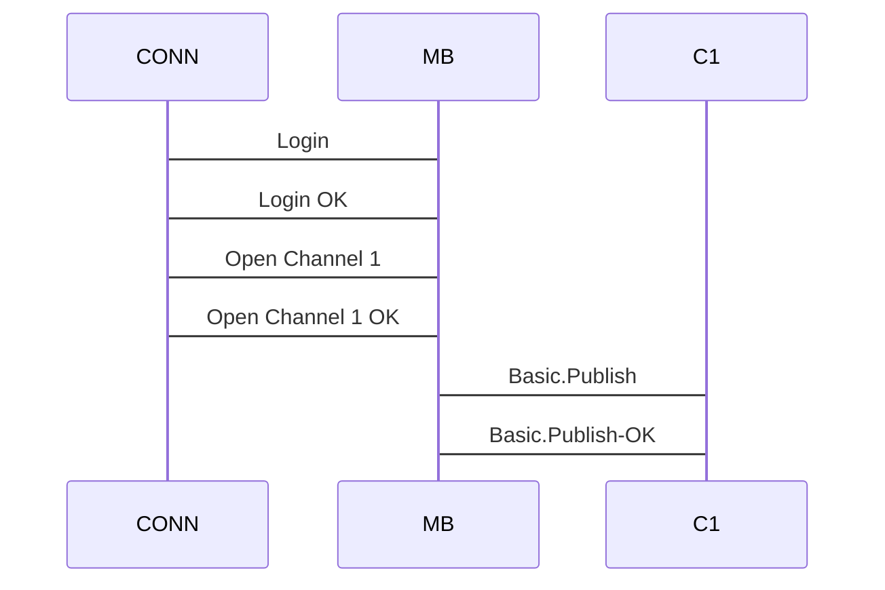

# RabbitMQ Scenarios

Looking at various scenarios in RabbitMQ sessions with an eye toward reliable multiplexing.

## Problematic Scenarios

I'm trying to cover the following scenarios here:

1. Publisher confirms

### Publisher Confirms

We're going to analyze test #037 for this. There are a handful of steps in this test, and it exercises multiplexing:

1. Open channel 1
2. Declare an exchange
3. Declare a queue
4. Bind the queue to the exchange
5. Enable select mode on the channel
6. Publish three messages
7. Get one message

**TODO: Update the test code in this document once this works**

```perl
use strict;
use Test::More;
use Data::Dumper;
use Net::AMQP::RabbitMQ;

use FindBin qw/$Bin/;
use lib "$Bin/lib";
use NAR::Helper;

my $helper = NAR::Helper->new;
$helper->plan(11);

ok $helper->connect,      "connected";
ok $helper->channel_open, "channel_open";

ok $helper->exchange_declare, "exchange declare";
ok $helper->queue_declare,    "queue declare";
ok $helper->queue_bind,       "queue bind";

ok $helper->confirm_select, "confirm_select";

my $count = 0;
ok $helper->publish("Message $count"), "Publish $count";
$count += 1;
ok $helper->publish("Message $count"), "Publish $count";
$count += 1;
ok $helper->publish("Message $count"), "Publish $count";

my $got = $helper->get;
is $got->{body}, 'Message 0', 'Got the 0th message.';

$count += 1;
ok $helper->publish("Message $count"), "Publish $count";

$helper->mq->purge($helper->{channel},$helper->{queue});

my $second_got = $helper->get;

ok !$second_got, 'no message (purged)';
sleep 15;
```



It's pretty easy to see how a serial program on a multiplexing protocol like this can get confusing. This is just publishing the message, now what happens when the same process also wants to consume those messages?

## Questions

- What if we use multiple channels?
