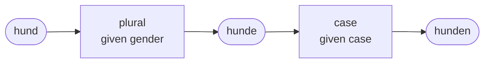
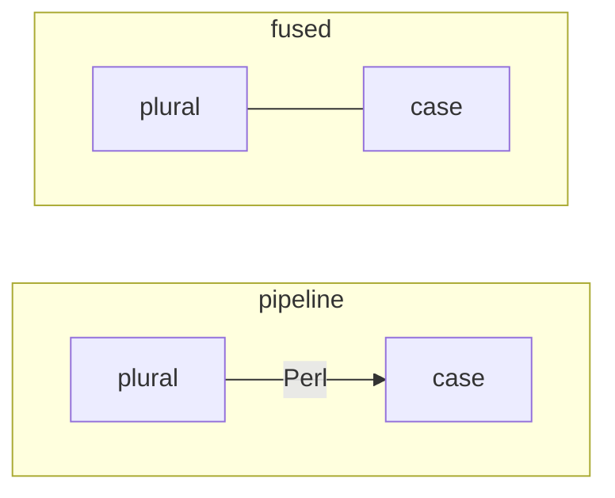

# Getting started

In a quarter of an hour: train a model that forms German plurals, ask it,
save it, give it a second model to work with, and run the two as one.

You need Perl 5.36 or later, or pperl. Nothing else is required. With PDL
installed training is many times faster, and under pperl with a graphics
card faster again; the library uses what it finds.

```sh
cpanm Peta::NN            # or, in a checkout of the repository: use lib 'lib'
```

Every block of Perl on this page is part of one script, in order. The data
file it reads comes with the distribution.

## The data

A model learns from examples. Here an example is a German noun: its
singular, its gender, and its plural.

```perl
use v5.36;
use utf8;
use open qw(:std :encoding(UTF-8));
use Peta::NN::Data;
use Peta::NN::Model;
use Peta::NN::Chain qw(chain);

my $nouns = Peta::NN::Data->read('examples/out/deu-noun/nouns.tsv', fields => [qw(singular gender plural listed)])
    ->sample(10_000)
    ->hold_out(0.2);

printf "%d nouns, %d of them held out\n", $nouns->count, $nouns->held->count;
my ($first) = $nouns->records;
print "$first->{singular} ($first->{gender}): $first->{plural}\n";
```

```text
10000 nouns, 2005 of them held out
aal (masculine): aale
```

`read` takes a file of tab-separated lines and the names of its columns;
from then on a column is a *field* and is called by its name. The file has
45,000 nouns; `sample` takes 10,000 of them so that this page runs quickly.

`hold_out(0.2)` sets a fifth of the nouns aside. A model is never shown
them, so they are what it can honestly be measured by afterwards: anyone
gets right what they have seen before.

## A model

```perl
my $plural = Peta::NN::Model->new(
    kind  => 'edit',
    from  => 'singular',
    to    => 'plural',
    given => ['gender'],
    reads => { end => 6 },
    goal  => { unseen => 0.93 },
);
```

This says everything about the model that is yours to decide:

- `kind => 'edit'`: it rewrites the end of a string. Its answer is of the
  form "cut two characters and add *en*".
- `from` and `to`: the field it reads and the field it is to answer.
- `given`: what it is told beside the word. How a German noun forms its
  plural depends on its gender (*der Hammer, die Hämmer*; *die Kammer, die
  Kammern*). The model knows nothing about gender; to it `masculine` is a
  value that goes with different answers.
- `reads`: how much of the word it looks at, here its last six characters.
- `goal`: what it has to reach, here 93% of the nouns it was not shown.

How large the network is, how long it is trained and on which engine is not
said here. Training finds that out.

## Training

```perl
$plural->train($nouns);
print $plural->report;
```

```text
7 training pairs the model cannot tell from a pair with a different answer; a wider window would (mutter → mütter as magnetmutter → magnetmuttern, magnetmutter → magnetmuttern as mutter → mütter, codeausdruck → codeausdrücke as wettbewerbsdruck → wettbewerbsdrucke, ...)
#   stage                    width  params epochs on         ms  all           outcome
    required                                                     >= 93.0%    
1   train                       64   16323      3 pdl     0.079  93.74%        met
2   second seed: train          64   16323      3 pdl     0.072  93.33%        confirmed

the model meets the thresholds: depth 1, width 64, 16323 parameters, 0.079 ms per item. Confirmed on a second seed. 2 stages, 3 epochs, 8 s (done).
on the test part, measured once: all 93.4%
```

A model with a goal is trained until it meets it. If it stops getting
closer it is made wider and trained on; when it is there, a second model is
trained from another random start to see that the first was not a lucky
draw. The report says what happened: here a network 64 wide, with some
16,000 weights, was enough after three passes over the data (*epochs*), and
it was trained on PDL (`on`). Your numbers will differ a little from engine
to engine.

The first line of the report is the library being honest about the data: a
few nouns look exactly alike in their last six characters and gender, and
have different plurals (*Mutter, Mütter* and *Magnetmutter, Magnetmuttern*).
No model that reads six characters can get both right, so they are set
aside and named.

## Asking it

```perl
for my $noun ([ frau => 'feminine' ], [ auto => 'neuter' ], [ hund => 'masculine' ], [ zeitung => 'feminine' ]) {
    my ($word, $gender) = @$noun;
    my ($answer, $confidence) = $plural->predict($word, gender => $gender);
    printf "%-8s %-9s -> %-10s (%.2f)\n", $word, $gender, $answer, $confidence;
}
```

```text
frau     feminine  -> frauen     (0.93)
auto     neuter    -> autos      (0.99)
hund     masculine -> hunde      (0.98)
zeitung  feminine  -> zeitungen  (1.00)
```

What the model is given is named when it is asked: `gender => 'feminine'`.
In list context `predict` also returns how sure the model is.

## Measuring it

```perl
my $score = $plural->score($nouns);
printf "%.1f%% of the %d nouns it was not shown\n", 100 * $score->{unseen}, $nouns->held->count;

my @wrong = grep { $plural->predict($_->{singular}, gender => $_->{gender}) ne $_->{plural} } $nouns->held->records;
printf "  %-14s -> %-16s (should be %s)\n", $_->{singular}, scalar $plural->predict($_->{singular}, gender => $_->{gender}), $_->{plural}
    for @wrong[ 0 .. 4 ];
```

```text
91.9% of the 2005 nouns it was not shown
  addiermodus    -> addiermodusse    (should be addiermodi)
  agronom        -> agronome         (should be agronomen)
  aktendeckelkarton -> aktendeckelkartone (should be aktendeckelkartons)
  amaryllis      -> amaryllisse      (should be amaryllen)
  ankunft        -> ankunften        (should be ankünfte)
```

`score` measures the model on the nouns the data holds out, which nothing in
training ever touched. (The goal was checked on other nouns, set aside from
the ones the model was given; the two figures are close, not equal.)

Looking at what it gets wrong is worth more than the number. Some misses
are plurals nobody could guess from the spelling (*Modus, Modi*); others
change a vowel in the middle of the word (*Ankunft, Ankünfte*), which a
model that rewrites the end has to learn as one long cut for every such
word. `examples/nouns-deu.pl` splits the task for that reason: one model
changes the vowel, a second the ending, each trained to its own goal on all
45,000 nouns, with the nouns that have to be right marked as such. Together
they reach 98%.

## Saving it, and using it elsewhere

```perl
chain(plural => $plural)->save('plural.chain', name => 'German nouns: singular to plural');

my $loaded = Peta::NN::Chain->load('plural.chain');
print scalar $loaded->predict('zeitung', gender => 'feminine'), "\n";
```

```text
zeitungen
```

A program that uses a model needs the file and those two lines. `peta-nn-info
plural.chain` prints what a file is.

Models are saved as *chains*, even one alone. What a chain is comes next.

## A second model, and the two together

The dative plural of a German noun adds an *-n* unless the plural already
ends in *-n* or *-s*: *die Hunde, den Hunden*. That is a different, smaller
task, so it gets a model of its own, trained on data of its own.

```perl
my @CASES = qw(nominative genitive dative accusative);
my $forms = Peta::NN::Data->new(
    fields  => [qw(singular gender plural case form)],
    records => [ map { my $noun = $_; map { {
        %$noun{qw(singular gender plural)},
        case => $_,
        form => $_ eq 'dative' && $noun->{plural} !~ /[ns]\z/ ? "$noun->{plural}n" : $noun->{plural},
    } } @CASES } $nouns->records ],
)->hold_out(0.2);

my $case = Peta::NN::Model->new(kind => 'edit', from => 'plural', to => 'form', given => ['case'], reads => { end => 3 });
$case->train($forms);
printf "case: %.1f%% of the forms it was not shown\n", 100 * $case->score($forms)->{unseen};
```

```text
case: 100.0% of the forms it was not shown
```

The data here is made in the script: a rule written in Perl is the
*teacher*, and the model learns from what the rule says about each plural.
This model has no goal, so it is fitted once, and the held-out forms say
when to stop.

Now the two in a row:

```perl
my $dative = chain(plural => $plural, case => $case);

print join(', ', $dative->given), "\n";
print scalar $dative->predict('hund', gender => 'masculine', case => 'dative'), "\n";
printf "%.1f%% of unseen nouns, from the singular to the case form\n",
    100 * $dative->score($forms, from => 'singular', to => 'form')->{unseen};
```

```text
gender, case
hunden
92.3% of unseen nouns, from the singular to the case form
```

`chain` puts models together under names, in order. The first model's
answer is what the second reads. The chain takes what its parts are given,
by the same names: `gender` for the first, `case` for the second.

A chain is itself a model. It is asked, scored, saved and loaded like one,
and it can be a part of a further chain. Neither model was changed or
trained again to make it; the plural model does not know that anything comes
after it.



## The two as one

```perl
$dative->save('dative.chain');

my $fused = Peta::NN::Chain->load('dative.chain')->on('cpu');
my @neuter = map { $_->{singular} } $nouns->where(sub ($noun) { $noun->{gender} eq 'neuter' })->records;
my @forms  = $fused->predict_all(\@neuter, gender => 'neuter', case => 'dative');
print "$neuter[$_] -> $forms[$_]\n" for 0 .. 2;
```

```text
abbruchgebot -> abbruchgeboten
abbruchunternehmen -> abbruchunternehmen
abdichtungsband -> abdichtungsbändern
```

As it comes, a chain runs as a *pipeline*: Perl takes the first model's
answer, builds the new string and hands it to the second. `on('cpu')` runs
the same two models *fused*: as one model, with the hand-over inside it.
Nothing is trained for that and no weight changes; a fused chain answers
exactly what the pipeline answers.

The reason to do it is the graphics card. With `on('gpu')`, under pperl, a
whole batch of words goes to the card once, passes both models there, and
comes back once. From a few hundred words on that is about ten times faster
than the pipeline.



## Where to go from here

| To | read |
|---|---|
| make data from rules, a lexicon or a program | [Data](guides/data.md) |
| choose the kind of model and what it reads | [Models](guides/models.md) |
| have one model choose which other model runs, or judge a whole text | [Composing](guides/composing.md) |
| understand fused models and run them on a card | [Fusing](guides/fusing.md) |
| see the same task done properly | `examples/nouns-deu.pl` in [the examples](examples.md) |
| know why it is built this way | [What Peta::NN is for](philosophy.md) |
