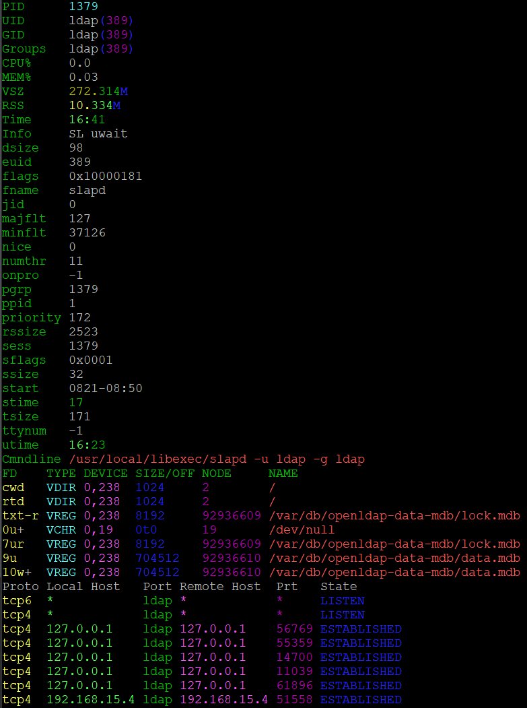

# About

Display all process table, open files, and network connections for a PID.




# Command Line Options
```
-a        Show a_inodes.
-c        Do not show pipe chains.
-d        Do not dedup.
-e <int>  Max number of peers to show. 0 or less shows all. Default is 0.
-f        Do not show FIFOs.
-j        Show all the jail info for the jail the process is in.
-l <int>  Max command length in a pipe chain. 0 or less does not truncate. Default is 0.
-m        Show memory mapped libraries of the REG type.
-n        Do not resolve PTR addresses.
--nc      Disable color.
-p        Do not show pipes.
-r        Show show VREG / files.
-t        Show shared libraries.
-u        Do not show unix sockets.
-E        Do not resolve pipe, FIFO, unix socket, and SHM peers.
-H        Do not humanize sizes.
```

# Enviromental Variables

The enviromental variables below may be set to set the default for the
flag in question.

Unless set to defined ands set to 1, these will default to 0. The
exceptions are PIDDLER_peer_max and PIDDLER_pipe_chain_command_length,
which take a value rather than being toggles.

| Variable |  Description  |
| -------- | ---------------- |
| NO_COLOR | If set to 1, color will be disabled. |
| PIDDLER_dont_dedup | If set to 1, duplicate file handles are removed. |
| PIDDLER_dont_resolv | If set to 1, PTR addresses will not be resolved for network connections. |
| PIDDLER_a_inode | If set to 1, a_inode types will be shown. |
| PIDDLER_dont_fifo | If set to 1, FIFOs will not be shown. |
| PIDDLER_jail_info | If set to 1, all the jail info will be shown for the jail a process is in. |
| PIDDLER_memreglib | If set to 1, memory mapped libraries with the type REG will be shown. |
| PIDDLER_dont_pipe | If set to 1, pipes will not be shown. |
| PIDDLER_dont_pipe_chains | If set to 1, pipe chains will not be shown. |
| PIDDLER_pipe_chain_command_length | Sets how long a command may be in a pipe chain before it is truncated, the same as -l, which overrides it when passed. |
| PIDDLER_txt | If set to 1, libraries with the TXT type will not be shown. |
| PIDDLER_dont_unix | If set to 1, unix sockets will not be shown. |
| PIDDLER_dont_peers | If set to 1, pipe, FIFO, unix socket, and SHM peers will not be resolved. |
| PIDDLER_peer_max | Sets how many peers will be shown, the same as -e, which overrides it when passed. |
| PIDDLER_dont_human_size | If set to 1, sizes will be printed as the raw number of bytes. |
| PIDDLER_vregroot | If set to 1, VREG / will not be shown. |

# Installing

## FreeBSD

    pkg install perl5 p5-App-cpanminus
    cpanm Proc::ProcessTable::piddler
    
## Linux

### CentOS

    yum install cpanm
    cpanm Proc::ProcessTable::piddler

### Debian

This has been tested as working on Debian 9 minimal.

    apt install perl perl-base perl-modules make cpanminus gcc 
    cpanm Proc::ProcessTable::piddler
