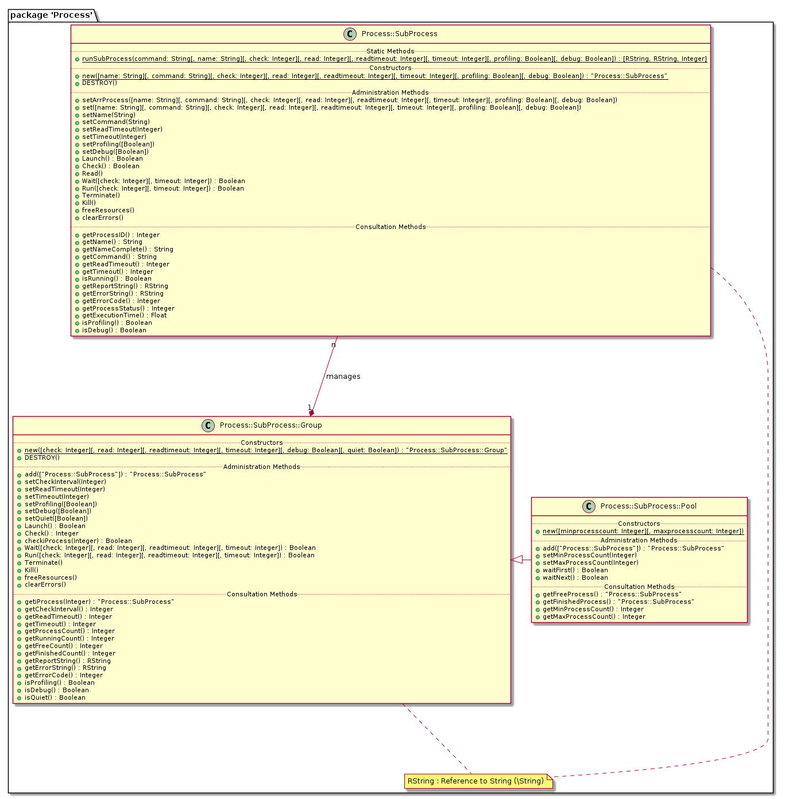

[](https://travis-ci.com/bodo-hugo-barwich/Process)

# Process
Process::SubProcess - Perl Module for Multiprocessing

Running Sub Processes in an easy way while reading STDOUT, STDERR, Exit Code and possible System Errors. \
It also implements running multiple Sub Processes simultaneously while keeping all Report and Error Messages and Exit Codes
seperate.

# Features
Some important Features are:
* Asynchronous Launch
* Reads Big Outputs
* Execution Timeout
* Configurable Read Interval
* Captures possible System Errors at Launch Time like "file not found" Errors

# Motivation
This Module was conceived out of the need to launch multiple Tasks simulaneously while still keeping each Log and Error Messages and Exit Codes separately. \
As I developed it as Prototype at:
[Multi Process Manager](https://stackoverflow.com/questions/50177534/why-do-pipes-from-child-processes-break-sometimes-and-sometimes-not)\
The **Object Oriented Design** permits the implementation of the **[Command Pattern / Manager-Worker Pattern](https://en.wikipedia.org/wiki/Command_pattern)** with the `Process::SubProcess::Group` and `Process::SubProcess::Pool` Packages.\
Having a similar implementation as the [`Capture::Tiny` Package](https://metacpan.org/pod/Capture::Tiny) it eventually evolved as a Procedural Replacement for the `Capture::Tiny::capture()` Function.

## Example Use Case
The Usefulness of this Library is best shown by an Example Use Case as seen in the `Process::SubProcess::Group::Run` Test Sequence:\
Having 3 Jobs at hand of 2 seconds, 3 seconds and 1 second running them sequencially would take aproximately **6 seconds**.\
But using the `Process::SubProcess::Group` it takes effectively only **3 seconds** to complete.\
And still each Job can be evaluated separately by their own Results keeping Log Message separate from Error Messages and viewing them in their context.
```
Test: 'Process::SubProcess::Group::Run' do ...
ok 3 - scripts (count: '3'): added correctly
Process Group Execution Start - Time Now: '1600376190.83796' s
ok 4 - Process Group Execution: Execution correct
Process Group Execution End - Time Now: '1600376193.88415' s
Process Group Execution finished in '3046.19097709656' ms
ok 5 - Process No. '0': Listed correctly
Process (2763) 'test-script:2s':
ERROR CODE: '0'
EXIT CODE: '0'
STDOUT: 'Start - Time Now: '1600376190.8788' s
script 'test_script.pl' START 0
script 'test_script.pl' PAUSE '2' ...
script 'test_script.pl' END 1
End - Time Now: '1600376192.87905' s
script 'test_script.pl' done in '2000.25105476379' ms
script 'test_script.pl' EXIT '0'
'
STDERR: 'script 'test_script.pl' START 0 ERROR
script 'test_script.pl' END 1 ERROR
'
ok 6 - Process No. '1': Listed correctly
Process (2764) 'test-script:3s':
ERROR CODE: '0'
EXIT CODE: '0'
STDOUT: 'Start - Time Now: '1600376190.88212' s
script 'test_script.pl' START 0
script 'test_script.pl' PAUSE '3' ...
script 'test_script.pl' END 1
End - Time Now: '1600376193.88235' s
script 'test_script.pl' done in '3000.22411346436' ms
script 'test_script.pl' EXIT '0'
'
STDERR: 'script 'test_script.pl' START 0 ERROR
script 'test_script.pl' END 1 ERROR
'
ok 7 - Process No. '2': Listed correctly
Process (2765) 'test-script:1s':
ERROR CODE: '0'
EXIT CODE: '0'
STDOUT: 'Start - Time Now: '1600376190.88512' s
script 'test_script.pl' START 0
script 'test_script.pl' PAUSE '1' ...
script 'test_script.pl' END 1
End - Time Now: '1600376191.88534' s
script 'test_script.pl' done in '1000.21886825562' ms
script 'test_script.pl' EXIT '0'
'
STDERR: 'script 'test_script.pl' START 0 ERROR
script 'test_script.pl' END 1 ERROR
'
```

# Usage
## runSubProcess() Function
Demonstrating the `runSubProcess()` Function Use Case:
```perl
use Process::SubProcess qw(runSubProcess);

use Test::More;


my $stestscript = "test_script.pl";
my $spath = '/path/to/test/script/';

my $rscriptlog = undef;
my $rscripterror = undef;
my $iscriptstatus = -1;


#Execute the Command
($rscriptlog, $rscripterror, $iscriptstatus) = runSubProcess($spath . $stestscript);

#Evaluate the Results

isnt($rscriptlog, undef, "STDOUT Ref is returned");
isnt($rscripterror, undef, "STDERR Ref is returned");
isnt($iscriptstatus, undef, "EXIT CODE is returned");
ok($iscriptstatus =~ qr/^-?\d$/, "EXIT CODE is numeric");

print("EXIT CODE: '$iscriptstatus'\n");

if(defined $rscriptlog)
{
  isnt($$rscriptlog, '', "STDOUT was captured");

  print("STDOUT: '$$rscriptlog'\n");
} #if(defined $rscriptlog)

if(defined $rscripterror)
{
  isnt($$rscripterror, '', "STDERR was captured");

  print("STDERR: '$$rscripterror'\n");
} #if(defined $rscripterror)

done_testing();
```

# Documentation
The Class Diagramm kann be found at:\
[Class Diagram for the Package 'Process'](docs/Process.jpg)\



