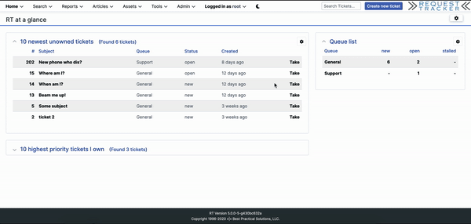

#### NAME

    RT-Extension-ToggleTheme - Toggle elevator light and dark theme.

#### DESCRIPTION

    To save your eyes in the dark. The theme toggle button only displays for
users who have the ModifySelf right.

#### RT VERSION

    Works with RT 5

#### INSTALLATION

    perl Makefile.PL
    make
    make install

##### May need root permissions

##### Edit your /opt/rt4/etc/RT_SiteConfig.pm

##### Add this line:

    Plugin('RT::Extension::ToggleTheme');

##### Apply patch to RT5

    patch -d /opt/r5 -p1 < patches/header-callback.patch

##### Clear your mason cache

    rm -rf /opt/rt5/var/mason_data/obj

##### Restart your webserver

#### AUTHOR

    Craig Kaiser <modules@ceal.dev>

