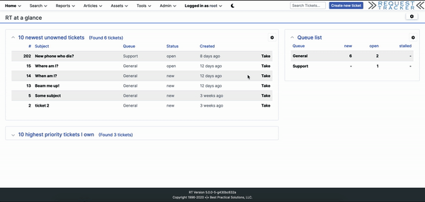

# RT-Extension-ToggleTheme

Adds a light/dark mode toggle button to the RT 6 navigation bar.

Clicking the icon switches Bootstrap 5's `data-bs-theme` attribute between `light` and `dark` and persists the choice to the user's RT preferences (`WebDefaultThemeMode`). Works with any Bootstrap 5 theme — not just Elevator.

Only users with the `ModifySelf` right see the button. It appears in both the privileged interface and the self-service portal.



## RT Version

Works with RT 6

## Installation

```
perl Makefile.PL
make
make install
```

May need root permissions.

Edit `/opt/rt6/etc/RT_SiteConfig.pm` and add:

```perl
Plugin('RT::Extension::ToggleTheme');
```

Clear the Mason cache and restart your webserver:

```bash
rm -rf /opt/rt6/var/mason_data/obj
```

## Author

Craig Kaiser <modules@ceal.dev>

## License

GNU General Public License version 2
