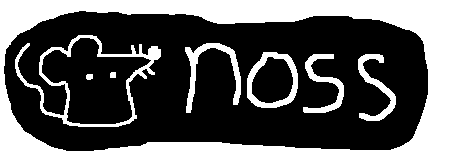

# noss



**noss** is a command-line RSS/Atom feed reader and aggregator written in
Perl.

## Installing
**noss** has been packaged for the following repositories:
* CPAN: <https://metacpan.org/dist/WWW-Noss>
* Alpine Linux: <https://pkgs.alpinelinux.org/package/edge/testing/x86_64/perl-www-noss>
* Slackware Linux (SBo): <https://slackbuilds.org/repository/15.0/network/noss/>

If you cannot install **noss** through any of the above repositories, you can
try building **noss** from source by following the instructions provided in
the [Building](#Building) section below.

## Building
**noss** should be able to run on most Unix-like and Windows systems.

**noss** depends on the following:
* `perl` (>= `5.16`)
* `DBI`
* `DBD::SQLite`
* `JSON`
* `Parallel::ForkManager`
* `Time::Piece`
* `XML::LibXML`
* `curl` (>= `7.68.0`)
* `lynx`
* `sqlite3` (>= `3.35.0`)

**noss** optionally depends on the following:
* `JSON::XS`: For faster JSON processing.
* `dialog`: For the `nossui` script.

Once the aforementioned dependencies are installed, **noss** can be built and
installed via the following commands:
```bash
perl Makefile.PL
make
make test
make install
```
Please consult the documentation for the `ExtUtils::MakeMaker` Perl module for
information on configuring the build process.

## Usage
The documentation for the usage of **noss** can be found in its manual.
```bash
man noss
```
It should contain all the information you need to get started using **noss**.

**noss** also comes with **nossui**, a `dialog`-based TUI frontend to **noss**
written in POSIX `sh`. Most of the regular functionality of **noss** should also
be available through **nossui**.

## Thanks
A huge thanks to the [newsraft](https://codeberg.org/newsraft/newsraft) and
[newsboat](https://newsboat.org/) projects, which inspired the creation of this
program and are also where I got many ideas for this project from.

## Author
This program was written by Samuel Young, *\<samyoung12788 at gmail dot com\>*.

This project's source can be found on its
[Codeberg page](https://codeberg.org/1-1sam/noss). Comments and pull
requests are welcome!

## Copyright
Copyright (C) 2025 Samuel Young

This program is free software: you can redistribute it and/or modify
it under the terms of the GNU General Public License as published by
the Free Software Foundation, either version 3 of the License, or
(at your option) any later version.
