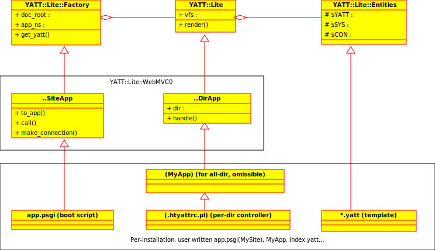

# NAME

prog\_guide(ja) -- perl プログラマー向け yatt 内部構造解説(日本語版)

# DESCRIPTION

yatt は汎用のテンプレートエンジンである ["YATT::Lite"](#yatt-lite) と、
それを用いた Webアプリケーションフレームワークの Reference Implementation である
["WebMVC0"](#webmvc0) から構成されています。



なお、この文書では分かりやすさのため、
実際には上位クラスで定義されているメソッドやメンバー変数でも、
**敢えてサブクラスのものとして** 説明している箇所が多数あります。

# YATT::Lite -- General Purpose Template Engine


yatt はテンプレートを perl の関数の集まりへと変換し、
その中の必要な関数を呼び出します。例えば次のような yatt テンプレート:

```html
<!yatt:args x y>
<h2>&yatt:x;</h2>
<yatt:hello who=y />

<!yatt:widget hello who>
Hello &yatt:who;!
```

が、以下のプログラムの変数 `$template_1` に入っていた場合:

```perl
use YATT::Lite;
my $yatt = new YATT::Lite(vfs => [data => $template_1]);
print $yatt->render('', {x => "foo", y => "bar"});
# 又は
$yatt->render_into(\*STDOUT, "" => {x => "baz", y => "qux"});
```

`$yatt->render`が呼ばれた時、yatt は以下のような perl package を
動的に生成し、
`MyYATT::EntNS->render_(...)` を呼び出します。

```perl
package MyYATT::EntNS;
sub render_ {
  my ($this, $CON, $x, $y, $body) = @_;
  print $CON (q|<h2>|, YATT::Lite::Util::escape($x), q|</h2>|, "\n");
  $this->render_hello($CON, (undef, $y)[1, 0]); print $CON ("\n");}

sub render_hello {
  my ($this, $CON, $who, $body) = @_;
  print $CON (q|Hello |, YATT::Lite::Util::escape($who), q|!|, "\n");}
```

なおテンプレートとしてファイルを指定した場合、
ファイルが変更されるまでスクリプトはキャッシュされます。

## template

yatt のテンプレートは、 `<!yatt: ... >` で始まる
[yatt 宣言](https://metacpan.org/pod/YATT%3A%3ALite%3A%3Adocs%3A%3Ayatt_manual#YATT-Declaration)
と、定義本体をフラットに(入れ子せずに)並べたものです。

```html
<!yatt:args x y>
  ...definition...

<!yatt:widget myfoo a>
  ...definition of myfoo...

<!yatt:widget mybar b>
  ...definition of mybar...

<!yatt:page myadmin u>
  ...definition of myadmin...
```

## widget

yatt ではテンプレートの部品化の単位を **widget** と呼びます。
一つのテンプレートファイルには、複数の widget を定義することが出来ます。

widget は必ずユニークな名前を持ち、名前によって識別・参照されます。
テンプレートの先頭は暗黙のうちに、空文字列 `""` を名前とする widget
(**default widget**) の始まりとして扱われます。 default widget に
引数宣言を追加するには `<!yatt:args>` を使います。

```html
<!yatt:args x y>
<h2>&yatt:x;</h2>
<yatt:hello who=y />

<!yatt:widget hello who>
Hello &yatt:who;!
```

この例では、一つのテンプレートに `""`, `hello` の2つの widget
が定義されています。これらを perl から呼び出して文字列を作るには、
[render](https://metacpan.org/pod/YATT%3A%3ALite#render)
メソッドを呼び出します。以下は `""` で default widget を呼び出す例です：

```perl
print $yatt->render('', {x => 'foo', y => 'bar'});
```

### public vs private

上記の例をそのまま **CGI** アプリに応用して、例えば

```perl
my $cmd = $cgi->param('cmd') || '';
print $yatt->render($cmd, {cgi => $cgi});
```

のようにした場合、気になる問題が出てきます。それは、
前節の hello widget のような、
コード改善のために括り出された部品を、
web からのリクエストで勝手に呼び出される可能性です。

この問題を避けるため、 yatt では widget に public と private の
区別を持たせ、 `YATT::Lite->render` で呼び出せるものは public な widget
のみとしました。 (private な widget を呼び出すとエラーになります)

- public

    拡張子が `.yatt` であるテンプレートファイルの default widget と、
    `` `!yatt:page` `` で宣言された widget は public となり、
    render による呼び出しが許可されます。

- private

    それ以外の widget, つまり、 `<!yatt:widget>` で宣言された widget と
    拡張子が `.ytmpl` であるテンプレートファイルの default widget は
    private となり、 render では呼び出し禁止となります。

### $this, $CON


yatt の widget には、宣言した引数以外に, 先頭に `$this` と `$CON` という
２つの引数が渡されます。先の hello の例を再掲します：

```perl
sub render_hello {
  my ($this, $CON, $who, $body) = @_;
  print $CON (q|Hello |, YATT::Lite::Util::escape($who), q|!|, "\n");}
```

このうち、 `$this` はテンプレート自身を表すクラス名です。
残る `$CON` は、perl の IO Handle 互換のオブジェクトです。
概念的には以下のように呼び出されます

```perl
MyYATT::EntNS->render_hello(\*STDOUT, "foo", undef);
```

### Why stream writer

yatt で書かれたテンプレートは、ここまでで示したように、
内部的には html を (戻り値で返す代わりに)
stream へ書き込む関数へと変換されます。これは (Web は別としても)
一般的にはテンプレートエンジンは巨大なデータを出力するために使われる可能性があり、
全処理が完了するまで出力をメモリーに保持し続けなければならない設計は避けるべきだろう、
という考えからです。また将来的に PSGI の streaming
インターフェースに対応するためでもあります。

もっとも、Web で使う場合には変換処理の途中でエラーやリダイレクトが発生する可能性があるため、
基本的には出力は全てメモリーストリームに一旦貯めてから出力されます。
そのためのクラス ["Connection"](#connection) も用意されています。

### XXX: widget path

render('foo:bar') や render('/foo/bar'), render('foo/bar.yatt')
の話も書かないと...

## `vfs`
 

テンプレートが一つのファイルで収まらない時もあるでしょう。
特に、複数人数で開発を分担したい時には、テンプレートを別ファイルに
分けたくなるでしょう。逆に実験段階ではテンプレート一個で済ませたいときや、
プログラムのなかにテンプレートを直接含めたい時もあるでしょう。
これらのケースに対応するため、 yatt はテンプレートの集まりを
指定する方法を複数用意しています。

**YATT::Lite** にテンプレートの集まりを渡すには、 `vfs` オプションを使います。
vfs オプションには `[vfstype => SPEC]` 形式の配列を渡します。 vfstype には
`data`, `file`, `dir` の3つの種類があります。

- vfs => \[data => STRING\_or\_HASH\]


    外部ファイルに頼らずに、プログラムから直接テンプレートを渡したいときに使います。
    文字列か HASH のいずれかを渡して下さい。

    文字列を渡した場合、
    `render($name)` 時の `$name` はテンプレート内の
    [page](https://metacpan.org/pod/YATT%3A%3ALite%3A%3Adocs%3A%3Ayatt_manual#page) 名として解釈されます。

    HASH を渡した場合、
    `render($name)` 時の `$name` は HASH の key として解釈されます。

- vfs => \[file => FILENAME\]


    SPEC をファイル名として解釈し、ファイルシステムからテンプレートを読み込みます。
    `render($name)` 時の `$name` はテンプレート内の
    [page](https://metacpan.org/pod/YATT%3A%3ALite%3A%3Adocs%3A%3Ayatt_manual#page) 名として解釈されます。

- vfs => \[dir => DIRNAME\]


    SPEC をディレクトリ名として解釈し、このディレクトリの `*.yatt`, `*.ytmpl` ファイルを
    テンプレートとして扱います。`render($name)` 時の `$name` はディレクトリ内の
    `*.yatt` ファイル名として解釈されます。

## `base`


別ディレクトリのテンプレートライブラリを使用できるようにするためのオプションが
`base` オプションです。正確には、base オプションには前節の
["vfsspec"](#vfsspec) の配列を渡します。

```perl
my $yatt = new YATT::Lite(vfs => [dir => "$app_root/html"]
                          , base => [[dir => "$app_root/tmpl_lib1"]
                                     , [dir => "$app_root/tmpl_lib2"]]);
```

XXX: 多重継承、大丈夫だっけ?

## `namespace`


yatt では、テンプレートの中で用いる名前空間をカスタマイズすることが出来ます。
名前空間を指定するには `namespace` オプションを使います。

```perl
my $yatt = new YATT::Lite(..., namespace => ['japh', 'yapc']);
```

こうすると、テンプレートの中で、指定した名前空間が使えるようになります。

```html
<!japh:widget foo>
  ...
  <japh:foreach ...>
  ...

<!yapc:widget bar>
  ...
  <yapc:foreach ...>
  ...
```

この機能の存在理由は、 **「チーム固有のタグ」を一目で分かるようにする** ことと、
**テンプレートを生成するテンプレートを書きやすくする** ためです。

## `app_ns`


yatt が生成した perl スクリプトには、オプション `app_ns`
で指定した package 名が付けられます。
デフォルト値は `default_app_ns` メソッドで定義されており、 `MyYATT::` になっています。

同一プロセス内で複数の yatt インスタンスを用いる時には、
次節の ["Factory"](#factory) を使うか、
明示的に別の app\_ns を渡すようにしてください。さもないと、
以下のように生成されたスクリプト同士で再定義エラーが発生します。

```perl
my $yatt1 = new YATT::Lite(vfs => [data => $template_1]);
my $yatt2 = new YATT::Lite(vfs => [data => $template_1]);
my $yatt3 = new YATT::Lite(app_ns => 'MyYATT3', vfs => [data => $template_1]);

# OK.
print $yatt1->render('', {x => "foo", y => "bar"});
#>> <h2>foo</h2>

# NG!
# print $yatt2->render('', {x => "baz", y => "qux"});
#>> Subroutine filename redefined at (eval 27) line 1.

# OK.
print $yatt3->render('', {x => "baz", y => "qux"});
#>> <h2>foo</h2>
```

# YATT::Lite::Factory -- for multiplicity
 

**YATT::Lite::Factory** は、
複数の YATT::Lite インスタンスを使うアプリを簡潔に書くためのモジュールです。
Web 用に yatt を使う場合、
生の YATT::Lite を用いるより Factory (か、そのサブクラス) を用いる方が、
**各ディレクトリ毎にカスタマイズされた** 独立の YATT::Lite インスタンスを持てる分、
Webアプリをモジュール化しやすくなります。

```perl
use FindBin;
use YATT::Lite::Factory -as_base;
{
  my $factory = MY->new(app_ns => 'MyYATT', doc_root => "$FindBin::Bin/html");

  my $y1 = $factory->get_yatt('/');
  print $y1->render(index => {x => "foo"});   # /index.yatt
  print ref $y1, ", ", $y1->cget('app_ns'), "\n";
  #>> MyYATT::INST1, MyYATT::INST1

  my $y2 = $factory->get_yatt('/auth');
  print $y2->render(login => {nx => "/bbs"}); # /auth/login.yatt
  print ref $y2, ", ", $y2->cget('app_ns'), "\n";
  #>> MyYATT::INST2, MyYATT::INST2
}
```

## `doc_root`, `get_yatt()`
 

Factory を構築する時はオプション `app_ns`, `doc_root` を渡します。
app\_ns 省略時のデフォルト値は MyYATT です。
doc\_root 以下の各ディレクトリの yatt インスタンスを取り出すには、
サブディレクトリパスを引数として `get_yatt()` を呼びます。

```perl
my $factory = MY->new(app_ns => 'MyYATT', doc_root => "$FindBin::Bin/html");

my $y1 = $factory->get_yatt('/');     # $FindBin::Bin/html/

print $y1->render(index => []);       # $FindBin::Bin/html/index.yatt

my $y2 = $factory->get_yatt('/auth'); # $FindBin::Bin/html/auth/

print $y2->render(login => []);       # $FindBin::Bin/html/auth/login.yatt
```

`get_yatt()` の結果はキャッシュされます。yatt インスタンスの生成は、
オンデマンドか、起動時一括か、いずれかを選ぶことが出来ます。

Factory が yatt インスタンスを生成する手順は以下のようになっています。

- `require MyYATT`

    最初に一度だけ、app\_ns で指定されたパッケージ(MyYATT)の読み込みを試みます。
    もし有れば、それが `YATT::Lite` を継承しているか確認します。
    無かった場合は `YATT::Lite` のサブクラスとして MyYATT を自動生成します。

- インスタンス固有クラスの生成

    新たな yatt インスタンスが必要になる度に、
    `MyYATT::INST1`, `MyYATT::INST2`, ... のように、
    そのインスタンス固有のクラスを生成します。
    (各々の親クラスは `MyYATT` になります)

- `.htyattrc.pl` の読み込み

    もしそのディレクトリに `.htyattrc.pl` があれば、
    これを固有クラスの文脈でロードします。

- `.htyattconfig.xhf` の読み込み

    更にそのディレクトリに `.htyattconfig.xhf` があれば、
    そこから設定 `@config` を読み込みます。

- new

    そして、`MyYATT::INST1->new(app_ns => 'MyYATT::INST1', @config)` ... のように
    インスタンスを生成します。

## `use ... -as_base`


Factory は、通常プロジェクト毎にサブクラスを定義して使います
(テンプレートにモデルを見せるための Entity 参照関数を定義したいからです)。
なお Factory は [YATT::Lite::Util::AsBase](https://metacpan.org/pod/YATT%3A%3ALite%3A%3AUtil%3A%3AAsBase) を用いているので、
`use` 時に `-as_base` オプションを立てれば、
継承関係の設定、
[MY エイリアス](https://metacpan.org/pod/YATT%3A%3ALite%3A%3Adocs%3A%3Awhyfields#MY) の設定が同時に済みます。

```perl
# Works, but is not interesting.
package MyYATT1 {
  require YATT::Lite::Factory;
  my $factory = YATT::Lite::Factory->new(...);
}

# Not enough good.
package MyYATT2 {
  use base qw/YATT::Lite::Factory/;
  my $factory = YATT::Lite::Factory->new(...);
}

# Recommended.
package MyYATT3 {
  use YATT::Lite::Factory -as_base;
  use YATT::Lite qw/Entity/; # XXX: Should be removed in future release.
  my $factory = MY->new(...);

  Entity userlist => sub {
     my ($this, $group) = @_;
     ...
  };
}
```

`XXX:` 現在のところ、 `Entity` 定義関数を使うには、
更に加えて `YATT::Lite` も use する必要が有ります。

# WebMVC0 -- Reference Impl of a Web Framework on YATT


汎用品である [YATT::Lite](https://metacpan.org/pod/YATT%3A%3ALite) をベースに、
これを Web アプリ構築に特化させたものが **WebMVC0** クラス群です。
WebMVC0 を用いた [PSGI](https://metacpan.org/pod/PSGI) アプリケーションの典型例を以下に挙げます：

```perl
use FindBin;
use YATT::Lite::WebMVC0::SiteApp -as_base;
use YATT::Lite qw/Entity/; # XXX: Should be removed in future release.
{
  my $site = MY->new(doc_root => "$FindBin::Bin/html");
  return $site->to_app;
}
BEGIN {
  Entity session => sub {
    my ($this, $key) = @_;
    ...
  };
}
```

これはオプション `doc_root` で指定したディレクトリ `$FindBin::Bin/html`
を起点公開ディレクトリとする、 PSGI アプリです。
doc\_root 以下に置かれた `*.yatt` ファイルは yatt テンプレートとして
動的に変換され実行されます。yatt 以外のファイルはデフォルトでは
[Plack::App::File](https://metacpan.org/pod/Plack%3A%3AApp%3A%3AFile) によって静的コンテンツとして処理されます。

doc\_root の下に置かれた **ディレクトリ** は、

オプション **doc\_root** で指定した起点公開ディレクトリ以下を
テンプレートディレクトリとします。

より厳密に言えば、 **doc\_root** 以下の各ディレクトリに対して、
一個ずつ YATT::Lite のインスタンスを生成します。

その際、

XXX: \* 拡張子抜きは .yatt へ自動 map

XXX: ディレクトリ＝YATTアプリ

XXX: Entity の定義と、それが具体的に何をするか

XXX: die \\@PSGI\_TUPLE

XXX: PATH\_TRANSLATED, REDIRECT\_STATUS

XXX: allow\_debug\_from

## XXX: `SiteApp` -- PSGI bridge


XXX: \* Site の Entity

XXX: site\_config

XXX: make\_connection

XXX: psgi\_static

## XXX: `DirApp` -- Web-specific YATT::Lite


XXX: action

XXX: handle, \_handle\_yatt, \_handle\_ydo

XXX: error\_handler

XXX: dir\_config

## XXX: `.htyattrc.pl` -- kitchen sink class

## XXX: error, raise

エラー画面のカスタマイズも Webアプリの重要な機能です。
yatt もエラー発生時に呼び出されるテンプレートを定義することが可能です。
通常は `error.ytmpl` のように **private** なテンプレートファイルにします。

## XXX: Connection -- Request + Response


## XXX: logging

XXX: logging interface は、とりあえず付けただけ、状態です。御意見募集中です。

## XXX: DBSchema, DBSchema::DBIC
