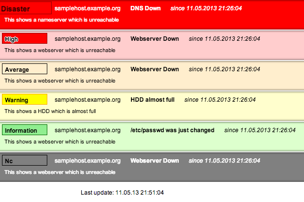
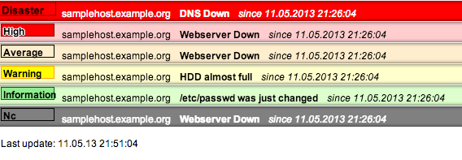
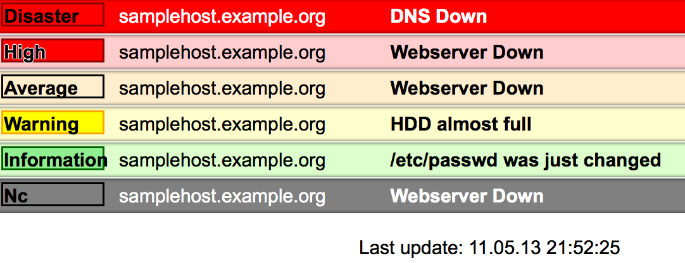
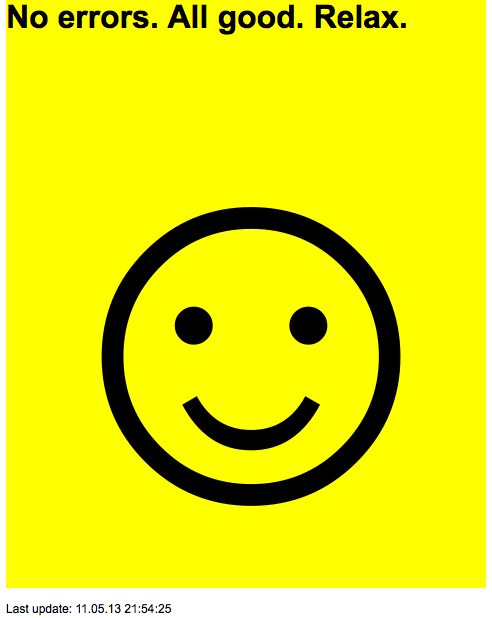

This is the README file for Zabbix-Reporter,
a responsive Zabbix Dashboard.

## Description

Zabbix-Reporter provides a responsive
HTML5/CSS Zabbix Dashboard.

Please have a close look at the Plugins in the
namespace Zabbix::Reporter::Web::Plugin and
the coresponding documentation in conf/zreporter.conf.dist.
Please not how the Plugin names are mapped to the
appropriate configuration keys.

## Installation

This package uses Dist::Zilla.

Use

dzil build

to create a release tarball which can be
unpacked and installed like any other EUMM
distribution.

perl Makefile.PL

make

make test

make install

## Documentation

Please see perldoc Zabbix::Reporter.

## Examples

Here is [an static snapshot of the Zabbix::Reporter demo page](examples/zreporter-static.html).

## Resources

The following resources may prove helpful when dealing with the
Zabbix database schema:

* https://www.zabbix.com/documentation/1.8/api/
* http://git.zabbixzone.com/zabbix1.8/.git/tree

